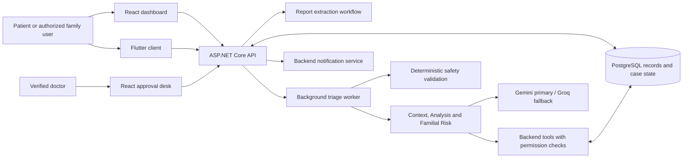
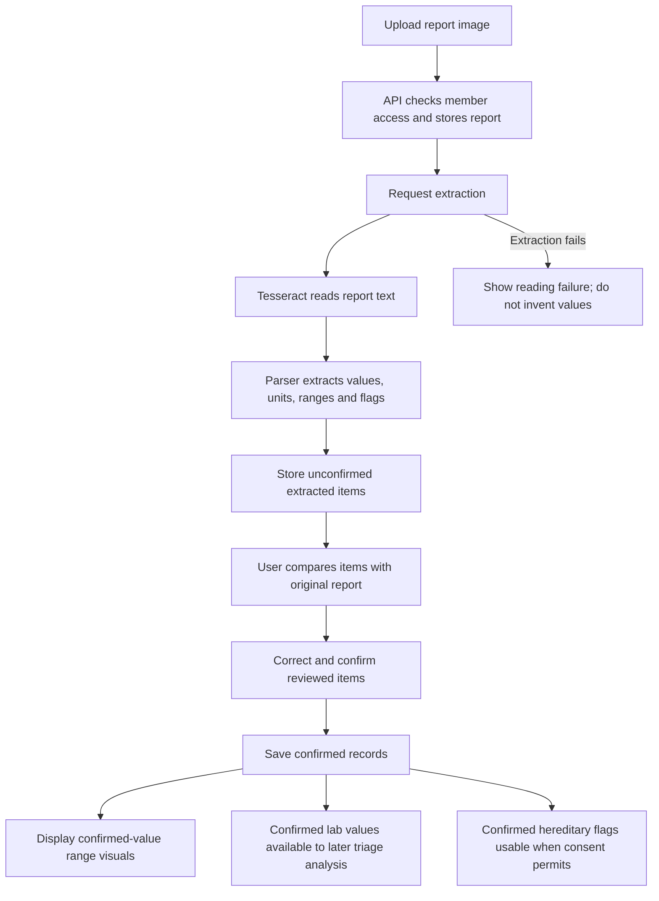
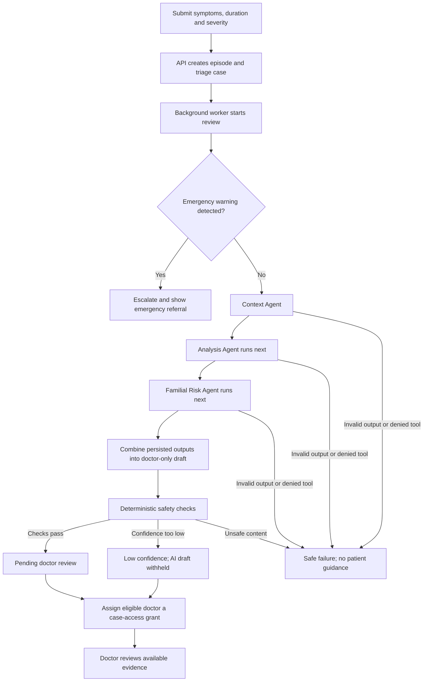
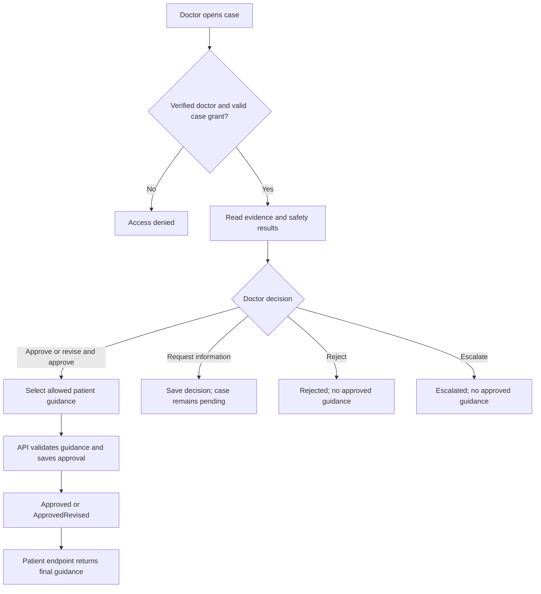
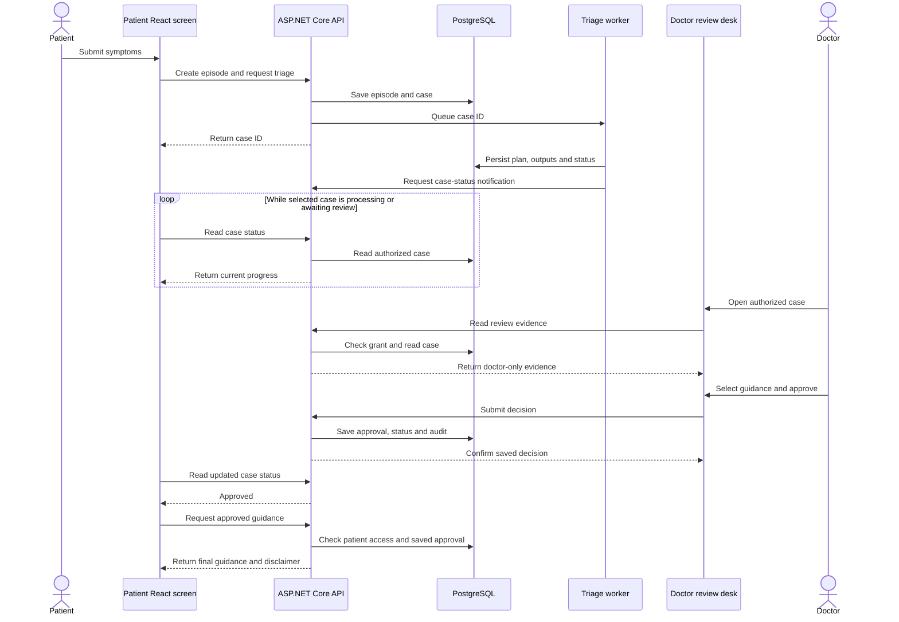
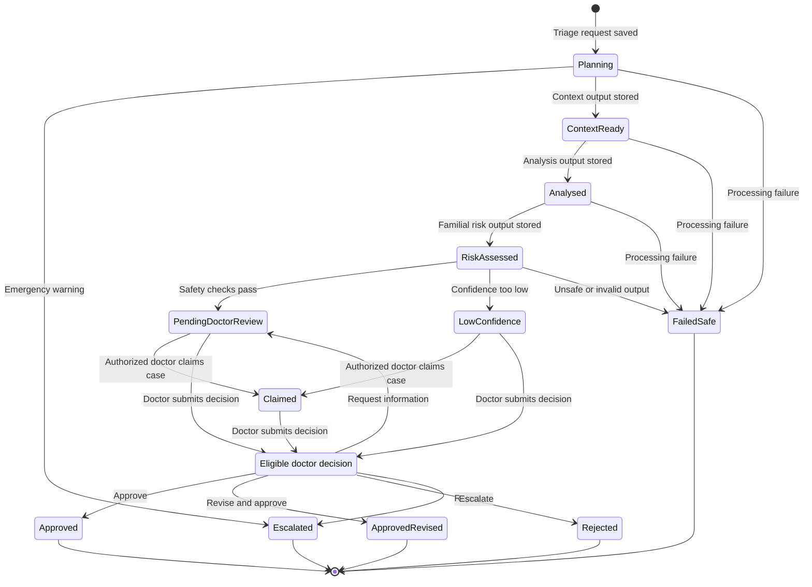

# Family Veda — AI Flow and Dashboard Integration

**Owner:** S4 · **Code review date:** 2026-10-01

**Scope:** Current backend workflow and the redesigned React patient/family and doctor screens.

Family Veda follows this flow: **patient input → automated review → doctor decision → approved patient guidance**. Report reading is a separate workflow: **upload → OCR extraction → human confirmation → recorded values**.

Patient confirmation means “these values match my report.” Doctor approval means “this guidance may be shown to the patient.” These are different decisions.

This document describes inspected code, not a successful live AI execution. The integrated browser preview uses synthetic fixtures and does not call the live AI pipeline. Mermaid diagrams below render in compatible Markdown viewers, including GitHub.

## 1. System overview

Both React and Flutter use one ASP.NET Core API and the same persisted records, permissions and case state. The UI redesign described here is implemented in React; it does not establish that Flutter has the same new layout.

The clients do not call AI providers directly. Application agents obtain data through backend tools with per-agent allow-lists; they do not hold database credentials. Hosted LLM processing is not an offline-only architecture.

## 2. Who does what?

| Component | Plain-language job | Implementation boundary |
|---|---|---|
| Extraction Agent | Reads values and structured flags from a lab report. | Tesseract OCR plus deterministic parsing; extracted items require manual review. |
| Coordinator/orchestrator | Runs the symptom-review steps in order and persists progress. | Backend orchestration; the coordinator plan is recorded as a trace. |
| Context Agent | Organizes the member's history for doctor review. | Reads authorized member profile, vitals, episodes and conditions. |
| Analysis Agent | Reviews recorded trends and deviations. | Reads manually confirmed lab values; its deviation tool compares recorded vitals. |
| Familial Risk Agent | Summarizes consented family-history flags as screening evidence. | Uses confirmed structured flags and biological relationships; does not read relatives' raw reports or calculate inheritance probabilities. |
| Safety/Validation | Checks whether processing may continue safely. | Deterministic rules, without an LLM. |
| Doctor | Reviews evidence and records the final decision. | Verified identity and a current case-access grant are required. |

The five application agents are Extraction, Context, Analysis, Familial Risk and Safety/Validation. Extraction runs in the report workflow; it is not rerun for every symptom request. Context, Analysis and Familial Risk use hosted language models. The other components above do not add extra LLM agents.

## 3. Report-upload flow

### What the person sees

1. Open **Health Records → Labs** and choose **Upload report**.
2. Upload a PNG or JPEG image, within the current 10 MB limit.
3. Open **Check values** and compare the extracted items with the original report.
4. Correct values where needed, then confirm the reviewed items.
5. Read the confirmed values and their position within the report's printed reference interval.

### How to read the visuals

- The number and unit come from confirmed source values.
- The bar uses a valid low/high reference interval printed on the report.
- Missing or reversed intervals are not plotted. Missing ranges are shown as unavailable.
- A value outside the printed interval is not clipped to look as though it is within it.
- Range position is a recorded comparison, not a diagnosis or an AI health explanation.

Uploading or confirming a report **does not automatically create a triage case or send it to a doctor's approval queue**. A symptom request starts the separate clinical-review workflow.

A shared adult report is shown to an authorized Family Head as a summary. That shared view does not grant extraction-detail access or permission to confirm another adult's values. Minor-profile access remains subject to guardian consent and backend authorization.

## 4. Symptoms and AI-review flow

### What the person sees

The person selects an authorized family member, chooses symptoms or writes them in their own words, adds duration and severity, and submits for doctor review. The screen uses four understandable progress labels:

**Submitted → Being reviewed → Doctor review → Guidance available**

These labels simplify several backend states. “Guidance available” appears only after an approved doctor decision; emergency or stopped cases have their own messages.

The agents execute sequentially. Each reads its own permitted tools; the diagram's arrows describe execution order, not an unrestricted transfer of all patient data between agents. Their outputs are persisted and assembled for doctor review.

### Safety and failure handling

| Situation | Current behavior |
|---|---|
| Emergency warning | Deterministic escalation/referral before the LLM steps; no AI advisory is generated. |
| Valid outputs and sufficient confidence | Store the doctor-only draft and move to `PendingDoctorReview`. |
| Confidence below the configured threshold, default 60% | Move to `LowConfidence`, withhold the draft and route for doctor attention. |
| Invalid output structure | Stop with a safe failure; do not publish an advisory. |
| Agent attempts a denied tool | Record the denial and stop safely. |
| Prohibited clinical content | Deterministic safety rules stop processing. |
| All hosted providers fail or are unconfigured | Stop safely with an unavailable-provider failure. |
| Worker restarts during processing | Untouched queued cases can be recovered; interrupted cases with processing evidence are marked safely failed rather than silently replayed. |

Gemini is attempted first when configured. Groq is the hosted fallback. A provider without its required key is skipped. Outputs must be structured and validated; no indefinite revision loop is intended. Provider behavior is implemented in the provider clients and fallback client, not in the patient screen.

## 5. Doctor approval and patient visibility

The approval desk shows the selected case, its reference, available agent evidence, draft, trace-derived safety results and decision actions. Selecting a different case clears the previous case's evidence and form state.

The current final guidance is selected from the backend's fixed, non-diagnostic allow-list. “Revise and approve” does not authorize arbitrary free-form clinical advice. The patient's guidance endpoint returns the saved doctor's final guidance, timestamp and disclaimer; it does not return the raw AI draft.

Only `Approved` and `ApprovedRevised` cases can return approved guidance to an authorized patient/guardian. Doctor decisions are audited. Terminal decisions revoke active case grants. Concurrent conflicting decisions return a conflict rather than silently replacing another doctor's decision.

**Current request-information limitation:** the decision and internal doctor notes are saved, and the case remains pending. The redesigned patient screen does not automatically open a follow-up questionnaire or display those internal notes.

## 6. How patient and doctor dashboards stay synchronized

Both dashboards read the same backend case. They are separate views of persisted state, not independent copies of the AI result.

The sequence is illustrative: the worker invokes the backend notification service in-process, rather than making an HTTP request to its own API.

### Current React refresh behavior

- The selected symptom case polls status every **3 seconds** while it is non-terminal. Polling stops for approved, rejected, escalated, safely failed or emergency cases.
- The patient screen fetches guidance only after receiving an approved status.
- Family and doctor dashboard summaries reload on mount and when the browser window regains focus.
- Backend case-status notifications complement these reads; they do not replace the authorization checks.
- Older responses are discarded when a different profile or case has been selected.
- Continuous push-based dashboard updates are not part of this redesign. A dashboard left focused can show older summary counts until it refreshes.

### Navigation into the workflows

| Dashboard action | React route | Opens |
|---|---|---|
| Upload report | `/records?tab=labs&upload=1` | Labs with the upload form open. |
| Lab reports | `/records?tab=labs` | Report library. |
| Manual records | `/records?tab=records` | Recorded health-history entries. |
| Vitals | `/records?tab=vitals` | Recorded vital measurements. |
| Approved guidance | `/triage?view=guidance` | An authorized approved case when available. |
| Doctor review desk | `/approvals` | Authorized review queue. |
| Review a specific case | `/approvals?case=CASE_ID` | The authorized selected case. |

## 7. Case-state diagram

This diagram summarizes the current main paths. Intermediate processing details remain doctor-only evidence; the patient sees the simpler progress labels.

`Decision` is a diagram routing node, not a stored `TriageStatus`. Schema/provider/tool failures can occur within an agent step before its success state is saved. The overview does not enumerate every failure from every intermediate state.

## 8. Implemented scope and remaining work

| Area | Current scope |
|---|---|
| Redesigned React screens | Reports, symptoms/progress, doctor approvals and dashboard links use existing APIs and the shared UI theme. |
| Report visuals | Confirmed-value comparisons against printed ranges; no new clinical interpretation. |
| Patient guidance | Existing doctor-approved, allow-listed final statements. |
| New AI lab explanations | Not added by this UI integration. They require their own approved backend and patient-visibility workflow. |
| Universal approval workflow for new AI features | Not added; the present clinical gate is the triage approval flow. |
| Flutter visual redesign | Not established by this React integration. |
| Live hosted-AI verification | Not performed during the synthetic UI preview checks. Code presence and frontend tests do not prove a live provider call. |

Clinical boundaries remain: no diagnoses, drug names/dosing, prescriptions or meal plans; family history produces screening indications; emergency messages are deterministic referrals. Unapproved AI drafts stay doctor-only. Human-confirmed OCR readings are source records, not doctor-approved AI clinical guidance.

## 9. Source references

These relative links identify the inspected implementation and remain portable within the repository.

| Topic | Source |
|---|---|
| Clinical safety and architecture | [CLAUDE.md](../CLAUDE.md) |
| Report extraction | [LabExtractionService.cs](../backend/src/Infrastructure/Records/LabExtractionService.cs), [ExtractionAgent.cs](../backend/src/Infrastructure/Agents/ExtractionAgent.cs), [TesseractOcrService.cs](../backend/src/Infrastructure/Records/TesseractOcrService.cs) |
| Report review and visuals | [RecordsPage.tsx](../web/src/pages/records/RecordsPage.tsx), [RecordedRangeVisual.tsx](../web/src/components/records/RecordedRangeVisual.tsx) |
| Triage orchestration and recovery | [TriageOrchestrator.cs](../backend/src/Infrastructure/Triage/TriageOrchestrator.cs), [TriageWorker.cs](../backend/src/Api/Background/TriageWorker.cs) |
| Agent tools and consented data | [ToolDispatcher.cs](../backend/src/Infrastructure/Agents/ToolDispatcher.cs) |
| Hosted providers | [LlmFallbackClient.cs](../backend/src/Infrastructure/Agents/LlmFallbackClient.cs), [ADR-013](adr/ADR-013-hosted-gemini-llm.md) |
| Deterministic safety and guidance allow-list | [SafetyValidationService.cs](../backend/src/Domain/Safety/SafetyValidationService.cs) |
| Doctor decisions and patient guidance access | [ClinicalService.cs](../backend/src/Infrastructure/Clinical/ClinicalService.cs), [TriageService.cs](../backend/src/Infrastructure/Triage/TriageService.cs) |
| Patient progress and polling | [TriagePage.tsx](../web/src/pages/triage/TriagePage.tsx), [FamilyCaseProgress.tsx](../web/src/pages/triage/FamilyCaseProgress.tsx) |
| Doctor review UI | [ApprovalsPage.tsx](../web/src/pages/doctor/ApprovalsPage.tsx) |
| Dashboard refresh and navigation | [FamilyDashboardPanel.tsx](../web/src/pages/family/FamilyDashboardPanel.tsx), [DoctorDashboardPanel.tsx](../web/src/pages/doctor/DoctorDashboardPanel.tsx) |

Assessment evidence is tracked separately in [REQUIREMENTS_REFERENCE.md](university/REQUIREMENTS_REFERENCE.md) and the dated [audit](university/AUDIT_2026-09-23.md). This document is a workflow explanation, not a university-compliance or deployment certification.
