# Connected client E2E execution — 8 October 2026

## Scope and outcome

Real Flutter iOS simulator and React Chrome clients used the same fresh local API5080/PostgreSQL database. UI automation used Computer Use, supplemented by authenticated HTTP assertions and actual persisted case identifiers. Synthetic accounts/data only; no production records/decisions changed. This is an executed tool-based integration journey, not a passing automated hosted-LLM certification.

**Overall: executed, Failed/Partial.** Fresh hosted submission failed safely; seeded approval propagated, but revealed internal-note exposure and stale-delay UI defects. Do not mark the whole workflow Pass.

| Scenario | Actual outcome | Status |
|---|---|---|
| Flutter submit fresh synthetic case0021 → web doctor queue | Same persisted ID visible in both clients; guidance HTTP404 | Pass for transport and pre-approval gate |
| Hosted processing case0021 | FailedSafe / AGENT_UNAVAILABLE; Gemini failed, fallback config unavailable; guidance still404 | Safe-failure invariant Pass; normal hosted completion Failed |
| Seeded case0003 before decision | Patient guidance404; same case visible in Flutter and web doctor desk | Pass |
| Web approve seeded case0003 → backend → Flutter | Web saved decision; backend statusApproved, selected final guidance endpoint200; Flutter showed response received | Transport/decision propagation Pass |
| Doctor-only note confidentiality | Exact internal note returned in patient DTO and rendered on Flutter patient progress | Failed, High defect |
| Approved guidance navigation | Old DOCTOR_RESPONSE_DELAY persisted; Flutter still showed delayed-review warning and omitted approved guidance button | Failed, High functional defect |

## Correlated identifiers

- Fresh0021: `b76cf4c5-aac1-414d-b231-a1bf59aaa1bc` — submitted in this session from Flutter.
- Seeded0003: `c5d100ec-860d-4130-baf4-6ac9d279a30a` — pre-existing seed; not submitted or processed by a hosted model in this session. Seed and fresh cases are not combined into one passing happy path.

## Reproduce

1. Create an isolated PostgreSQL database and apply existing migrations/seeds; use private environment credentials.
2. Start local API on5080, React with `VITE_API_BASE_URL=http://127.0.0.1:5080/api/v1` on5175; use localhost browser origin configured in CORS.
3. Run Flutter iOS with `--dart-define=API_BASE_URL=http://127.0.0.1:5080/api/v1`.
4. Login as synthetic Adult in Flutter, submit the documented mild synthetic fixture. Correlate displayed case number with API/DB ID; assert approved-guidance404 before approval.
5. Observe same case in web Doctor queue. Hosted availability may differ on rerun; record actual outcome. Never bypass FailedSafe to force approval.
6. For independent seeded decision propagation, open Adult seeded pending case0003, assert404, open same case in web Doctor Approval Desk. Select existing in-person-review template; put harmless unique marker in Internal Clinical Notes. Approve and confirm in disposable environment.
7. Refresh Flutter via Dashboard → Triage → same case. Compare patient DTO and approved-guidance endpoint. Internal note must be absent from patient response; approved button must be present. Current run failed both expectations.

## Assertion and response evidence

- [Fresh preapproval assertion](evidence/2026-10-08-connected-e2e/preapproval-assertion.json)
- [Fresh safe failure and seeded pending denial](evidence/2026-10-08-connected-e2e/guidance-denial-assertions.json)
- [Patient postapproval responses](evidence/2026-10-08-connected-e2e/seeded-postapproval-responses.json)
- [Postapproval privacy/navigation assertions](evidence/2026-10-08-connected-e2e/postapproval-assertions.json)
- [Patient accessibility evidence](evidence/2026-10-08-connected-e2e/ios-postapproval-accessibility.txt)

## Supplemental API journey

Existing `scripts/e2e/synthetic_portal_journey.py` was executed on the same local target and failed at its expected404 assertion: the Head received HTTP200 with an empty adult-record list. This response did not expose the private record. Treat as a test expectation/API contract mismatch requiring investigation, not proof of successful private-record access or a completed journey. [Actual log](evidence/2026-10-08-connected-e2e/synthetic-api-journey.txt). No assertion was weakened to manufacture a pass.

## Light-mode screenshots

### 01-ios-local-adult-dashboard

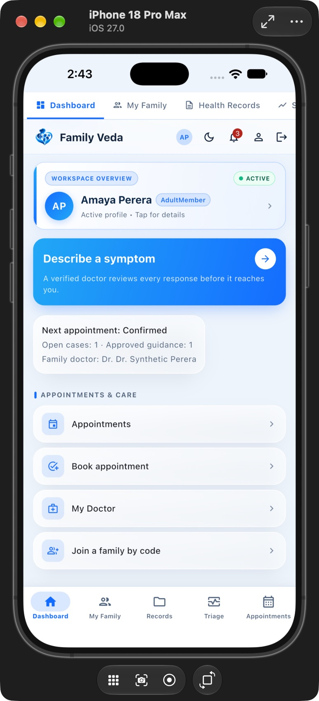

### 02-ios-review-before-submit

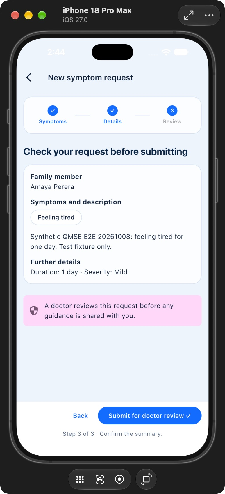

### 03-ios-submitted-awaiting-review

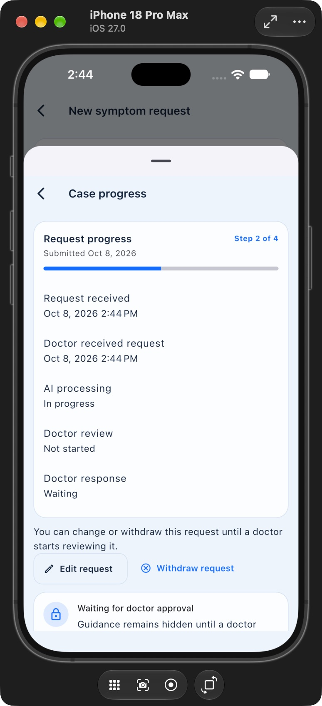

### 04-ios-case0021-no-guidance

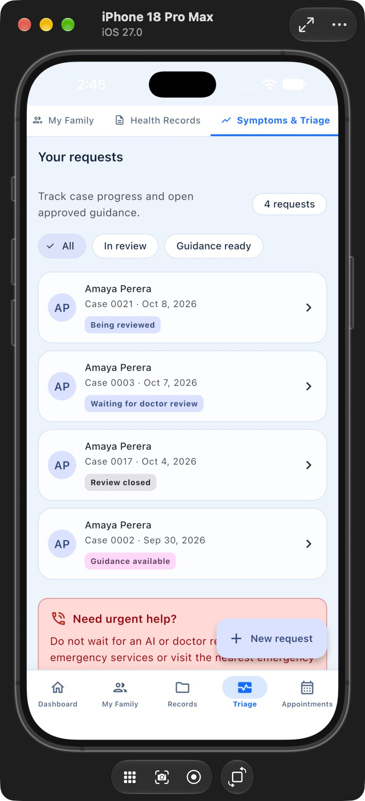

### 05-web-doctor-case0021-processing

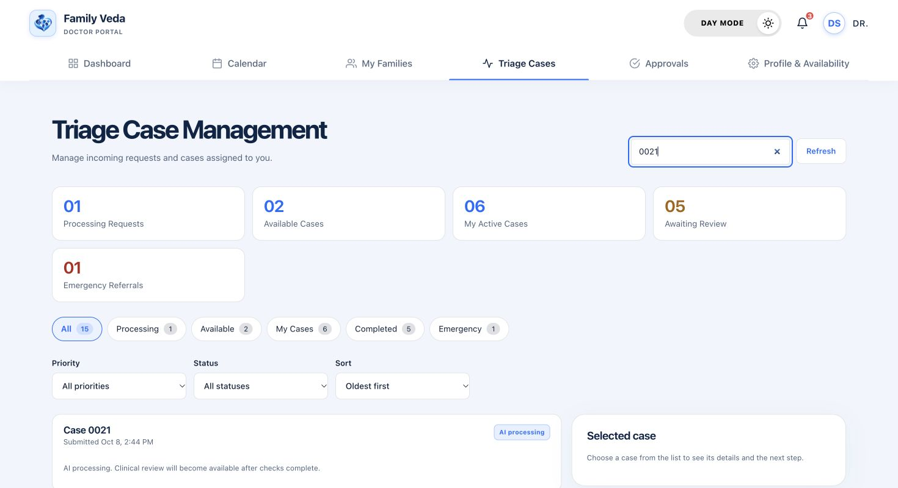

### 06-web-case0021-safe-failure

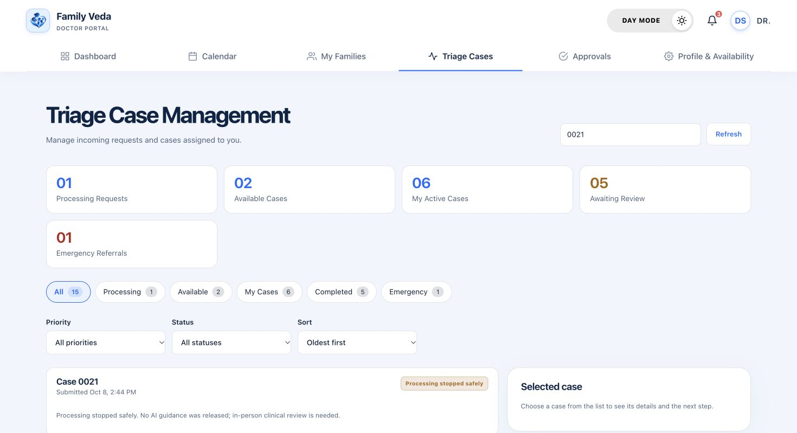

### 07-ios-case0021-safe-failure

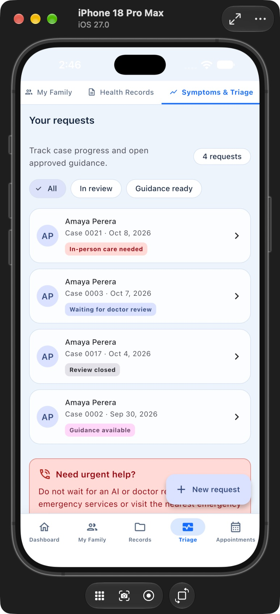

### 08-ios-seeded-case0003-before-approval

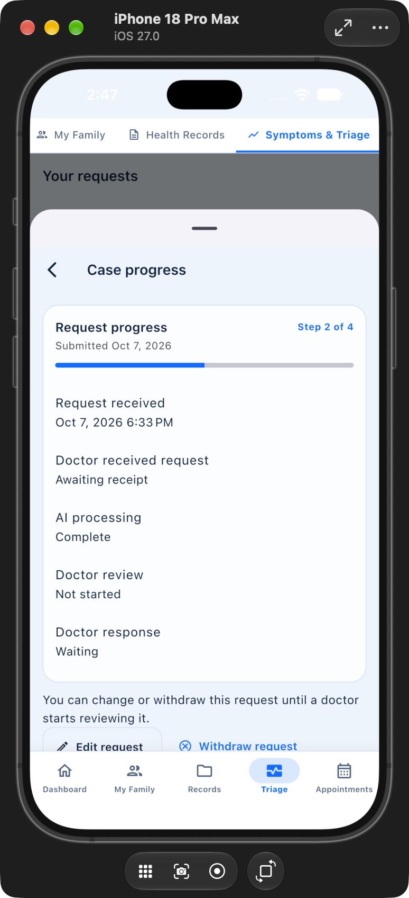

### 09-web-case0003-doctor-review

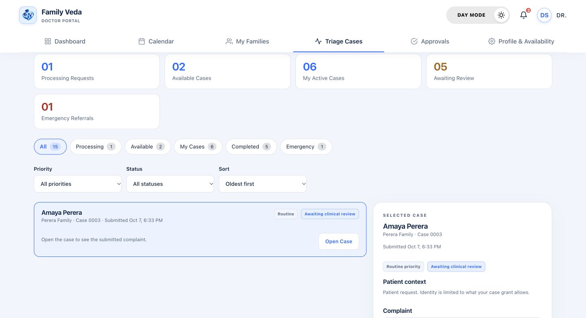

### 10-web-seeded-case0003-before-decision

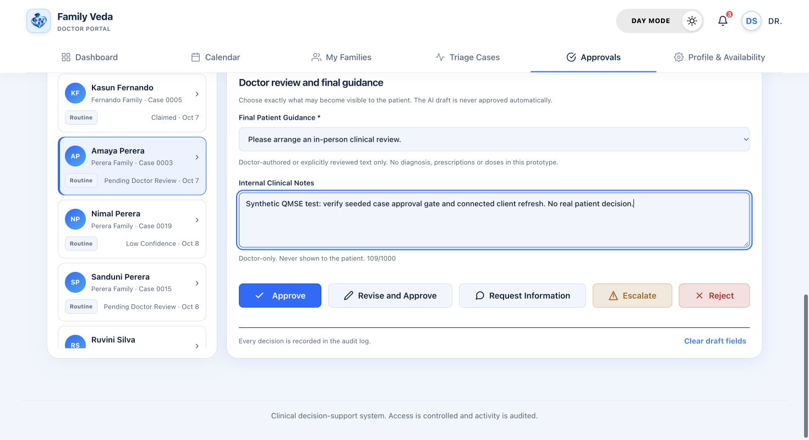

### 11-web-seeded-case0003-approved

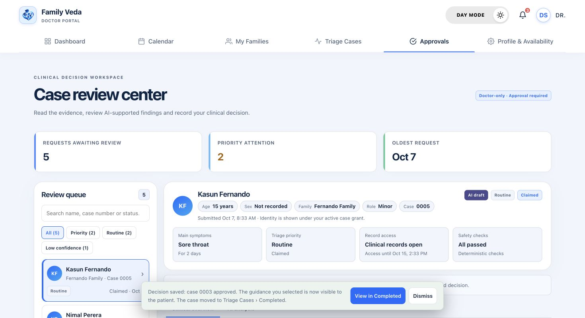

### 12-ios-case0003-approved-internal-notes-visible

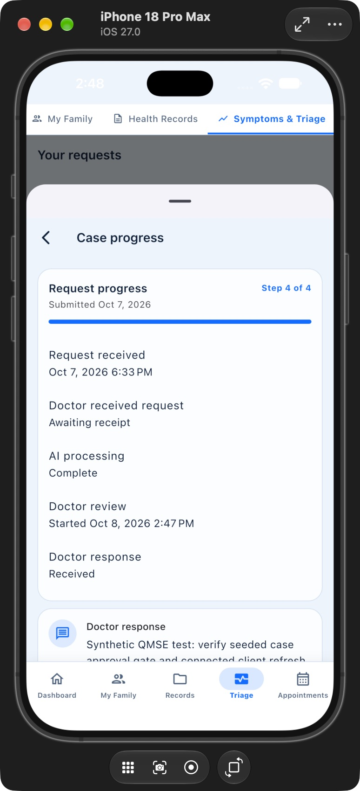

## Hosted-agent golden journey — 8 October (after the defect fix)

The fresh case in the run above failed safe because the local API had no working provider configuration. The journey was repeated with the provider keys loaded, using `scripts/e2e/hosted_agent_golden_journey.py` against a disposable database and a local API (port 5095). The agents called the hosted Gemini model; all data is synthetic.

| Variant | Case ID | Pipeline outcome | Checks |
|---|---|---|---|
| Seeded member with recorded vitals and labs | `942a0b6d-3293-4d3b-8cfe-6e85b3ce3eff` | PendingDoctorReview in 30.1 s; Context 0.90 and Analysis 0.88 confidence; draft advisory produced | 11 passed, 0 failed |
| Newly registered member with no health data | `a36a0387-89ce-4444-8257-bf437e0f3b02` | LowConfidence in 20.2 s; agents report NoData; no draft advisory | 10 passed, 0 failed |

Checks in each run: guidance returns 404 before any decision; a family user gets 403 on the doctor-only review; every completed agent step is schema-valid and uses only allow-listed tools (none denied); guidance is still 404 after the agents finish; the family progress view carries step metadata only; after the doctor approves, the family reads the approved guidance; the internal doctor note is absent from every patient response; no overdue-review marker remains.

This is an API-driven run (no screens), so it complements the visual client run above rather than replacing it. Rerun: start a local API with the provider keys and `Seed__Enabled=true`, then `FV_TEST_PASSWORD=<private> FV_TEST_SEEDED_HEAD_EMAIL=demo-head@example.invalid python3 scripts/e2e/hosted_agent_golden_journey.py` (omit the e-mail variable for the new-member variant). Evidence: [seeded member](evidence/2026-10-08-hosted-golden/journey-seeded-member.txt) · [new member](evidence/2026-10-08-hosted-golden/journey-new-member-low-confidence.txt).
