# Current iOS screenshot capture attempt - 8 October 2026

- Source revision: `3bb6c192a379f73eccbfea2745f6fee26fec87e4`, with existing uncommitted workspace changes.
- Flutter 3.47.5 / Dart 3.13.4; Xcode 27.0 (27A266a).
- Build: `flutter build ios --simulator --debug --no-pub --dart-define=API_BASE_URL=https://family-veda-api-production.up.railway.app/api/v1 --dart-define=APP_ENV=production` from `mobile/`.
- Result: `Xcode build done. 205.1s`; `Built build/ios/iphonesimulator/Runner.app`.
- Bundle: `lk.familyveda.familyveda`.
- Installed on iPhone 17 Pro, iOS 26.5, simulator `DCA2D161-A099-4FD4-AD30-C33E376A44D2`.
- Launch tool reported success, but subsequent UI snapshot had no usable interaction targets; screenshot commands stalled. Rendering was subsequently verified by direct screenshot; authenticated login has not been verified.
- An iPhone 18 Pro / iOS 27 fallback boot was attempted; installation returned CoreSimulator code 405 (device still Booting).
- Host load average observed at 309.25; commands were severely delayed. This observation does not establish the underlying cause of the simulator failure.
- Current login screen rendered and was captured at native 1206 x 2622 resolution: `01-login.png`. Existing September/October screenshots remain historical.
- No application code, dependency lockfile, signing, permissions or backend settings were deliberately changed. Flutter build refreshes generated build configuration.

Status: build/install and login-screen rendering verified; authenticated screen capture pending. No new test-suite execution or integrated-workflow verification.

## Current screenshot

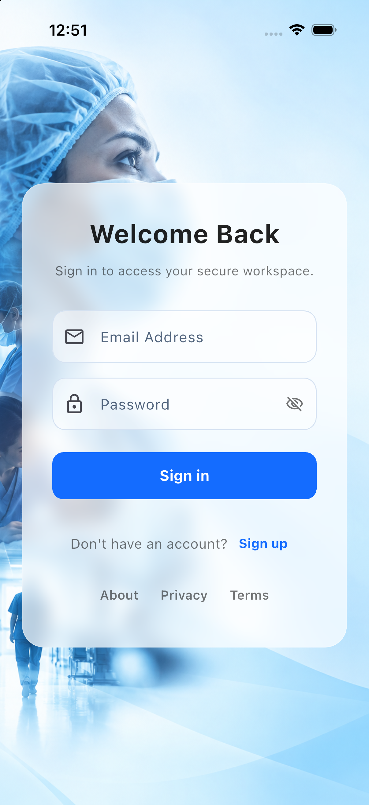

## Remaining capture blocker

Repeated XcodeBuildMCP tap/type actions reported success but left text fields empty and navigation unchanged. No credential was visibly entered and no successful authenticated session was observed. Current dashboard, records, triage, approvals and guidance captures remain pending. iOS 27 fallback boot failed with `launchd failed to respond` / CoreSimulator timeout; no project configuration change was made to bypass it.

## Doctor session captured after user sign-in

The user signed in as the synthetic doctor and supplied the iPhone 18 Pro Max screenshot. On 8 October 2026 the live doctor session was inspected in Device Hub on iPhone 18 Pro Max / iOS 27.0, simulator `5B7C260A-6494-410F-887A-6DBC8DB29427`. This is a different simulator from the earlier login capture. The app was already running; the precise installed build revision/API configuration on this second simulator was not independently established. Do not attribute the earlier build provenance to these captures.

Device Hub navigation opened the following screens. Native simulator PNGs were saved, without approving cases, changing records, or changing the application source.

| Screenshot | Observed state |
|---|---|
| [Doctor dashboard](02-doctor-dashboard.png) | Dr. Synthetic Perera, active Doctor workspace |
| [Triage cases](03-doctor-triage-cases.png) | Processing requests (12); existing dated case rows |
| [My Families](04-doctor-families.png) | 4 assigned households, 2 new requests, next appointment 9 October |
| [Calendar](05-doctor-calendar.png) | 8 October selected, 0 today, 5 pending, 7 this month |

These screenshots verify current rendered screens and navigation only. They do not establish backend test success, permission enforcement, completion of processing, or the connected Flutter/React approval workflow. Profile capture remains pending because Device Hub input became unavailable (`noWindowsAvailable`).

### Doctor dashboard

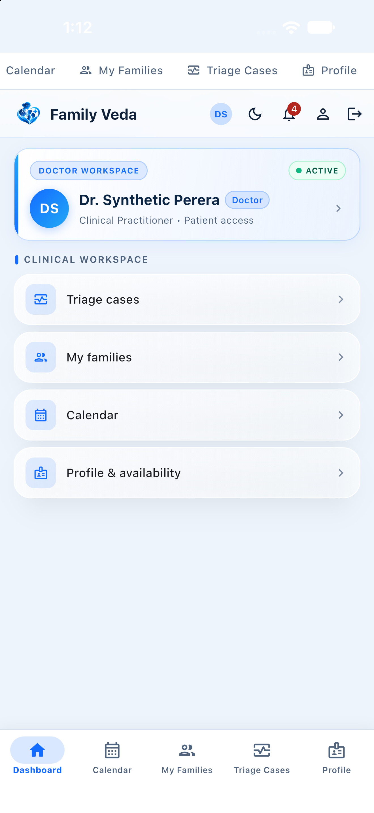

### Triage cases

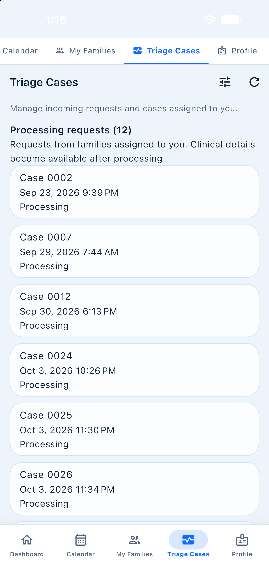

### My Families

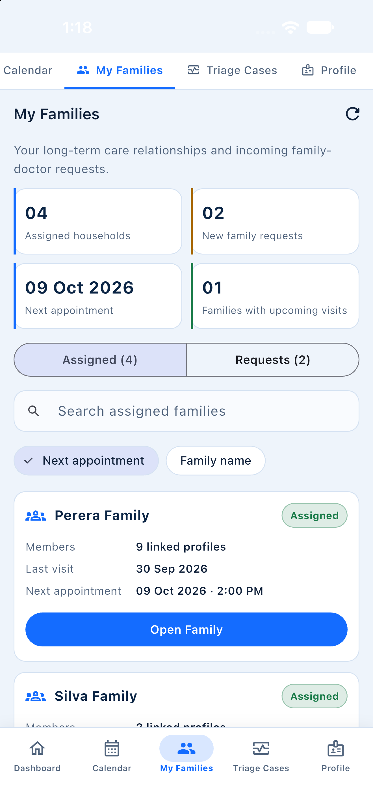

### Calendar

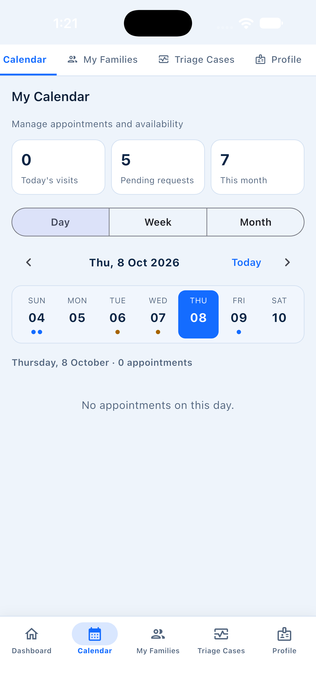

## 2026-10-08 — iOS startup/simulator recovery

User clarified issue is startup/simulator freeze, not triage Processing. Shut down only the extra iPhone 17 Pro simulator DCA2D161; left user-selected iPhone 18 Pro Max 5B7C260A running. Terminated/relaunched Family Veda without erasing simulator or uninstalling app. simctl launch returned exit 0 in 1.72 seconds (command duration, not first-frame timing). Verified doctor dashboard, Calendar navigation and return to dashboard through Device Hub; app left open on dashboard. Sample of Runner74687 showed main and raster threads waiting normally, and AXBinaryMonitorQueue scanning loaded images heavily. Host load remained elevated; this supports environment contention but does not prove a permanent app bug/root cause. No application code, auth logic, lockfiles or permissions changed. Existing Xcode/Flutter workspace modifications predated this pass and were retained.

## Additional doctor and Family Head screenshots - 8 October 2026

Captured on the live iPhone 18 Pro Max / iOS 27.0 simulator. Doctor signed out; synthetic `demo-head@example.invalid` signed in through the normal login form. Credentials are not included. Doctor profile capture is now completed, superseding the earlier pending note. App left open on the Family Head dashboard. No case decisions, record changes, consent toggles or appointment actions performed.

### Doctor Profile Availability

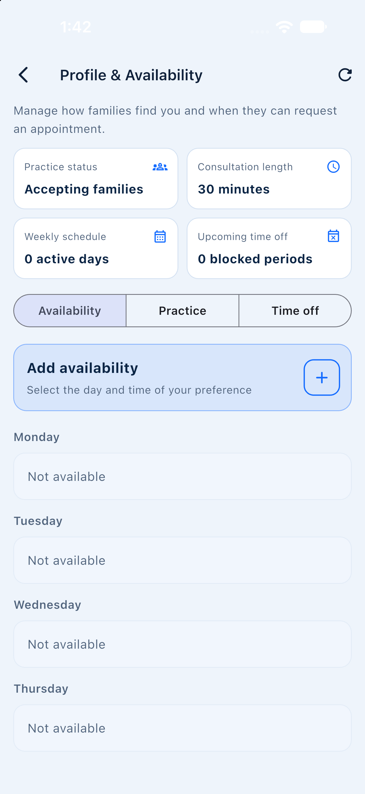

### Doctor Practice

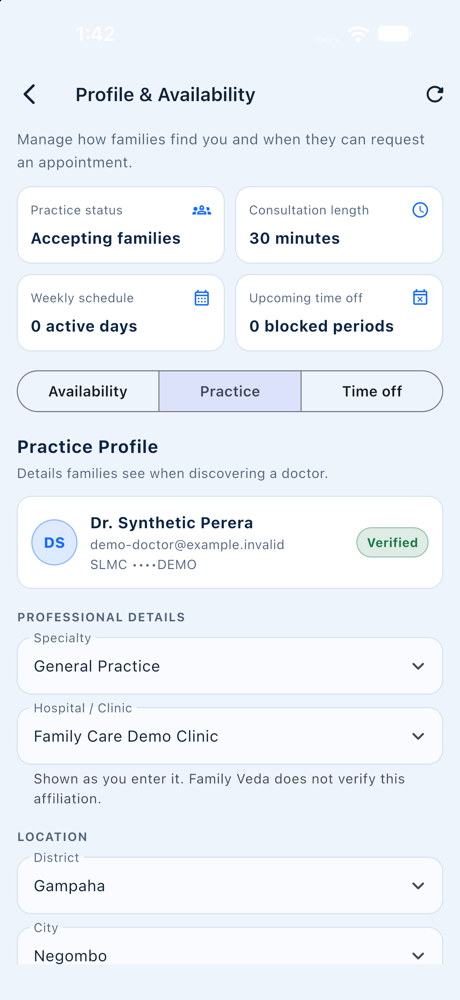

### Head Dashboard

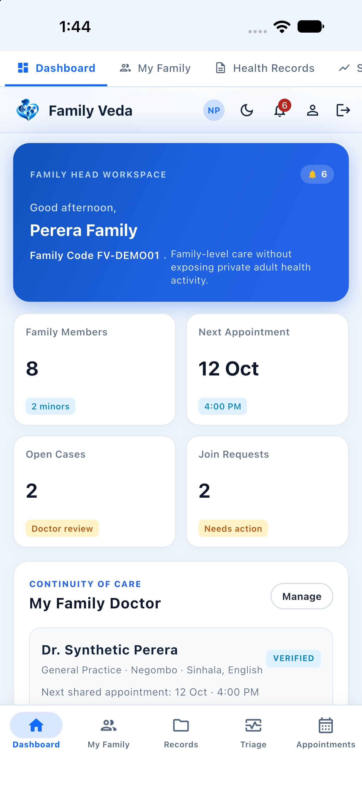

### Head Family

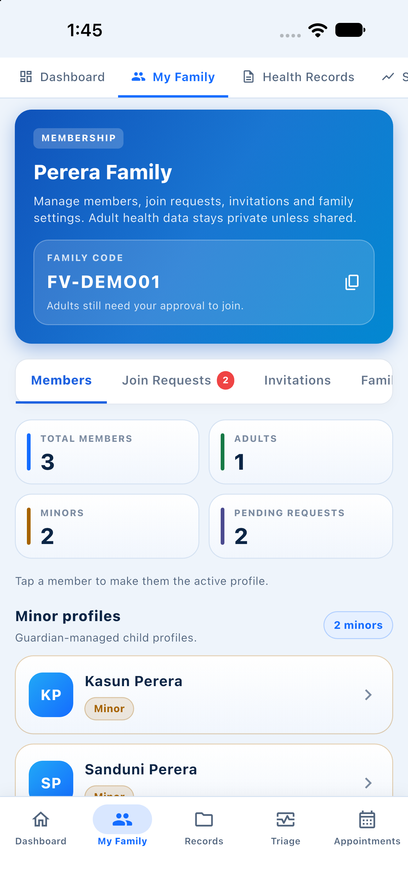

### Head Records

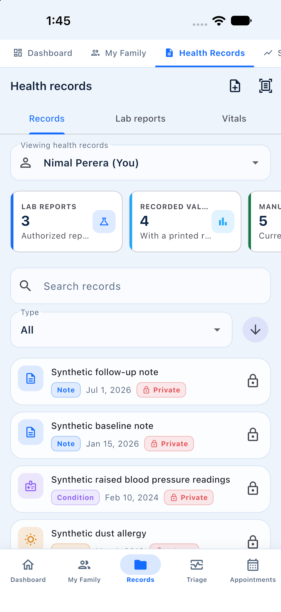

### Head Lab Reports

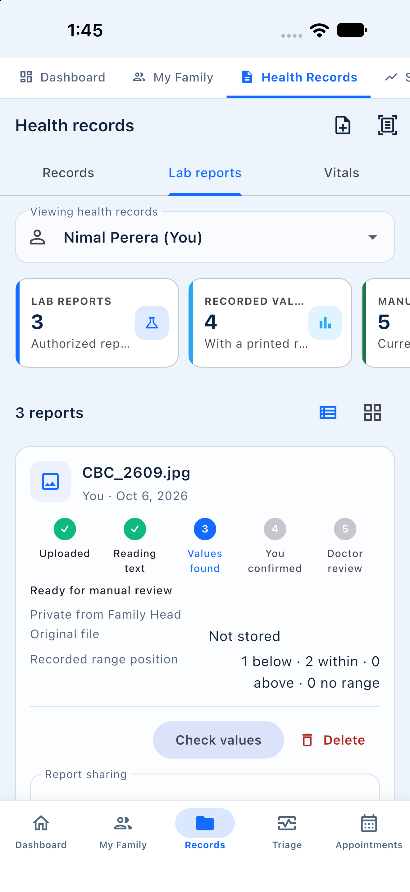

### Head Vitals

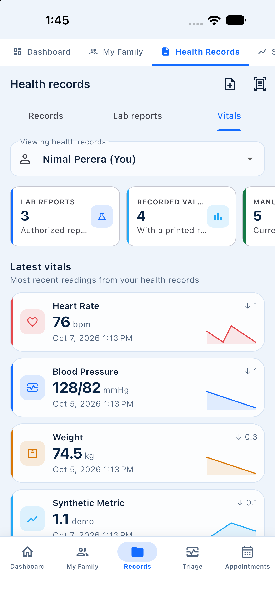

### Head Triage

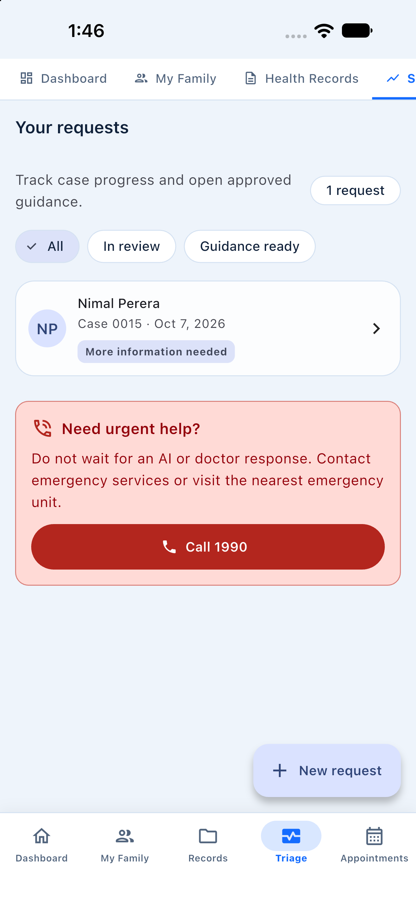

### Head Appointments

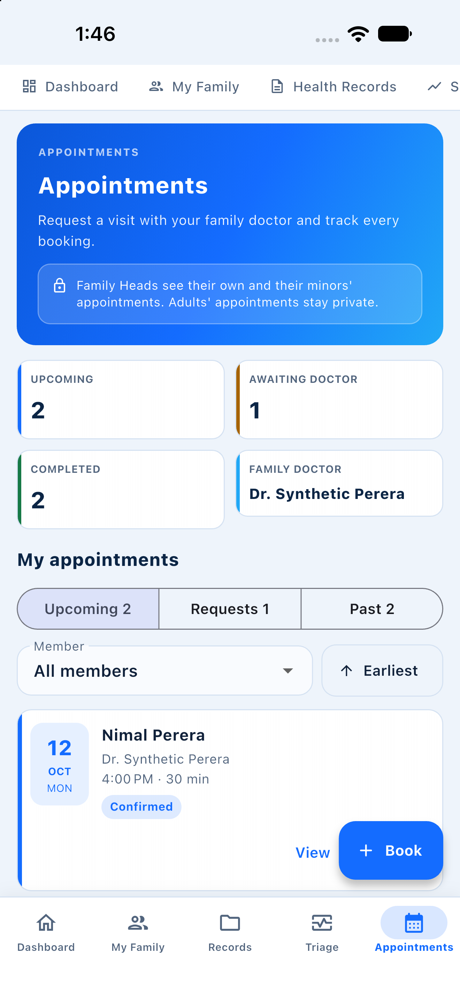

### Head My Doctor

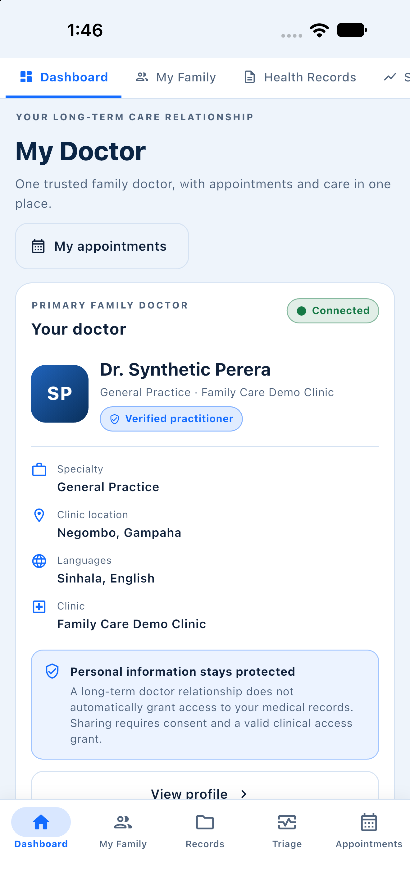

### Head Privacy Access

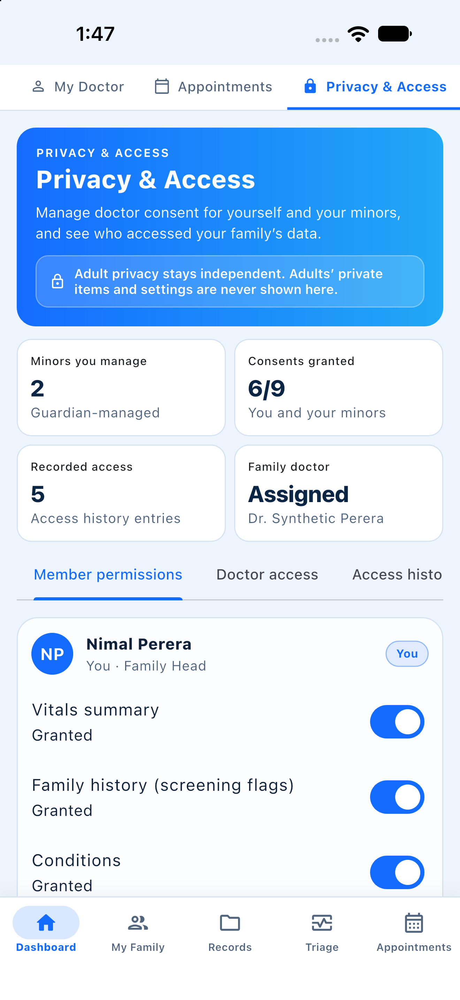

### Head Notifications

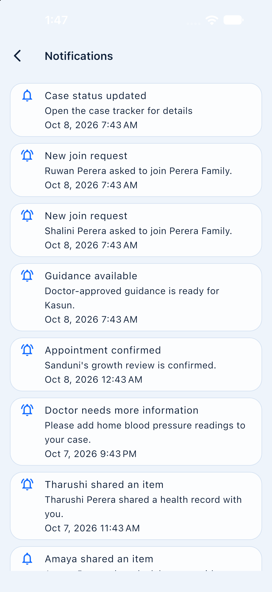

