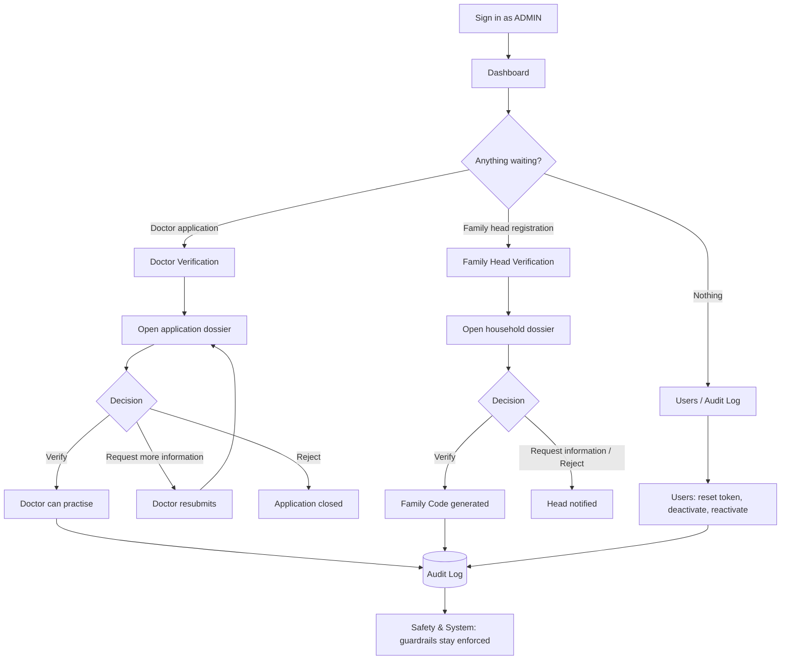

# Clinic Admin Portal

Role: `ADMIN` · Portal name in the app: **Clinic Admin Portal**

The Clinic Admin keeps the platform trustworthy: verifies doctors and family heads, manages accounts, and reads the audit trail. The admin **never sees members' health data** — every screen here shows identity, status and access metadata only.

Other portals: [Doctor](doctor.md) · [Family Head](family-head.md) · [Adult Member](adult-member.md)

## Flow

## Tabs

| Tab | Route | Purpose |
|---|---|---|
| Dashboard | `/dashboard` | Platform health and work waiting for the admin |
| Doctor Verification | `/doctor-verification` | Review and decide doctor applications |
| Users | `/users` | Account directory and security actions |
| Audit Log | `/audit` | Who accessed or changed what, and when |
| Safety & System | `/settings` | Read-only view of the clinical guardrails |

Family Head Verification (`/family-head-verification`) is part of the same portal and is reached by direct link; it has no entry in the top navigation.

---

### 1. Dashboard

Header shows a greeting and a **"10 safety rules always on"** badge.

**Platform metrics** — four cards, each a link:

| Card | Shows | Opens |
|---|---|---|
| Doctors awaiting verification | Pending and more-info-requested applications; badge "Needs action" or "Queue clear" | Doctor Verification |
| Verified doctors | Verified count, with total registered | Doctor Verification |
| Family accounts | Family user accounts, with total accounts | Users |
| Deactivated accounts | Deactivated count; history is kept | Users |

**Needs Attention** — up to five doctor applications waiting, each with name, specialty, masked SLMC number (last four digits) and status. "Open queue" jumps to Doctor Verification.

**Recent Activity** — latest audit events in plain language (event, resource type, time). "Audit Log" opens the full log.

### 2. Doctor Verification

Table of every doctor application.

- **Search** — doctor, hospital or registration number.
- **Columns** — Doctor · Medical Reg No. · Specialization · Hospital / Clinic · Status · Actions.
- **Doctor Application Dossier** — full registration details for one doctor, opened from the row.
- **Decisions** — verify, request additional information, reject, suspend, re-verify.
- **Generate reset password token** — one-time token shown once to the admin, for a doctor locked out of their account.
- **Deactivate doctor account** — confirmation dialog first; the account is disabled, its history is kept.

A doctor cannot see any patient or accept any family until verified.

### 3. Family Head Verification

Table of household registrations.

- **Search** — family name, head or NIC.
- **Columns** — Family Name · Head of Family · Masked NIC · Family Code · Status · Actions.
- **Household Registration Dossier** — the registration details for one household.
- **Decisions** — verify and generate the Family ID / Family Code, request additional information, reject, suspend, reactivate.
- **Generate reset password token** and **Deactivate family head account** — same behaviour as for doctors.

The NIC is always masked. Only synthetic identities exist in the system.

### 4. Users

**User Directory** — every account on the platform.

- **Search** — name, email or role.
- **Role filter** — All Roles · Doctor · Family User · Admin.
- **Status filter** — All Statuses · Active · Suspended.
- **Columns** — User · Role · Status · Security Actions.
- **Security actions** — generate a one-time password reset token, deactivate, reactivate.

### 5. Audit Log

"Who accessed or changed what, and when." Clinical content is never shown — only access details.

- **Columns** — Event · Resource · Time · Outcome.
- **Show only agent tool-permission events** — filters to `TOOL_*` events written by the backend dispatcher.
- **Denied tool calls** — a red badge counts `TOOL_DENIED` events on the page: an agent asked for a tool outside its allow-list and the dispatcher blocked it.
- **Pagination** — 20 events per page.

The portal component also contains an **Audit Activity** view (search, per-row **Audit Event Metadata** inspector, CSV export), but no route opens it today — `/audit` serves the page described above.

### 6. Safety & System

**10 Clinical Safety Invariants** — a read-only board. Each guardrail shows an "Enforced" badge. It covers:

- No guidance reaches a patient without licensed-doctor approval.
- Prompt templates prohibit diagnostic certainty; output is informational triage only.
- The Safety & Validation gate is deterministic code, not LLM judgement.
- LLM routing: Gemini primary, Groq fallback, synthetic data only.
- The Context agent reads only records the family consented to share.
- No real NICs, SLMC numbers or patient data exist in the system.

Nothing on this tab can be switched off — there is no bypass path.

## Also available

- **Notifications** (bell) and **Profile** (`/profile`) — own account details and password change.

## Rules this portal enforces

- Admin screens carry no clinical content (safety rules 7 and 8).
- Every verification decision and security action writes an audit row.
- Authorisation is checked by the ASP.NET Core API; the UI only reflects it.

## Mobile app

The Flutter app has no admin screens. Clinic administration is a web-only console.
