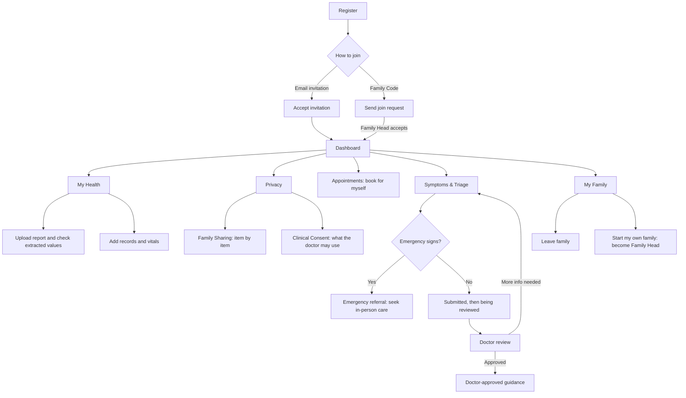

# Adult Member Portal

Role: `MEMBER` · Portal name in the app: **Adult Member Portal**

An adult member manages their own health inside a family. Their data is **private by default**: the Family Head and the family doctor see only what the adult chooses to share or consents to.

Other portals: [Clinic Admin](admin.md) · [Doctor](doctor.md) · [Family Head](family-head.md)

## Flow

## Tabs

| Tab | Route | Purpose |
|---|---|---|
| Dashboard | `/dashboard` | Own health at a glance |
| My Health | `/records` | Own lab reports, records and vitals |
| Appointments | `/appointments` | Book and manage own appointments |
| Symptoms & Triage | `/triage` | Report symptoms and follow the request |
| My Family | `/my-family` | Membership and family options |
| My Doctor | `/my-doctor` | The family doctor and available times |
| Privacy | `/privacy` | Sharing and clinical consent |

---

### 1. Dashboard

**My metrics** — four cards, each a link:

| Card | Shows | Opens |
|---|---|---|
| Next Appointment | Date and time, or "Book when needed" | Appointments |
| My Health Cases | Open symptom requests; "Doctor review" while one is open | Symptoms & Triage |
| Approved Guidance | Guidance a doctor has approved | Symptoms & Triage |
| My Reports | Own reports; "Private unless you share" | My Health → Labs |

**Sections**

- **My Family Doctor** — the family's doctor. The Family Head chooses the doctor.
- **Quick Actions** — Upload Report · Report Symptoms · Add Vital · Book My Appointment.
- **Recent Health** — latest own records, reports and vitals.
- **Who Can See My Data?** — a plain summary of current sharing, linking to Privacy.

### 2. My Health

Same workspace as the Family Head's Health Records, limited to the member's own profile. Three views:

**Labs**

- **Lab reports** — upload a PNG, JPEG or PDF. The original is kept and can be previewed.
- **Check extracted values** — confirm or correct the values read from the report against the original.
- **Confirmed report values** — each value against its recorded reference range; out-of-range values are flagged.
- **Potential hereditary screening flags** — informational screening indication only, never a diagnosis.

**Records**

- **Health records** — search and filter own history.
- **Add health record** / edit — record details including status, severity and doctor or healthcare provider.

**Vitals**

- **Log New Vital** — type, value, unit, date.
- **Recorded Vitals** — dated list of readings.
- **Trend Progress** — one trend per vital type.

Everything added here is private until shared under Privacy.

### 3. Appointments

- **Book an appointment** — for the member only, with the family doctor: date, time slot, reason and an optional attachment. If the family has no doctor yet, booking waits until the Family Head chooses one.
- **My appointments** — list with status. Requested and Confirmed appointments can be cancelled.

### 4. Symptoms & Triage

"Tell us how you're feeling."

**New request — three steps**

1. **Symptoms** — what has been bothering you, with common-symptom chips.
2. **Details** — severity, duration and extra detail.
3. **Review** — check the request before submitting.

**Your requests** — every submitted request with its status.

**Request progress** — Submitted → Being reviewed → Doctor review → Guidance available. Other outcomes:

- **Waiting for more information** — the doctor asked for more detail.
- **In-person review needed** / **Please seek in-person care** — the system defers to in-person care; in an emergency a referral is shown instead of any AI output.
- **Doctor-approved guidance** — shown only after a doctor approves it.

Agent traces and unapproved AI output are never shown to the member.

### 5. My Family

**Membership** — family name, Family Head, own role, family doctor, and the member count. Names and roles only; nobody sees the member's private health data here.

**Family Options**

- **Start My Own Family** — create a new household and become its Family Head. Account and health history come along.
- **Leave Family** — manage health alone. Items shared with the family become private again.
- **Join using a Family Code** — opens the join page (`/join-family`): enter a code, and track **My requests**.

Start and Leave both ask for confirmation first.

### 6. My Doctor

- **Your family doctor** — profile of the doctor the Family Head chose.
- **Available appointment times** — choose a date to see open slots.

Adult members cannot change the family doctor; the directory search is Family Head only.

### 7. Privacy

- **Family Sharing** — choose, item by item, which reports and records the Family Head can see. Everything starts private.
- **Clinical Consent** — what the family doctor may use during a visit or a triage case, by category. Withdrawing consent closes that category to the doctor.

Every consent change is recorded in the audit log.

## Also available

- **Family screening indications** (`/family-risk`) — doctor-approved screening indication, if one exists.
- **Notifications** (bell), **Profile** (`/profile`) and the **Emergency help** shortcut.

## Rules this portal enforces

- Private by default; sharing and consent are explicit and audited (rule 8).
- Guidance appears only after doctor approval (rules 2 and 3).
- Family history yields a screening indication, never a diagnosis (rule 5).
- Emergency signs show a referral, not AI output (rule 10).

## Mobile app

Flutter provides the same features with native screens on the same API: home dashboard, records (lab upload, record entry, vital entry), symptom submission, case status, approved guidance, appointments, join family, my doctor, notifications, profile and the emergency screen.
