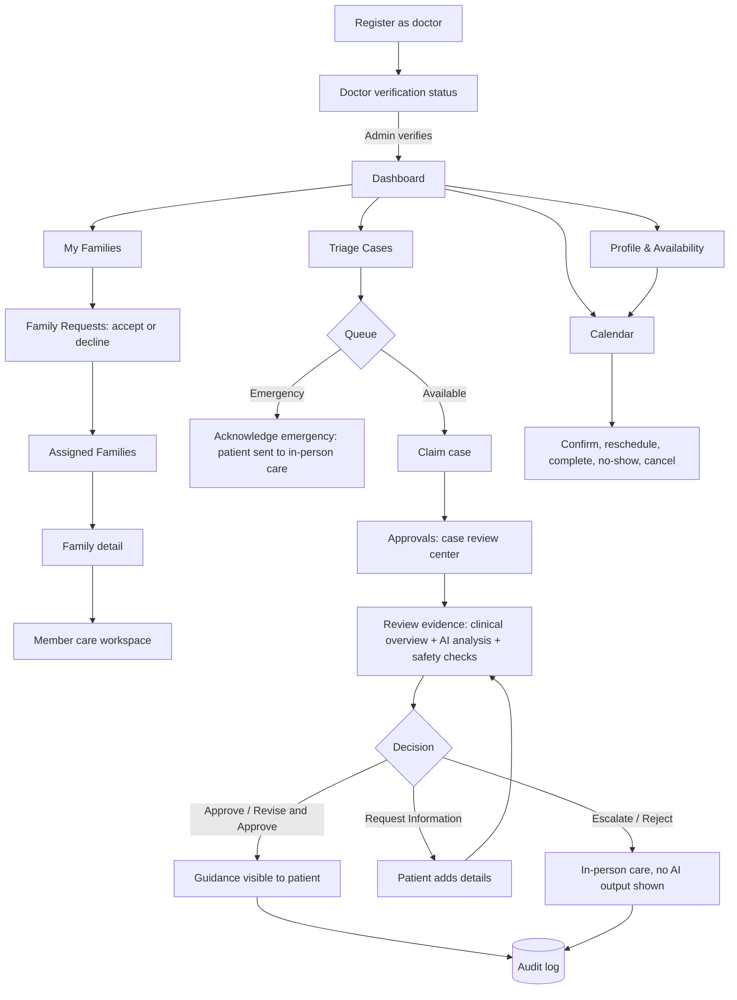

# Doctor Portal

Role: `DOCTOR` · Portal name in the app: **Doctor Portal**

The doctor is the human approval gate. AI agents prepare a structured, non-diagnostic summary; **nothing reaches a patient until a verified doctor approves it**. Access to a member's clinical data is by grant — a confirmed visit or a shared case, with the member's consent — never by role alone.

Other portals: [Clinic Admin](admin.md) · [Family Head](family-head.md) · [Adult Member](adult-member.md)

## Flow

## Tabs

| Tab | Route | Purpose |
|---|---|---|
| Dashboard | `/dashboard` | Today's work at a glance |
| Calendar | `/calendar` | Appointments by month, week or day |
| My Families | `/families` | Assigned families and incoming requests |
| Triage Cases | `/cases` | Case queues: claim, track, acknowledge |
| Approvals | `/approvals` | Review AI output and decide what the patient sees |
| Profile & Availability | `/doctor-profile` | Practice details and bookable hours |

Before verification the only screen available is **Doctor verification status** (`/doctor-status`).

---

### 0. Doctor verification status

- **Complete Profile Submission** — shown until the registration details are complete.
- **Doctor Profile & Status** — submitted details and the current status (pending, more information requested, verified, rejected, suspended).
- **Verification Notice** — what the admin is waiting for.

### 1. Dashboard

**Doctor metrics** — four cards, each a link:

| Card | Shows | Opens |
|---|---|---|
| Today's Appointments | Count, with the next start time | Calendar |
| Pending Approvals | Cases waiting for a decision; "Action required" when above zero | Approvals |
| Open Triage Cases | Open cases, with the number flagged priority | Triage Cases |
| Family Requests | Families asking for this doctor | My Families → Family Requests |

**Sections**

- **Today's Schedule** — today's appointments in time order.
- **Needs Attention** — priority items: approvals, priority cases, pending requests.
- **My Families** — assigned families for longitudinal care.
- **Clinical Timeline** — recent permitted activity: appointments and granted cases only.
- **Family Requests** — pending requests with accept / decline.

### 2. Calendar

- **Appointment summary** — counts for the visible range.
- **View switch** — Month · Week · Day. Phones open on Day view with a date strip.
- **Navigation** — previous, Today, next.
- **Selected day** — side panel listing that day's appointments (Month and Week views).
- **Manage availability** — shortcut to Profile & Availability.

**Appointment details drawer** — opens from any appointment:

- Member, time, status, **Reason for visit**, **Your note**.
- Actions by status: confirm, reschedule (pick a new time), mark complete, mark no-show, cancel. Each asks for confirmation.

### 3. My Families

Summary stats sit above two views.

**Assigned Families**

- Search assigned families.
- One card per family: name, member count, upcoming visits. A one-person household shows as "Individual patient".

**Family Requests**

- **Awaiting your response** — families that asked for this doctor as their long-term doctor. Accept or decline. The assignment starts only after acceptance.

**Family detail** (`/families/:familyId`)

- Notice: assignment makes the doctor *eligible* to care for the family; it is not blanket clinical access.
- **Household members** — member directory with an **Access status** filter: All members · Active care grant · Restricted.

**Member care workspace** (`/members/:memberId`) — six tabs:

| Tab | Contents |
|---|---|
| Overview | Member summary and which data categories are open to this doctor |
| Records | Health records the member recorded, newest first |
| Labs | Uploaded reports with the values the member confirmed |
| Vitals | Readings grouped by measurement and unit, with trend |
| Visits | Appointments with this doctor: Upcoming and Past |
| Notes | Doctor-only clinical notes with full amendment history; never shown to the patient or family |

Categories the member has not consented to stay closed, and restricted categories are never counted or hinted at.

### 4. Triage Cases

**Triage Case Management.** Search by case reference.

**Queue summary** — Available Cases · My Active Cases · Awaiting Review · Emergency Referrals.

**Case queues**

| Queue | Contents |
|---|---|
| Available | Unclaimed cases this doctor may take |
| My Cases | Cases this doctor claimed |
| Completed | Cases with a recorded decision |
| Emergency | Emergency referrals — the patient was shown a referral, not AI output |

**Selected case preview** — Patient context · Complaint · Workflow status, plus the one action that applies:

- **Claim Case** — take an available case.
- **Acknowledge Emergency** — confirm the referral was seen.
- **Open Approval Desk** — case is ready for a decision.
- **Review Available Evidence** — partial evidence only.

If processing stopped safely, the preview says so and no AI output is offered for review.

### 5. Approvals

**Case review center** — the clinical decision workspace.

**Approval queue summary** — queue size and oldest waiting case.

**Review queue** — search, plus filters: All · Priority · Routine · Low confidence.

**Case workspace**

- **Patient snapshot** — member, patient details, submission time, priority and status, with an "AI draft" badge. Identity is shown under the doctor's active case grant.
- **Clinical overview** tab — why the case needs review, **Vital signs overview** (select a card for its history) and **Supporting reports**.
- **AI analysis** tab — plain-language AI findings, then one card per agent: Context, Analysis, Familial risk, Safety validation. Raw technical traces sit in an expandable section. This is doctor-only and never appears on a patient screen.
- **Deterministic safety checks** — Safety/Validation agent completed · every agent output matched its JSON schema · no agent requested a tool outside its allow-list.

**Doctor review and final guidance** — the decision gate:

- **Final Patient Guidance** — chosen from approved wording only. No diagnosis, no medicine names, no doses.
- **Internal Clinical Notes** — doctor-only, up to 1000 characters.
- **Decisions** — Approve · Revise and Approve · Request Information · Escalate · Reject.
- A confirmation dialog repeats exactly what will become visible to the patient. Every decision is written to the audit log.

Familial risk output is a **screening indication**, never a diagnosis.

### 6. Profile & Availability

1. **Practice Profile** — specialty, hospital / clinic, languages and other details families see in the doctor directory.
2. **Weekly Availability** — working days with one or more time ranges; these become bookable slots.
3. **Time Off & Blocked Periods** — holidays, leave and unavailable times, with a list of upcoming blocked periods.

## Also available

- **Notifications** (bell) and **Profile** (`/profile`).
- **Emergency help** shortcut in the header.

## Rules this portal enforces

- No AI output is patient-visible without a doctor decision (safety rules 2 and 3).
- Safety checks are deterministic, not LLM judgement (rule 4).
- Every cross-profile read is consented and audited (rule 8).
- Guidance wording excludes diagnosis, drug names and dosing (rules 1 and 6).

## Mobile app

Flutter covers Calendar, My Families, family detail, member workspace, Triage Cases and Profile & Availability with native widgets on the same API. The Approvals review desk is web-only.
