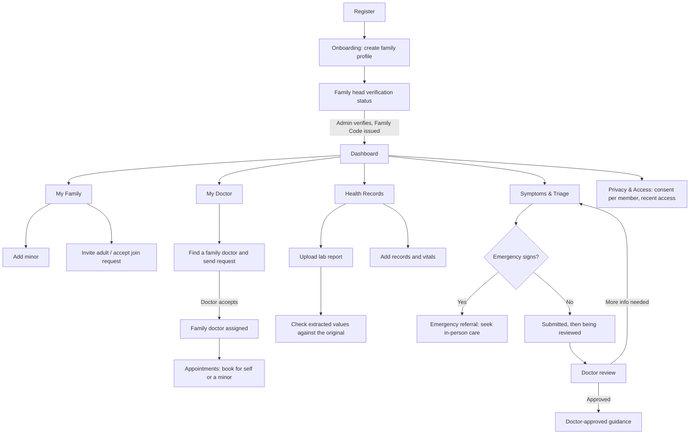

# Family Head Portal

Role: `FAMILY_HEAD` · Portal name in the app: **Family Head Portal**

The Family Head runs the household: adds minors, invites adults, chooses the family doctor, and manages health for themselves and their minors. An adult member's health data stays private unless that adult shares it.

Other portals: [Clinic Admin](admin.md) · [Doctor](doctor.md) · [Adult Member](adult-member.md)

## Flow

## Tabs

| Tab | Route | Purpose |
|---|---|---|
| Dashboard | `/dashboard` | Family overview and what needs action |
| My Family | `/family` | Members, join requests, invitations, settings |
| Health Records | `/records` | Lab reports, records and vitals for self and minors |
| Symptoms & Triage | `/triage` | Report symptoms and follow the request |
| My Doctor | `/my-doctor` | Family doctor, available times, doctor directory |
| Appointments | `/appointments` | Book and manage appointments |
| Privacy & Access | `/privacy` | Consent, sharing and access history |

Before verification the screens available are **Onboarding** (`/onboarding`) and **Family head verification status** (`/family-head-status`).

---

### 0. Onboarding and verification

- **Create your family profile** — family name and head details.
- **Family head verification** — "Registration received & pending review" until the clinic admin verifies, then "Account Verified" with the Family Code.

### 1. Dashboard

**Family metrics** — four cards, each a link:

| Card | Shows | Opens |
|---|---|---|
| Family Members | Member count, with number of minors | My Family → Members |
| Next Appointment | Date and time, or "Book when needed" | Appointments |
| Open Cases | Symptom requests still in review | Symptoms & Triage |
| Join Requests | Requests waiting for a decision | My Family → Join Requests |

**Sections**

- **My Family Doctor** — the assigned doctor, or a prompt to choose one.
- **Needs Attention** — join requests, pending invitations and other items needing a decision.
- **Members** — family overview: names and roles.
- **Quick Actions** — Add Minor · Invite Adult · Upload Report · Book Appointment · Report Symptoms.
- **Health Tools** — Check Report Values · Report Symptoms · Search My Records.
- **Recent Activity** — shared items only; an adult's private data never appears here.

### 2. My Family

The Family Code is shown in the header. Four sub-tabs; tabs with waiting items show a count.

**Members**

- **Members** — everyone in the family with role and status.
- **Add minor** — create a guardian-managed profile for a child.
- **Consent** (per selected member) — the consent categories the head may manage. Minors are managed by the head; adults decide for themselves.
- **Relationships** (per selected member) — family relationships, used only for the family-history screening indication.

**Join Requests**

- **Pending join requests** — adults who entered the Family Code. Accept or decline each one.
- **Invitations for you** — invitations this account received from another family.

**Invitations**

- **Invite adult** — send an email invitation.
- **Invitations** — sent invitations and their status, with Resend and Cancel.

**Family Settings**

- **Family name** — rename the family.
- **Family Code** — read-only, with "Copy code". Sharing the code lets an adult *request* to join; the head still decides.
- **Transfer Family Head** — offer the head role to an adult member. The transfer completes only when they accept.

### 3. Health Records

Choose whose records to view: yourself or a minor you manage. A **Records summary** strip sits above three views.

**Labs**

- **Lab reports** — upload a PNG, JPEG or PDF. The original file is kept and can be previewed.
- **Check extracted values** — values read from the report are shown next to the original for the user to confirm or correct. Extracted text is treated as untrusted until confirmed.
- **Confirmed report values** — each value against its recorded reference range; out-of-range values are flagged.
- **Shared reports** — reports an adult chose to share with the head (read-only).
- **Potential hereditary screening flags** — informational screening indication only, never a diagnosis.

**Records**

- **Health records** — search and filter the history.
- **Add health record** / edit — record details including status, severity and doctor or healthcare provider.

**Vitals**

- **Log New Vital** — type, value, unit, date.
- **Recorded Vitals** — dated list of readings.
- **Trend Progress** — one trend per vital type.

### 4. Symptoms & Triage

"Tell us how you're feeling."

**New request — three steps**

1. **Symptoms** — who it is for (self or a minor), what has been bothering them, with common-symptom chips.
2. **Details** — severity, duration and extra detail.
3. **Review** — check the request before submitting.

**Your requests** — every submitted request with its status.

**Request progress** — Submitted → Being reviewed → Doctor review → Guidance available. Other outcomes:

- **Waiting for more information** — the doctor asked for more detail.
- **In-person review needed** / **Please seek in-person care** — the system defers to in-person care; in an emergency a referral is shown instead of any AI output.
- **Doctor-approved guidance** — shown only after a doctor approves it.

The family never sees agent traces or unapproved AI output.

### 5. My Doctor

- **Your family doctor** — profile of the assigned doctor.
- **Available appointment times** — choose a date to see open slots.
- **Find a family doctor** — Family Head only. Search the directory by name, specialty or district and send a request. The assignment starts after the doctor accepts.

### 6. Appointments

- **Book an appointment** — member (self or a minor), date, time slot, reason and an optional attachment. Appointments are booked with the family doctor; without one, the form points to My Doctor.
- **My appointments** — list with status. Requested and Confirmed appointments can be cancelled.

### 7. Privacy & Access

- **Consent & Sharing** — per member. Minors are managed by the head. Adults decide for themselves, so their rows are read-only here.
- **Recent Access** — who viewed or changed data the head can see, in plain language. Clinical content is never shown in this list.

## Also available

- **Family screening indications** (`/family-risk`) — doctor-approved screening indication for a profile, if one exists.
- **Audit** (`/audit`) — access events for the family.
- **Notifications** (bell), **Profile** (`/profile`) and the **Emergency help** shortcut.

## Rules this portal enforces

- Adult data is private by default; the head sees only what an adult shares (rule 8).
- Guidance appears only after doctor approval (rules 2 and 3).
- Family history yields a screening indication, never a diagnosis (rule 5).
- Emergency signs show a referral, not AI output (rule 10).

## Mobile app

Flutter provides the same features with native screens on the same API: home dashboard, members, join requests, my doctor, records (lab upload, record entry, vital entry), symptom submission, case status, approved guidance, appointments, notifications, profile and the emergency screen.
