# FINAL REPORT

## Family Veda — Longitudinal Family Health Context and Agentic Clinical Triage Platform

> **Export note (Word / PDF).** Apply the built-in Heading 1/2/3 styles to the chapter, section and sub-section headings so that the table of contents can be regenerated automatically. Use lower-case Roman numerals for the pre-body pages (Part A) and restart at Arabic numeral 1 at Chapter 1. Captions are chapter-based (for example, Table 2.1 and Figure 3.2) and should be inserted with the Word caption feature. The exact font, font size, line spacing, margins and binding must follow the SE3090 submission guideline: **[CONFIRM FORMAT WITH MODULE GUIDELINE]**. Submission file name: `SE3090_SE016`.

---

# PART A — PRE-BODY SECTION

## TITLE PAGE

<div align="center">

**[INSERT SLIIT LOGO]**

# Family Veda

### Longitudinal Family Health Context and Agentic Clinical Triage Platform

**SE3090 — Software Engineering Frameworks · Assignment 1 — Consolidated Final Report**

Year 3 Semester 1

**Group SE_016**

Faculty of Computing, Sri Lanka Institute of Information Technology (SLIIT)

</div>

*Group members*

| Ref | Student ID | Name | Component | Agent contribution |
|---|---|---|---|---|
| S1 | IT23544154 | Samaranayaka S.G.V.S | Family, Identity and Consent | No agent of its own; tool-permission enforcement layer, CI and testing lead |
| S2 | IT24101875 | Fernando K.R.N | Health Records and Extraction | Extraction Agent (OCR) |
| S3 | IT24100551 | Karunathilaka K.D.J.C (**Group Leader**) | Triage and Agent Orchestration | Coordinator, Context and Analysis Agents |
| S4 | IT24100559 | Wasala W.M.S.S.B. | Familial Risk and Clinical Approval | Familial Risk and Safety/Validation Agents |


**Date of submission:** 6 October 2026

---

## DECLARATION

We, the undersigned members of Group SE_016, declare that this report and the software system it describes are our own work, produced for the module SE3090 Software Engineering Frameworks at the Sri Lanka Institute of Information Technology. Where the ideas, text or findings of others have been used, they are acknowledged and cited in the reference list. This work has not been submitted for any other degree, diploma or assessment.

We further declare that AI-assisted development tools were used during the design, implementation and documentation of this project, in accordance with the module's permitted level of AI use. The tools used, the nature of their use and the human review applied are disclosed in Appendix E. All data used in the system, in its tests and in this report are synthetic; no real patient data have been collected, stored or processed.

| Ref | Name | Signature | Date |
|---|---|---|---|
| S1 | Samaranayaka S.G.V.S (IT23544154) | [INSERT SIGNATURE] | [INSERT DATE] |
| S2 | Fernando K.R.N (IT24101875) | [INSERT SIGNATURE] | [INSERT DATE] |
| S3 | Karunathilaka K.D.J.C (IT24100551) | [INSERT SIGNATURE] | [INSERT DATE] |
| S4 | Wasala W.M.S.S.B. (IT24100559) | [INSERT SIGNATURE] | [INSERT DATE] |

---

## ABSTRACT

Family doctors in Sri Lanka commonly consult without access to a patient's history, so every visit starts from zero and patients often bypass the general practitioner in favour of hospitals. This report presents Family Veda, a longitudinal family health context and agentic clinical triage platform developed by Group SE_016 for SE3090 Software Engineering Frameworks. A family keeps one shared account in which each member has health records, laboratory reports and vital-sign readings, so that continuity of information is retained across visits and across the household.

When a member reports a complaint, a multi-agent workflow assembles the personal baseline, analyses deviations from it, checks consented hereditary signals across the family and applies deterministic clinical safety rules. The result is a prepared case file and never a diagnosis. A verified doctor reviews, revises and approves the case, and only after that decision does the patient see any guidance. The system is built as a single ASP.NET Core 8 API backed by PostgreSQL 16 and consumed by one React web application and one Flutter mobile application. The agentic subsystem and the notification service are reachable only through the backend, and agents obtain data solely through an allow-listed tool dispatcher.

The report covers requirement analysis, architecture and design, implementation, and evaluation. The delivered system exposes 146 endpoint actions across 15 controllers and 34 domain entity sets. A retained test run on 28 September 2026 recorded 91 of 91 backend unit tests, 11 of 11 PostgreSQL integration tests, 41 of 41 web tests and 69 of 69 Flutter tests passing. Limitations are reported honestly, including the absence of a physical-device run, a release-signed application and a penetration test.

**Keywords:** family health record; clinical triage; multi-agent system; human-in-the-loop; clinical safety; consent management; ASP.NET Core; React; Flutter.

---

## ACKNOWLEDGEMENT

The members of Group SE_016 thank the lecturers and teaching staff of the Faculty of Computing, SLIIT, for the lectures, laboratory sessions and assessment framework on which this work is based. We also thank our families and peers for their support during the development period. Family Veda is an academic project and was not developed for an external client.

---

## TABLE OF CONTENTS

> Manual list for reference. In Word, delete this list and insert an automatic table of contents (References → Table of Contents) after applying the heading styles. Page numbers are inserted at that stage.

- Title Page, Declaration, Abstract, Acknowledgement
- Table of Contents, List of Tables, List of Figures, List of Abbreviations
- **Chapter 1 — Introduction**
  - 1.1 Background
  - 1.2 Problem Statement
  - 1.3 Motivation
  - 1.4 Literature Review
  - 1.5 Aim
  - 1.6 Objectives
  - 1.7 Scope of the System
  - 1.8 Solution Overview
  - 1.9 Git Repository and Deployed System
- **Chapter 2 — Requirement Analysis**
  - 2.1 Stakeholder Analysis
  - 2.2 Functional Requirements
  - 2.3 Non-Functional Requirements
  - 2.4 Clinical Safety Requirements
  - 2.5 Feasibility Analysis
  - 2.6 SWOT Analysis
  - 2.7 Requirements Modelling
- **Chapter 3 — Design and Development**
  - 3.1 System Architecture
  - 3.2 Technology Stack
  - 3.3 Business Components and Ownership
  - 3.4 Authentication and Access Control
  - 3.5 Agentic Triage Workflow
  - 3.6 Triage Case Lifecycle
  - 3.7 Doctor Approval Gate
  - 3.8 Health Records and Extraction
  - 3.9 Family, Identity and Consent
  - 3.10 Database Design
  - 3.11 API Design
  - 3.12 Third-Party Integration
  - 3.13 User Interface Design
  - 3.14 CI/CD and Deployment
  - 3.15 Architecture Decision Records
- **Chapter 4 — Results and Evaluation**
  - 4.1 Final System Overview
  - 4.2 Implemented Features
  - 4.3 Screens and Outputs
  - 4.4 Testing
  - 4.5 Security Evaluation
  - 4.6 Performance Evaluation
  - 4.7 Defects and Retests
  - 4.8 Limitations
  - 4.9 Future Improvements
- **Chapter 5 — Conclusion**
  - 5.1 Achievement of Objectives
  - 5.2 Achievement of Project Aim
  - 5.3 Summary of Key Contributions
  - 5.4 Lessons Learned
  - 5.5 Individual Reflections
- References
- Appendix A — Contribution and Git Evidence
- Appendix B — Individual Component Sections
- Appendix C — Project Management
- Appendix D — Risk Analysis
- Appendix E — AI Use Disclosure
- Appendix F — Setup and Submission Material

---

## LIST OF TABLES

| Table | Title |
|---|---|
| Table 2.1 | Stakeholder Analysis |
| Table 2.2 | Functional Requirements by Component |
| Table 2.3 | Non-Functional Requirements |
| Table 2.4 | Clinical Safety Rules and Enforcement Points |
| Table 2.5 | Feasibility Summary |
| Table 2.6 | SWOT Analysis |
| Table 3.1 | Architecture Alternatives Considered |
| Table 3.2 | Technology Stack Summary |
| Table 3.3 | Business Components and Ownership |
| Table 3.4 | Agents and Tool Allow-List |
| Table 3.5 | Safe-Failure Behaviour |
| Table 3.6 | Core Database Entities |
| Table 3.7 | API Endpoints (Representative Subset) |
| Table 3.8 | Third-Party Integrations and Failure Handling |
| Table 3.9 | Architecture Decision Records |
| Table 4.1 | Implemented Features |
| Table 4.2 | Test Plan |
| Table 4.3 | Non-Functional Test Selection |
| Table 4.4 | Automated Test Suite Results |
| Table 4.5 | Test Case Document |
| Table 4.6 | Test Execution Summary |
| Table 4.7 | Security Checks |
| Table 4.8 | Performance Baseline |
| Table 4.9 | Defect and Retest Log |
| Table 4.10 | Limitations |
| Table 4.11 | Future Improvements |
| Table 5.1 | Summary of Key Contributions |
| Table A.1 | Repository Overview |
| Table A.2 | Commits by Git Author |
| Table A.3 | Commits by Component Scope Tag |
| Table A.4 | Member Contribution Summary |
| Table C.1 | Project Timeline |
| Table C.2 | Tools and Infrastructure |
| Table D.1 | Risk Register |
| Table D.2 | Risk Response Summary |

---

## LIST OF FIGURES

| Figure | Title |
|---|---|
| Figure 2.1 | Use Case Diagram |
| Figure 3.1 | High-Level System Architecture |
| Figure 3.2 | Authentication and Access-Control Flow |
| Figure 3.3 | Agentic Triage Workflow |
| Figure 3.4 | Triage Case State Machine |
| Figure 3.5 | Doctor Approval Gate |
| Figure 3.6 | Lab Report Upload and Extraction Flow |
| Figure 3.7 | Consent State Machine |
| Figure 3.8 | Entity-Relationship Diagram |
| Figure 3.9 | CI/CD and Deployment Pipeline |
| Figure 4.1 | Family Head Dashboard (Web) |
| Figure 4.2 | Adult Member Dashboard (Web) |
| Figure 4.3 | Doctor Dashboard (Web) |
| Figure 4.4 | Android App Launch |
| Figure 4.5 | Android Family Head Dashboard |
| Figure 4.6 | Android Appointments |
| Figure 4.7 | Android Notifications |

---

## LIST OF ABBREVIATIONS

| Abbreviation | Meaning |
|---|---|
| ADR | Architecture Decision Record |
| AI | Artificial Intelligence |
| API | Application Programming Interface |
| APK | Android Package (Kit) |
| CI/CD | Continuous Integration / Continuous Delivery |
| CORS | Cross-Origin Resource Sharing |
| CRUD | Create, Read, Update, Delete |
| DTO | Data Transfer Object |
| EF Core | Entity Framework Core |
| FCM | Firebase Cloud Messaging |
| FR | Functional Requirement |
| GP | General Practitioner |
| JWT | JSON Web Token |
| LLM | Large Language Model |
| NFR | Non-Functional Requirement |
| OCR | Optical Character Recognition |
| ORM | Object-Relational Mapper |
| OWASP | Open Worldwide Application Security Project |
| PBKDF2 | Password-Based Key Derivation Function 2 |
| PR | Pull Request |
| RBAC | Role-Based Access Control |
| REST | Representational State Transfer |
| SLA | Service Level Agreement |
| SLMC | Sri Lanka Medical Council |
| SPA | Single-Page Application |
| SWOT | Strengths, Weaknesses, Opportunities, Threats |
| UI/UX | User Interface / User Experience |

---

# PART B — MAIN BODY

# CHAPTER 1 — INTRODUCTION

## 1.1 Background

Primary care depends on continuity: the family doctor is most useful when the history of the patient and of the patient's relatives is already known at the start of the consultation. In Sri Lanka, as the project's working premise states, family doctors usually consult without the patient's history. Records are scattered across hospital files, paper laboratory reports and the memory of family members. Each visit therefore starts from zero, the consultation spends its limited time reconstructing context, and patients who sense this inefficiency tend to bypass the general practitioner and attend hospital outpatient departments directly.

Family Veda is a response to this gap. It is a longitudinal family health context and agentic clinical triage platform whose tagline is "Your family doctor, with your family's whole story." A family keeps one shared account with a profile for each member, to which health records, laboratory reports and vital-sign readings are added over time. When a member reports a complaint, the platform prepares a case file for a verified doctor. Its guiding motto is "The AI does context. The doctor does medicine." This report documents the project undertaken by Group SE_016 for the module SE3090 Software Engineering Frameworks, Assignment 1, and describes the requirements, design, implementation and evaluation of the delivered system.

## 1.2 Problem Statement

The project addresses the following concrete problems.

1. **No longitudinal context at the point of care.** A family doctor typically meets the patient without prior records, so history, allergies, previous laboratory results and earlier episodes must be re-collected at every visit.
2. **Fragmented and unstructured health data.** Laboratory results exist mainly as printed or photographed reports. Without extraction and confirmation, the values cannot be compared across time or against reference intervals.
3. **Hereditary signals are invisible within the household.** Information about conditions in blood relatives is held informally, and sharing it across family members raises consent and privacy questions that ad hoc sharing does not answer.
4. **Unprepared triage.** A complaint reaches the clinician without a baseline, without an analysis of deviation from the patient's own norms and without a structured indication of urgency, so the doctor's first minutes are spent organising rather than judging.
5. **Unsafe automation risk.** Applying general-purpose language models to health questions risks diagnosis, unsafe advice or prompt-injected behaviour unless the architecture itself forbids AI output from reaching the patient without a licensed doctor's decision.
6. **Weak accountability for sensitive access.** Health data are accessed by relatives, doctors and administrators, yet there is rarely a consented, time-bound and audited record of who accessed whose data and why.

## 1.3 Motivation

The motivation is both practical and academic. Practically, a shared family record with a doctor-in-the-loop triage assistant can shorten the time a doctor needs to understand a case, encourage patients to return to a continuing family doctor, and give relatives a lawful, consent-based way to surface hereditary risk. Academically, the problem is a rich vehicle for the SE3090 learning outcomes: it demands requirement analysis for several stakeholders, a layered architecture, a single backend shared by two clients, a security and consent model, third-party integration, an AI subsystem with enforced safety boundaries, automated testing at several levels, and disciplined team workflow with continuous integration. The safety dimension is especially instructive, because it requires that critical guarantees be implemented as architecture and deterministic code rather than as promises in a prompt.

## 1.4 Literature Review

Six themes from the literature and from standards inform the design of Family Veda. Each is summarised briefly and followed by the project's response.

1. **Continuity of primary care.** Work on primary care and health-system performance argues that a strong, continuing primary care relationship is associated with better outcomes, more coherent care and more efficient use of services (Starfield et al., 2005). The argument depends on the clinician knowing the patient over time. Where records are fragmented, that continuity is eroded and patients drift towards episodic hospital care. Family Veda responds by giving the family doctor a prepared, longitudinal case file at the start of each consultation rather than a blank page.

2. **Family history as a clinical tool.** Family history is described as a simple and inexpensive way to identify people who may benefit from earlier screening or closer follow-up (Guttmacher et al., 2004). Its value is as a prompt for further assessment, not as a diagnosis. Family Veda therefore models hereditary information as consented flags and produces only a screening indication for the doctor to consider, and never a diagnosis.

3. **Artificial intelligence in medicine and human oversight.** Reviews of high-performance medicine argue that AI can assist clinicians in specific tasks, yet its limitations, its susceptibility to error and the need for clinician judgement mean that it should support rather than replace professional decision-making (Topol, 2019). Family Veda adopts this stance structurally: the agents prepare context, but a licensed doctor must approve before any guidance becomes visible, and the approval gate has no bypass path.

4. **Ethics and governance of AI for health.** Guidance on the ethics and governance of AI for health emphasises human oversight, accountability, transparency and the protection of autonomy (World Health Organization, 2021). These principles map onto concrete mechanisms in the system: mandatory doctor approval, an audit log of cross-profile access, persisted agent traces that record each step, and explicit deferral to in-person care whenever confidence is low. Family Veda treats these as design requirements rather than aspirations.

5. **Security of LLM-integrated applications.** Research on indirect prompt injection shows that when a language model reads untrusted content, such as text extracted from a document, adversarial instructions embedded in that content can redirect the model's behaviour (Greshake et al., 2023). The OWASP Top Ten (OWASP Foundation, 2021) and the OWASP Top 10 for LLM applications (OWASP Foundation, 2025) identify the general web risks and, for LLM systems, the risks of prompt injection and excessive agency. Family Veda responds by treating OCR and LLM output as untrusted data, validating every agent output against a schema, giving agents no database credentials, and restricting each agent to an allow-listed set of tools enforced at the dispatch layer.

6. **Software architecture, OCR and data-protection law.** Clean architecture advocates inward-pointing dependencies so that domain rules are independent of frameworks and infrastructure (Martin, 2017); Family Veda follows this with four projects in which the Domain layer has no database or HTTP dependency. The Tesseract engine provides open-source optical character recognition (Smith, 2007) and is used to read uploaded laboratory reports, with a human confirmation step because OCR can err. Sri Lanka's Personal Data Protection Act (Personal Data Protection Act, No. 9 of 2022) places consent and purpose limitation at the centre of lawful processing; Family Veda reflects this through per-category consent, a consent state machine and audited, time-bound access grants. The project uses synthetic data only and does not claim legal compliance beyond these design intentions.

## 1.5 Aim

The aim of the project is to design, implement and evaluate a family health context and clinical triage platform in which a family maintains a shared longitudinal record, an agentic subsystem prepares a safe, non-diagnostic case file from that record, and a verified doctor remains the sole authority over any guidance that reaches the patient.

## 1.6 Objectives

1. Implement a single ASP.NET Core 8 Web API with versioned endpoints under `/api/v1` that serves both a React web application and a Flutter mobile application with the same identity, permissions and business rules.
2. Provide registration, authentication and role-based access for four portals (Clinic Admin, Doctor, Family Head and Adult Member), together with guardian-managed minor profiles.
3. Implement family lifecycle management, including family creation, join-by-code, invitations, join requests and family-head transfer.
4. Enforce per-category consent for hereditary flags, vitals summary and conditions through a consent state machine, with an audit row written for every cross-profile read.
5. Support health records, vital-sign entry and laboratory report upload with OCR extraction, user confirmation and soft deletion with trash and restore.
6. Implement an agentic triage pipeline in which agents obtain data only through an allow-listed tool dispatcher, and a deterministic safety and validation stage that precedes doctor review.
7. Implement the doctor approval gate so that no patient-visible guidance exists before a verified doctor holding an active case grant has approved it.
8. Verify the system through automated unit, integration, web and mobile test suites and a documented integrated test plan, and deploy it on free-tier cloud hosting with continuous integration.

## 1.7 Scope of the System

### In scope

- Registration and sign-in for family users, doctors and clinic administrators; doctor verification by an administrator.
- Family creation, join by family code, invitations, join requests, family-head transfer and guardian-managed minor members.
- Consent per category (hereditary flags, vitals summary, conditions) with revocation and re-affirmation.
- Health records, vitals, laboratory report upload, OCR extraction, confirmation and soft deletion.
- Triage case submission, the multi-agent pipeline, familial-risk screening indication and deterministic safety validation.
- A doctor case pool with claim, time-bound case grants and approval decisions with a fixed non-diagnostic guidance allow-list.
- Appointments, doctor availability, portal notifications and push notifications through the backend.
- Dashboards for each portal, audit logging, and search, filter, sort and pagination on principal lists.
- A React web application, a Flutter Android application, hosted deployment and continuous integration.

### Out of scope

- Diagnosis, prescriptions, drug names, dosing and meal plans (excluded by clinical safety rules 1 and 6).
- Real patient data of any kind; all data are synthetic.
- Direct client access to the agentic subsystem or to third-party notification services.
- Integration with hospital information systems, payment processing and teleconsultation video.
- Production-grade regulatory certification, a release-signed store distribution and an iOS store release.
- Clinical validation of agent output with real patients.

## 1.8 Solution Overview

Family Veda is delivered as one repository with a single backend, one web application and one mobile application. The ASP.NET Core API is organised as four projects whose dependencies point inward (Api, Infrastructure, Application, Domain). Both clients call the same `/api/v1` endpoints over HTTPS with JWT bearer tokens. PostgreSQL 16 holds the data, accessed through EF Core 8.

A triage request is accepted by the API and queued. A background worker then runs the agent pipeline in sequence: a Coordinator plans the steps; a Context Agent assembles the member's baseline; an Analysis Agent examines laboratory trends and deviations; and a Familial Risk Agent reads consented hereditary flags and the relationship graph to propose a screening indication. A deterministic Safety/Validation stage, which uses no language model, then checks the output against rule tables and schemas. Agents never hold database credentials and reach data only through a tool dispatcher that enforces a per-agent allow-list. The resulting case file enters a doctor's case pool; a verified doctor claims it, holds a time-bound grant, and approves, revises, rejects, escalates or requests information. Only approved or revised-and-approved guidance is returned to the patient, and the endpoint returns a not-found response before approval. Notifications are sent by the backend, never by a client.

Six architecture invariants and ten clinical safety rules govern the design; they are set out in Section 2.4 and are traced to enforcement points in Chapter 3.

## 1.9 Git Repository and Deployed System

| Item | Location |
|---|---|
| Git repository | https://github.com/sahansbandara/Family-Veda-SEF-Project |
| Web application (Vercel) | https://family-veda-web.vercel.app |
| API health endpoint (Render) | https://family-veda-api.onrender.com/health |
| API documentation (Swagger) | https://family-veda-api.onrender.com/swagger/index.html |
| Android APK (debug-signed, 159 MB) | https://github.com/sahansbandara/Family-Veda-SEF-Project/releases/tag/apk-2026-09-28 |

Synthetic demonstration accounts for each role are listed in the "Live demo access" section of the repository README. Credentials are deliberately not reproduced in this report. Hosting uses free-tier services (Render for the API, Neon for PostgreSQL and Vercel for the web client), so the first request to the API after a period of inactivity may be slow while the service starts.

---

# CHAPTER 2 — REQUIREMENT ANALYSIS

## 2.1 Stakeholder Analysis

Table 2.1 identifies the stakeholders of Family Veda, their interests and the influence they have over the design. As the project is an academic one, there is no external client; the module assessors are included because the assessment criteria shape the deliverables.

*Table 2.1 – Stakeholder Analysis*

| Stakeholder | Role and interest | Key needs | Influence |
|---|---|---|---|
| Family Head | Creates and administers the family account; manages members, consent, doctors and transfers | Simple onboarding, control over who sees what, a clear view of each member's records and appointments | High |
| Adult Member | Maintains own health data and consents to sharing within the family | Privacy, revocable consent, own dashboard, ability to submit complaints | High |
| Minor Member (guardian-managed) | Has a profile managed by a guardian; no login of their own | Records kept safely by the guardian; protection from over-sharing | Medium |
| Verified Doctor | Reviews prepared case files, approves, revises or rejects, and handles appointments | A concise case file, clear safety flags, time-bound access, an audit trail | High |
| Clinic Admin | Verifies doctor licences and oversees the platform | A verification queue, deactivation rather than deletion of accounts, visibility of audit data | Medium |
| Module assessors | Evaluate the system, report and viva against the SE3090 criteria | Traceable requirements, evidence of testing, individual accountability, a working deployment | High |

## 2.2 Functional Requirements

The functional requirements are organised by the four components, S1 to S4, and a cross-cutting group. They are summarised in Table 2.2 and refer to the features implemented in the repository. Component ownership follows Section 3.3.

*Table 2.2 – Functional Requirements by Component*

| ID | Component | Requirement |
|---|---|---|
| FR1 | S1 Family, Identity and Consent | The system shall allow registration and sign-in per role: family user (as Family Head or Adult Member), doctor and clinic administrator, using JWT access and single-use refresh tokens. |
| FR2 | S1 | The system shall allow a Family Head to create a family and shall allow members to join by family code, by invitation or by an approved join request. |
| FR3 | S1 | The system shall support family-head transfer, removal of a member and leaving a family, moving an adult who leaves to their own household. |
| FR4 | S1 | The system shall record consent per category (hereditary flags, vitals summary, conditions) with the states NotSet, Granted, Revoked and PendingReaffirmation, and shall permit only the defined transitions. |
| FR5 | S2 Health Records and Extraction | The system shall store health records (conditions, allergies, medication notes, surgeries, notes) and vital-sign readings for each member, with entry through validated forms. |
| FR6 | S2 | The system shall accept laboratory report images (PNG or JPEG up to 10 MB), extract values, units and reference intervals by OCR, store them as unconfirmed, and require the user to confirm or correct them before they are saved. |
| FR7 | S2 | The system shall support soft deletion, a trash view and restore of laboratory reports, and shall display confirmed values against the printed reference interval. |
| FR8 | S3 Triage and Agent Orchestration | The system shall accept a triage submission for a member, assign a priority (Routine, Priority or Emergency), queue the case and expose its status through the 14-state triage lifecycle. |
| FR9 | S3 | The system shall run the agent pipeline (Coordinator, Context, Analysis) with each agent restricted to its allow-listed tools and shall persist every step as an agent trace. |
| FR10 | S4 Familial Risk and Clinical Approval | The system shall produce a familial-risk screening indication from consented hereditary flags and the relationship graph, and shall never produce a diagnosis. |
| FR11 | S4 | The system shall allow a doctor to submit licence documents, shall allow an administrator to verify, request more information, reject or suspend the doctor, and shall record each decision in a verification log. |
| FR12 | S4 | The system shall present a case pool to verified doctors, allow a case to be claimed, issue a time-bound case access grant, and record an approval decision (approve, revise and approve, request information, reject, escalate or close referral) with the final guidance chosen from a fixed non-diagnostic allow-list. |
| FR13 | Cross-cutting | The system shall support doctor availability, appointment requests, confirmation, completion, cancellation and no-show handling, with visit-scoped access grants. |
| FR14 | Cross-cutting | The system shall deliver in-portal notifications and, through the backend only, push notifications via FCM when configured. |
| FR15 | Cross-cutting | The system shall write an audit row for every cross-profile read and shall make audit data reviewable by authorised roles. |
| FR16 | Cross-cutting | The system shall provide a dashboard for each portal and shall offer search, filtering, sorting and pagination on the principal list views. |

## 2.3 Non-Functional Requirements

Table 2.3 states the non-functional requirements together with the mechanism in the system that addresses each.

*Table 2.3 – Non-Functional Requirements*

| Category | Requirement | Mechanism in the system |
|---|---|---|
| Security | Authentication, authorisation and transport protection shall resist common web attacks. | JWT bearer (60-minute access token, 7-day single-use refresh token); passwords hashed with the ASP.NET Core Identity `PasswordHasher` (PBKDF2); HTTPS; CORS allow-list; rate limits (authentication 10 requests per minute per IP, family-code 10 per 10 minutes, OCR 3 per 5 minutes); CodeQL and Dependabot in CI. |
| Privacy and consent | Access to another member's data shall be consented, purposeful and revocable. | Per-category `ConsentStateMachine`; access by grant (consent, `CaseAccessGrant`, `VisitAccessGrant`) rather than by role alone; synthetic data only. |
| Clinical safety | No diagnosis and no unapproved output shall reach a patient. | Doctor approval gate, deterministic `SafetyValidationService`, `ClinicalRuleTables`, fixed guidance allow-list, guidance endpoint returns 404 before approval (Section 2.4). |
| Reliability and safe failure | Failures shall degrade to a safe state, never to unsafe output. | Explicit statuses `LowConfidence` and `FailedSafe`; LLM fallback from Gemini to Groq on failure, HTTP 429 or 5xx; queued cases recovered after a worker restart and interrupted cases marked safely failed rather than replayed. |
| Performance | Common authenticated requests shall respond quickly under modest concurrency. | Measured only as a local baseline (Table 4.8); broader load and agent-latency testing are recorded as limitations. |
| Maintainability | The code base shall be modular and testable. | Clean architecture with four projects and inward dependencies; FluentValidation validators; conventional commits; pull-request workflow into `develop`. |
| Portability | The same logic shall serve web and mobile. | One REST API (146 endpoint actions) consumed by React and Flutter; backend containerised with Docker. |
| Auditability | Sensitive actions shall be traceable. | `AuditLog` rows for cross-profile reads and decisions; `AgentTrace` rows for every agent step; doctor verification log. |
| Usability and accessibility | Interfaces shall be understandable by non-technical users on desktop and phone. | Role-specific dashboards, readable components for technical output, responsive web layouts, and a native Flutter equivalent of each principal screen. |
| Deployability | The system shall be deployable repeatedly at low cost. | GitHub Actions workflows (`ci.yml`, `codeql.yml`, `migrate-db.yml`); Render, Neon and Vercel free tiers; production migrations applied by an idempotent SQL script, never migrate-on-startup. |
| Error handling | Errors shall not leak internals. | RFC 7807 `ProblemDetails` via `ExceptionMiddleware`; generic messages for server errors. |

## 2.4 Clinical Safety Requirements

Family Veda is governed by ten clinical safety rules. Each is mapped in Table 2.4 to the point in the architecture or code at which it is enforced. A request that conflicts with any rule is rejected regardless of its source.

*Table 2.4 – Clinical Safety Rules and Enforcement Points*

| Rule | Statement | Enforcement point |
|---|---|---|
| 1 | The system never diagnoses. | `SafetyValidationService` stops prohibited clinical content deterministically; agent output is validated against a schema; guidance is limited to a fixed non-diagnostic allow-list. |
| 2 | No AI output reaches a patient without doctor approval. | The approved-guidance endpoint returns the doctor's final guidance only for Approved or ApprovedRevised cases and returns 404 before approval; the raw AI draft is never returned. |
| 3 | The approval gate is architectural, with no bypass path. | Approval requires a verified doctor and an active `CaseAccessGrant`; decisions are audited; terminal decisions revoke grants; conflicting concurrent decisions return 409. |
| 4 | Clinical safety checks are deterministic, never LLM judgement. | The Safety/Validation agent has no tools and no LLM; `ClinicalRuleTables` hold the red-flag list and thresholds; `LabRangeClassifier` is rule-based. |
| 5 | Family history yields a screening indication, never a diagnosis. | `FamilialRiskPolicy` in the Domain layer; the Familial Risk Agent reads flags only and is hard-denied raw records at dispatch. |
| 6 | No drug names, no dosing, no prescriptions, no meal plans. | Prohibited-content check in `SafetyValidationService`; fixed guidance allow-list in the approval endpoint. |
| 7 | Synthetic data only. | Seed data and tests use synthetic records; no real patient data are collected or stored. |
| 8 | Every cross-profile access is consented and audited. | `ConsentStateMachine`, `CaseAccessGrant` and `VisitAccessGrant` checks in the service layer; an `AuditLog` row for each cross-profile read. |
| 9 | On any uncertainty, defer to in-person care. | Confidence below the threshold (default 60 per cent) sets `LowConfidence`, withholds the draft and flags the doctor; invalid schema sets `FailedSafe` (`INVALID_AGENT_SCHEMA`) with no advisory. |
| 10 | In an emergency, show a referral, not AI output. | An emergency red-flag phrase triggers deterministic escalation and referral before any LLM step; no AI advisory is produced. |

The six architecture invariants that complement the rules are:

1. React and Flutter consume the same ASP.NET Core API; there is no second backend.
2. Both clients share the same database, identity, permissions and business rules.
3. The agentic subsystem is never called directly by a client; it is called only by ASP.NET Core.
4. Third-party services, including the notification service, are never called directly by a client.
5. No agent holds database credentials; agents receive data only through allow-listed backend tools enforced at the dispatch layer (`ToolDispatcher` and `ToolRegistry`).
6. No patient-visible output exists that has not passed the doctor approval gate.

## 2.5 Feasibility Analysis

**Technical feasibility.** The chosen stack is mainstream and well documented: ASP.NET Core 8 with EF Core and PostgreSQL 16 on the backend, React 18 with Vite and Redux Toolkit on the web, and Flutter 3 with Riverpod on mobile. Tesseract provides open-source OCR, and hosted Gemini and Groq models provide the language-model capability without local GPU infrastructure (recorded in ADR-013, which supersedes the earlier local-model decision in ADR-006). The principal technical risk, namely AI safety, is managed by architecture rather than by model behaviour, which makes the approach feasible with a student team.

**Economic feasibility.** All hosting uses free tiers: Render for the API, Neon for PostgreSQL and Vercel for the web client. The cost of development is the team's time. LLM provider usage is subject to the free quotas of the providers, which is acceptable for a demonstration workload but would require a commercial plan in production.

**Operational feasibility.** The four portals correspond to real roles, and the workflow adds one structured step (doctor review of a prepared case) rather than replacing existing clinical practice. Doctors keep authority, which supports acceptance. Operating the system needs only routine administrator tasks such as doctor verification.

**Schedule feasibility.** The project was delivered within a fixed period from the first commit on 22 September 2026 to submission on 6 October 2026. Scope was controlled through a core-versus-future decision for the three-portal blueprint and through a pull-request workflow that kept `develop` integrable. Table 2.5 summarises the assessment.

*Table 2.5 – Feasibility Summary*

| Dimension | Assessment | Basis |
|---|---|---|
| Technical | Feasible | Mainstream stack; AI safety enforced deterministically; hosted LLMs avoid local hardware. |
| Economic | Feasible for an academic project | Free-tier hosting; provider quotas may limit production use. |
| Operational | Feasible | Doctor remains the decision-maker; four role-aligned portals. |
| Schedule | Feasible with scope control | Fixed submission date; CORE versus FUTURE scoping; continuous integration. |
| Legal and ethical | Feasible with constraints | Synthetic data only; consent and audit by design; no claim of regulatory certification. |

## 2.6 SWOT Analysis

Table 2.6 presents the internal and external factors affecting the project.

*Table 2.6 – SWOT Analysis*

| Strengths | Weaknesses |
|---|---|
| One API shared by web and mobile, keeping rules consistent | Free-tier hosting causes cold-start delay and limited capacity |
| Safety enforced by architecture: deterministic checks, approval gate and tool allow-list | Hosted LLM dependence and provider quotas |
| Consent and audit built into the data model | OCR accuracy depends on image quality and requires user confirmation |
| Large automated test base across backend, web and mobile | No physical-device run, release-signed APK or penetration test yet |

| Opportunities | Threats |
|---|---|
| Extension to wider clinic and hospital workflows | Regulatory and data-protection obligations for real deployment |
| Richer familial-risk models and additional languages | Prompt-injection and misuse attempts against LLM components |
| Integration with laboratory systems to replace OCR | Changes in third-party API terms, pricing or availability |
| Adoption by family-practice clinics seeking continuity of care | User reluctance to share family health information |

## 2.7 Requirements Modelling

Figure 2.1 shows the use cases of the four human actors, grouped by the component that provides each capability. The backend, agentic subsystem and notification service are internal to the system and are not shown as actors, because clients never call them directly.

*Figure 2.1 – Use Case Diagram*

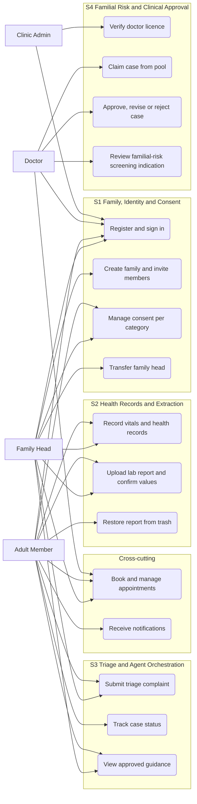
```mermaid
graph LR
    FH["Family Head"]
    AM["Adult Member"]
    DR["Doctor"]
    CA["Clinic Admin"]

    subgraph S1["S1 Family, Identity and Consent"]
        UC1("Register and sign in")
        UC2("Create family and invite members")
        UC3("Manage consent per category")
        UC4("Transfer family head")
    end

    subgraph S2["S2 Health Records and Extraction"]
        UC5("Record vitals and health records")
        UC6("Upload lab report and confirm values")
        UC7("Restore report from trash")
    end

    subgraph S3["S3 Triage and Agent Orchestration"]
        UC8("Submit triage complaint")
        UC9("Track case status")
        UC10("View approved guidance")
    end

    subgraph S4["S4 Familial Risk and Clinical Approval"]
        UC11("Verify doctor licence")
        UC12("Claim case from pool")
        UC13("Approve, revise or reject case")
        UC14("Review familial-risk screening indication")
    end

    subgraph XC["Cross-cutting"]
        UC15("Book and manage appointments")
        UC16("Receive notifications")
    end

    FH --> UC1
    FH --> UC2
    FH --> UC3
    FH --> UC4
    FH --> UC5
    FH --> UC6
    FH --> UC8
    FH --> UC10
    FH --> UC15
    AM --> UC1
    AM --> UC3
    AM --> UC5
    AM --> UC6
    AM --> UC7
    AM --> UC8
    AM --> UC9
    AM --> UC10
    AM --> UC15
    AM --> UC16
    DR --> UC1
    DR --> UC12
    DR --> UC13
    DR --> UC14
    DR --> UC15
    CA --> UC1
    CA --> UC11
```

*Explanation.* Figure 2.1 shows that the Family Head and Adult Member share most family-facing capabilities, whereas only the Doctor can claim and decide cases (UC12 and UC13) and only the Clinic Admin can verify a doctor (UC11). The patient-facing use case UC10 depends on UC13, since guidance exists only after approval, which expresses clinical safety rule 2 at requirement level. Notifications (UC16) and appointments (UC15) cut across the components.

The functional requirements of Table 2.2 are further illustrated by the following user stories.

1. **US1.** As a Family Head, I want to create a family and invite my relatives with a code, so that everyone's records can live in one shared household account.
2. **US2.** As an Adult Member, I want to grant or revoke consent for each category of my data, so that I stay in control of what relatives can see.
3. **US3.** As an Adult Member, I want to upload a photographed laboratory report and compare the extracted values with the original before saving them, so that mistakes in text recognition do not enter my record.
4. **US4.** As a Family Head, I want to submit a complaint for a family member and follow its status, so that I know when a doctor has reviewed it.
5. **US5.** As a Doctor, I want to claim a prepared case from a pool and see the member's baseline, deviations and safety flags together, so that I can start the consultation informed.
6. **US6.** As a Doctor, I want to approve, revise or reject a case using only permitted non-diagnostic guidance, so that no unsafe advice leaves the system under my name.
7. **US7.** As a Clinic Admin, I want to review a doctor's licence documents and verify, reject or suspend the doctor, so that only qualified clinicians can see family cases.
8. **US8.** As a Family Head, I want to book and manage appointments with the family doctor and receive notifications, so that follow-up care is coordinated.

---
# CHAPTER 3 — DESIGN AND DEVELOPMENT

This chapter describes how Family Veda was designed and built. It begins with the system architecture and the decisions that shaped it, then examines each business component in turn, and closes with the database, the application programming interface (API), the third-party integrations, the user interface, the delivery pipeline and the architecture decision records. Every design choice in this chapter is constrained by the six architectural invariants and the ten clinical safety rules stated in Chapter 2; where a choice exists mainly to uphold one of them, the text says so.

## 3.1 System Architecture

Family Veda is a single ASP.NET Core 8 solution organised according to the principles of clean architecture (Martin, 2017). The solution contains four projects whose dependencies point strictly inwards: Api depends on Infrastructure, Infrastructure depends on Application, and Application depends on Domain. The Domain project holds entities, enumerations and the pure business rules that must be testable without a database or an HTTP stack, namely the consent state machine, the case-grant policy, the familial-risk policy, the clinical rule tables, the deterministic safety validation service and the laboratory range classifier. The Application project holds service interfaces, data transfer objects, FluentValidation validators, the agent contracts and the tool registry. The Infrastructure project holds everything that touches the outside world: the EF Core database context and migrations, the authentication, family, record, triage and clinical services, the Tesseract OCR service, the four LLM-using or data-reading agents, the Gemini and Groq clients, the tool dispatcher, the triage orchestrator and work queue, the Firebase Cloud Messaging client and the Google Drive report store. The Api project holds fifteen controllers, the two background workers, the exception middleware and the current-user abstraction.

Two clients, a React web application and a Flutter mobile application, consume the same API (invariants 1 and 2 in Section 2.4). There is no second backend, no client-side business logic that duplicates server rules, and no separate identity store for mobile. Consequently a consent granted on the phone is the same consent a doctor sees on the web, and a permission denied on one surface is denied on the other. The two clients differ in purpose rather than in capability: the web application serves clinical and administrative work, while the mobile application serves patient and family operations (Section 3.13).

The agentic subsystem sits behind the API for a reason that is architectural rather than organisational. An LLM-driven component that a client could call directly would be able to bypass authentication, consent checks, rate limits and the approval gate. Large-language-model applications are also exposed to prompt injection and to excessive agency, where a model is given more tools or permissions than its task requires (Greshake et al., 2023; OWASP Foundation, 2025). Family Veda therefore makes the API the only entry point to agents (invariant 3), runs agents in a background worker that is started by the API, and gives agents no database credentials (invariant 5): every read or write an agent performs is a named tool call that the dispatch layer checks against a per-agent allow-list.

*Figure 3.1 – High-Level System Architecture*

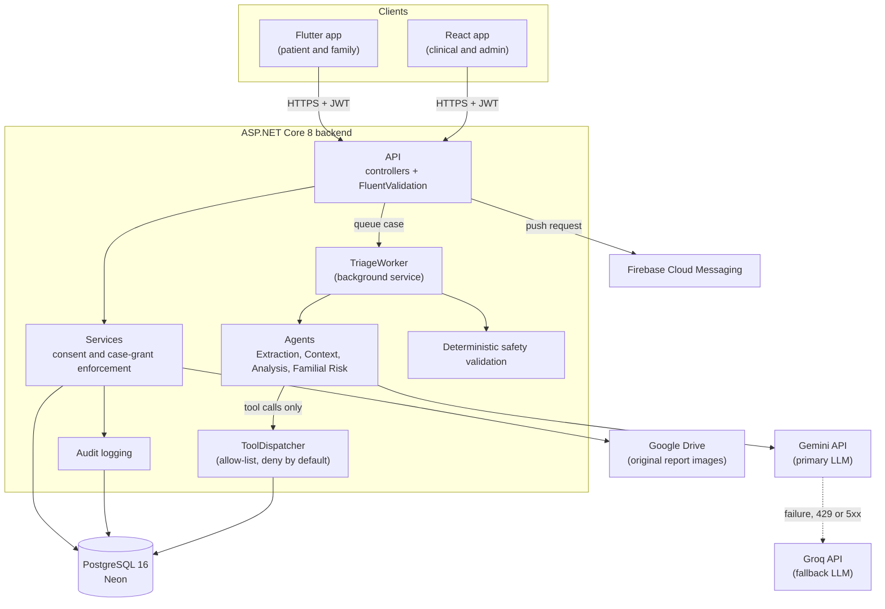
```mermaid
graph TB
    subgraph Clients["Clients"]
        FL["Flutter app<br/>(patient and family)"]
        RE["React app<br/>(clinical and admin)"]
    end

    subgraph Backend["ASP.NET Core 8 backend"]
        API["API<br/>controllers + FluentValidation"]
        SVC["Services<br/>consent and case-grant enforcement"]
        AUD["Audit logging"]
        TW["TriageWorker<br/>(background service)"]
        AG["Agents<br/>Extraction, Context, Analysis, Familial Risk"]
        SAFE["Deterministic safety validation"]
        TD["ToolDispatcher<br/>(allow-list, deny by default)"]
    end

    DB[("PostgreSQL 16<br/>Neon")]
    GEM["Gemini API<br/>(primary LLM)"]
    GRQ["Groq API<br/>(fallback LLM)"]
    FCM["Firebase Cloud Messaging"]
    GD["Google Drive<br/>(original report images)"]

    FL -->|"HTTPS + JWT"| API
    RE -->|"HTTPS + JWT"| API
    API --> SVC
    SVC --> AUD
    SVC --> DB
    AUD --> DB
    API -->|"queue case"| TW
    TW --> AG
    AG -->|"tool calls only"| TD
    TD --> DB
    AG --> GEM
    GEM -.->|"failure, 429 or 5xx"| GRQ
    TW --> SAFE
    API -->|"push request"| FCM
    SVC --> GD
```

The diagram shows that both clients terminate at the API and nowhere else. Services enforce consent and case-grant checks and write audit rows before any data is returned. A triage submission is queued to the TriageWorker, which runs the agent pipeline; agents reach the database only through the ToolDispatcher, and reach the language models through a client that tries Gemini first and Groq second. Safety validation runs after the agents and is deterministic. Firebase Cloud Messaging and Google Drive are called by the backend alone (invariant 4). Figure 3.1 therefore makes the trust boundary visible: nothing to the left of the API is trusted to enforce a rule, and nothing to the right of it is reachable by a client.

### 3.1.1 Request Flow

A typical request, from a client action to the point at which a patient sees an outcome, follows seven steps.

1. The client sends a request to a route under `/api/v1` over HTTPS with a JWT bearer token in the Authorization header.
2. The request passes through the middleware pipeline in a fixed order: exception handling, CORS, authentication, rate limiting and authorisation. The exception middleware converts any unhandled error into an RFC 7807 problem response that leaks no internal detail.
3. The controller binds the request and runs the FluentValidation validator for the request type; invalid input is rejected with a problem response before any service code runs.
4. The service layer performs the domain work. It checks that the caller holds a consent or a case grant that covers the data requested, reads or writes through EF Core, and writes an audit row for every cross-profile access.
5. For a symptom submission, the service creates the episode and the triage case and places the case identifier on the work queue; the API returns immediately with the case identifier rather than waiting for the agents.
6. The TriageWorker dequeues the case and runs the agent pipeline. Agents obtain data only through the ToolDispatcher allow-list, their outputs are persisted as trace rows, and deterministic safety validation decides whether the case may proceed to a doctor.
7. A verified doctor with an active case grant reviews the case through the approval gate (Section 3.7). Only after an approving decision does the patient endpoint return guidance, and the backend, not the client, sends any notification.

### 3.1.2 Alternatives Considered

Five architectural alternatives were considered and rejected. They are summarised in Table 3.1 and each reason is traceable to an invariant, a safety rule or a project constraint.

*Table 3.1 – Architecture Alternatives Considered*

| Alternative | Why it was rejected |
|---|---|
| Folder-per-student repository layout (one folder, and effectively one application, per group member) | It would produce four disconnected programs and violate invariants 1 and 2, because React and Flutter would not share one API, database or rule set. The assignment's integration requirement is only met by one integrated system, so a single solution, one web application and one mobile application were used, with ownership expressed through file-level headers instead of folders. |
| Clients calling the LLM provider directly | It would expose provider keys in client binaries, bypass consent, rate limiting and the approval gate, and breach invariants 3 and 4. It would also make deterministic safety validation impossible to enforce uniformly. |
| One microservice per business component | It would multiply deployment units, network hops and failure modes for a four-person team on free-tier hosting. A single modular backend with clean layer boundaries gives the same separation of concerns with one deployment and one transaction boundary. |
| Local-only LLM (Ollama, ADR-006) | It was the original decision but could not be hosted: the free-tier API host provides about 512 MB of memory, and the submission requires an evaluation that does not depend on a laptop. ADR-006 was superseded by ADR-013, which adopts hosted Gemini with Groq as fallback while keeping the deterministic safety rules unchanged. |
| Agents with direct database access | It would breach invariant 5 and rule 8: an agent holding credentials could read any member's records, so a prompt-injected agent would have unbounded reach. Allow-listed tools enforced at dispatch limit the damage of a compromised prompt to the tools that agent was already permitted to call. |

## 3.2 Technology Stack

The technology stack, summarised in Table 3.2, was chosen to give a type-safe, testable backend, two mainstream client frameworks, a relational store that can express the integrity rules of a clinical domain, and a free-tier deployment path.

*Table 3.2 – Technology Stack Summary*

| Concern | Technology | Justification |
|---|---|---|
| Backend framework | ASP.NET Core Web API, C# 12, .NET 8 (LTS) | Strong typing, built-in dependency injection, authentication, authorisation and rate-limiting middleware, and long-term support. |
| Object-relational mapping | EF Core 8 with Npgsql | Code-first migrations, parameterised queries by default (reducing injection risk) and first-class PostgreSQL support. |
| Database | PostgreSQL 16 | Relational integrity, transactions, and partial unique indexes used to enforce domain invariants (Section 3.10.1). |
| Input validation | FluentValidation | Declarative validators per request type, executed at the controller boundary. |
| Error contract | RFC 7807 ProblemDetails via exception middleware | Uniform, machine-readable errors with generic 500 responses that leak no internals. |
| Web client | React 18, Vite, TypeScript, React Router, Redux Toolkit | Component model suited to dense clinical tables; typed API access; fast builds. |
| Mobile client | Flutter 3.x, go_router, Riverpod, flutter_secure_storage | One codebase for Android and iOS; secure on-device token storage. |
| LLM | Gemini (primary) with Groq (fallback), hosted (ADR-013) | Free-tier availability and a fallback path; never used for safety decisions. |
| OCR | Tesseract | Open-source engine invoked by the backend; extracted values always require human confirmation. |
| Notifications | Firebase Cloud Messaging, called from the backend only | Push delivery without exposing credentials to clients; Twilio SMS was named as a possible fallback but is not the implemented path. |
| API documentation | Swagger (OpenAPI) | Interactive contract available on the hosted API for evaluators. |
| Continuous integration | GitHub Actions (ci.yml, codeql.yml, migrate-db.yml) and Dependabot | Automated build, test, static analysis and dependency updates on every pull request. |
| Testing | xUnit and Moq, Testcontainers (PostgreSQL 16), Vitest and React Testing Library, flutter_test | One idiomatic framework per layer; integration tests run against a real PostgreSQL container. |
| Hosting | Render (API, Docker), Neon (PostgreSQL 16), Vercel (web); all free tier | Zero cost, with an Android APK distributed through a GitHub release for the mobile client. |

## 3.3 Business Components and Ownership

The system is divided into four business components, each owned by one group member and each combining a data model, a set of API controllers and at least one non-CRUD operation. Table 3.3 summarises the division. The table names the original ownership of database tables; the later whole-project delivery decision (described below) did not change which component a table conceptually belongs to.

*Table 3.3 – Business Components and Ownership*

| Component | Owner | API controllers | Database tables | Agent contribution | Non-CRUD operation |
|---|---|---|---|---|---|
| Family, Identity and Consent | S1 – Samaranayaka S.G.V.S (IT23544154) | Auth, Families, Members, JoinRequests, FamilyLifecycle, FamilyHeadTransfers, Profile | users, families, members, relationships, consents (plus invitations, join requests, membership events, head transfers, user profiles) | None; owns the tool-permission enforcement layer and the CI pipeline | Consent state-machine transitions, join-by-code and invitation acceptance, family-head transfer, and token refresh with single-use rotation |
| Health Records and Extraction | S2 – Fernando K.R.N (IT24101875) | Records | health_records, lab_reports, lab_report_files, lab_values, vitals, hereditary_flags | Extraction Agent | Lab-report OCR extraction, parsing and range classification; human confirmation of extracted values; soft-delete, restore and sharing control |
| Triage and Agent Orchestration | S3 – Karunathilaka K.D.J.C (IT24100551), Group Leader | Triage, Notifications, Dashboard | episodes, triage_cases, agent_traces, notification_subscriptions | Coordinator, Context and Analysis agents | Queued multi-agent triage pipeline with persisted trace, provider fallback and safe-failure handling; case SLA processing |
| Familial Risk and Clinical Approval | S4 – Wasala W.M.S.S.B. (IT24100559) | Clinical, DoctorWorkspace, FamilyDoctor, Appointments | doctors, doctor_verification_log, family_doctor_assignments, case_access_grants, approvals, audit_log (plus appointments, availability, clinical notes) | Familial Risk and Safety/Validation agents | Doctor verification, time-bound case-grant issue and revocation, the doctor approval gate, and deterministic safety validation |

Although the product is one application, the work was authored by four people, and the project therefore adopted explicit ownership conventions so that each member's contribution remains identifiable. Every source file carries a header naming its owning component and member; the single source of truth is the manifest `docs/OWNERSHIP.tsv`, from which both the file headers and the `CODEOWNERS` file are generated, so that GitHub automatically requests the owning member as a reviewer on every pull request touching their files. A small number of files that every component must extend, such as the dependency-injection registration and the database context, are marked as shared and follow a labelled-block convention in which each member adds lines only inside their own block. On 28 September 2026 the group recorded a decision to deliver the whole project as one integrated system (DECISIONS 2026-09-28b). Under that decision, a component could be edited across ownership boundaries when the integrated system required it, and conventional-commit scope tags (such as `(s1)` to `(s4)`) mark which component a commit touched. A scope tag therefore records attribution of the component, not authorship of the commit; the repository evidence in Appendix A reports both.

## 3.4 Authentication and Access Control

Authentication uses JSON Web Tokens. A successful login returns a short-lived access token (60 minutes) and a refresh token (seven days). Refresh tokens are stored only as hashes, are single-use, and are rotated on every refresh, so a stolen refresh token that has already been used is rejected. Passwords are hashed with the ASP.NET Core Identity `PasswordHasher`, which uses PBKDF2, and the raw password is never stored or logged. Three role policies, FamilyUser, Doctor and Admin, protect route groups at the controller level.

A role alone never grants access to another person's data. The governing principle is access by grant, not by role. Three kinds of grant exist. A consent, held per member and per category (hereditary flags, vitals summary, conditions), controls what family information a member shares. A CaseAccessGrant gives one verified doctor time-limited access to one triage case. A VisitAccessGrant gives a doctor access to the data relevant to a booked appointment. Grants carry an expiry (configured at 48 hours in the application settings) and can be revoked; the `CaseGrantPolicy` allows access only when a grant has not been revoked and has not expired.

Adult privacy is the default. A Family Head can manage the family and its minors, but an adult member's records are private to that member unless the member chooses to share them. When a Family Head requests an adult member's record that has not been shared, the API responds with 404 rather than 403, so the existence of the record is not disclosed. Rate limiting protects the most abusable endpoints: authentication routes allow 10 requests per minute per IP address, family-code entry allows 10 requests per 10 minutes, and OCR extraction allows three requests per five minutes. Cross-origin requests are restricted to an explicit allow-list, and secrets are supplied through environment variables on the hosting platforms, never through the repository.

*Figure 3.2 – Authentication and Access-Control Flow*

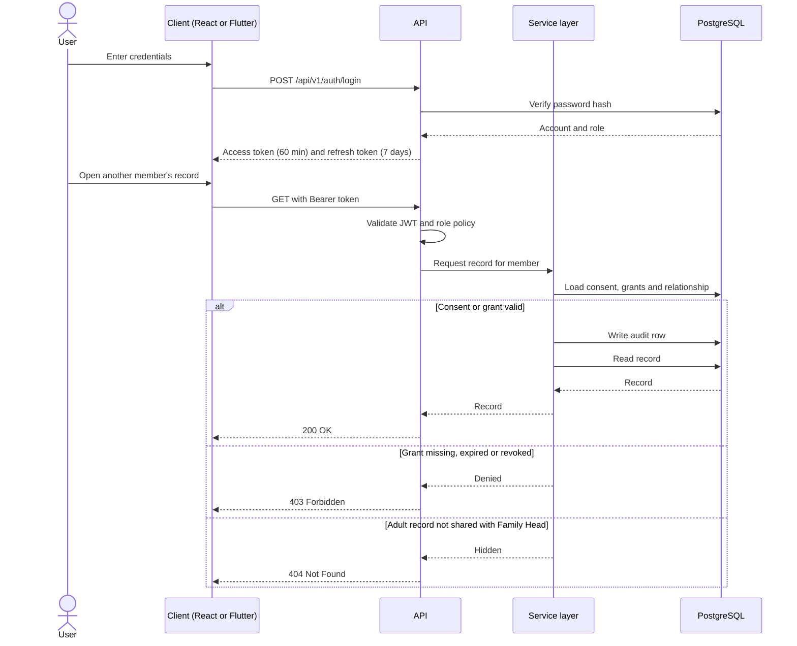
```mermaid
sequenceDiagram
    actor U as User
    participant C as Client (React or Flutter)
    participant A as API
    participant S as Service layer
    participant D as PostgreSQL

    U->>C: Enter credentials
    C->>A: POST /api/v1/auth/login
    A->>D: Verify password hash
    D-->>A: Account and role
    A-->>C: Access token (60 min) and refresh token (7 days)

    U->>C: Open another member's record
    C->>A: GET with Bearer token
    A->>A: Validate JWT and role policy
    A->>S: Request record for member
    S->>D: Load consent, grants and relationship
    alt Consent or grant valid
        S->>D: Write audit row
        S->>D: Read record
        D-->>S: Record
        S-->>A: Record
        A-->>C: 200 OK
    else Grant missing, expired or revoked
        S-->>A: Denied
        A-->>C: 403 Forbidden
    else Adult record not shared with Family Head
        S-->>A: Hidden
        A-->>C: 404 Not Found
    end
```

Figure 3.2 shows the two phases of access control. In the first phase the login route verifies the password hash and issues the token pair. In the second phase every protected cross-profile read passes through the role policy at the API boundary and then through the service layer, which consults the consent and grant tables. Only when a valid consent or grant is found is an audit row written and the record read; otherwise the caller receives 403, or 404 where revealing existence would itself leak information. Because the checks live in the service layer rather than in the clients, both the web and the mobile application are subject to exactly the same decisions.

## 3.5 Agentic Triage Workflow

The agentic triage workflow turns a family member's reported complaint into a prepared case file for a doctor, never into advice for the patient. Its design follows a fixed chain: an objective is submitted; a structured plan is produced by the Coordinator; distinct agents with distinct responsibilities run in sequence; each agent reaches data only through allow-listed tools; every step is persisted as a trace; each output is validated against a schema; deterministic safety rules decide whether processing may continue; a licensed doctor reviews the case at the approval gate; and the result is either an auditable approved outcome or a safe failure. At no point does the system diagnose (rule 1), and at no point does LLM judgement decide a safety question (rule 4).

Table 3.4 lists the agents, their scope, the tools each may call and whether each uses the hosted LLM. The allow-list is held in the `ToolRegistry` class and is the authoritative statement of what each agent may do.

*Table 3.4 – Agents and Tool Allow-List*

| Agent | Scope | Allowed tools | Uses LLM | Owner |
|---|---|---|---|---|
| Extraction | Reads laboratory report images and produces structured, unconfirmed values; runs in the report-upload workflow, not per symptom request | read_member_profile, read_raw_record, ocr_extract, write_lab_extraction | No (Tesseract OCR with deterministic parsing) | S2 |
| Coordinator | Plans and orders the triage steps and persists the plan as a trace | None | No | S3 |
| Context | Assembles the member's baseline from profile, vitals, episodes and conditions | read_member_profile, read_member_vitals, read_member_episodes, read_member_conditions | Yes | S3 |
| Analysis | Reviews recorded trends and deviations from the member's own baseline | read_lab_trends, compute_deviation | Yes | S3 |
| Familial Risk | Summarises consented hereditary flags as a screening indication; flags only, never raw relatives' records | read_consented_hereditary_flags, read_relationship_graph, lookup_inheritance_pattern | Yes | S4 |
| Safety/Validation | Applies deterministic rule tables and prohibited-content checks | None | No | S4 |

*Figure 3.3 – Agentic Triage Workflow*

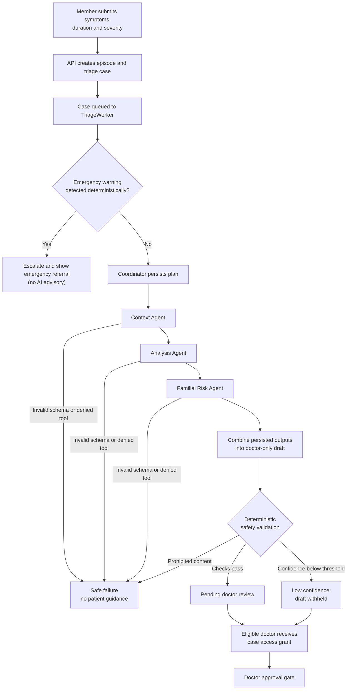
```mermaid
flowchart TD
    A["Member submits symptoms,<br/>duration and severity"] --> B["API creates episode and triage case"]
    B --> C["Case queued to TriageWorker"]
    C --> D{"Emergency warning<br/>detected deterministically?"}
    D -->|"Yes"| E["Escalate and show emergency referral<br/>(no AI advisory)"]
    D -->|"No"| F["Coordinator persists plan"]
    F --> G["Context Agent"]
    G --> H["Analysis Agent"]
    H --> I["Familial Risk Agent"]
    G -->|"Invalid schema or denied tool"| M["Safe failure<br/>no patient guidance"]
    H -->|"Invalid schema or denied tool"| M
    I -->|"Invalid schema or denied tool"| M
    I --> J["Combine persisted outputs<br/>into doctor-only draft"]
    J --> K{"Deterministic<br/>safety validation"}
    K -->|"Checks pass"| L["Pending doctor review"]
    K -->|"Confidence below threshold"| N["Low confidence:<br/>draft withheld"]
    K -->|"Prohibited content"| M
    L --> O["Eligible doctor receives<br/>case access grant"]
    N --> O
    O --> P["Doctor approval gate"]
```

Figure 3.3 follows the order in which the worker processes a case. The emergency check happens first and is deterministic, so an emergency never waits for a language model and never produces an AI advisory (rule 10). The three LLM-using agents then run sequentially, each reading only through its own allow-listed tools; arrows denote execution order, not an unrestricted transfer of all patient data between agents. Any invalid output structure, denied tool call or prohibited content diverts the case to a safe failure, while low confidence withholds the draft and routes the case to a doctor. Every route that continues leads to the doctor approval gate, which is described in Section 3.7.

### 3.5.1 Tool Dispatch Layer

The dispatch layer is the mechanism that makes invariant 5 real. The `ToolRegistry` defines, for each agent kind, the set of tool names it may call. The `ToolDispatcher` consults the registry on every call and denies by default: a tool that is not on the calling agent's list, or an empty tool name, is refused, and the refusal is recorded as a trace with the status ToolDenied before the pipeline stops. Because the check occurs at dispatch, not inside each agent, a new agent or a modified prompt cannot widen its own permissions. The Familial Risk Agent is additionally denied raw records outright, so it can only ever see flags that the owner has confirmed and consented to share.

This design responds directly to the two threats most relevant to an agentic health application. Excessive agency, where a model is given broader capabilities than its task requires, is listed among the principal risks of LLM applications (OWASP Foundation, 2025); least-privilege tool lists limit that agency. Indirect prompt injection, where adversarial instructions are embedded in content the model later reads, is a documented attack against applications that integrate LLMs with external data (Greshake et al., 2023). For this reason, text recovered by OCR from a laboratory report and any text returned by an LLM are treated as untrusted data and never as instructions: OCR output is parsed and validated before it is stored, agent outputs must satisfy a JSON schema before they are used, and no agent output can enlarge the set of tools available to it. A successful injection can therefore influence at most what a permitted tool would already return, and nothing it produces reaches a patient without passing the safety rules and a doctor.

### 3.5.2 Safe-Failure Design

Rule 9 requires the system to defer to in-person care on any uncertainty. Table 3.5 lists the situations the pipeline recognises and the behaviour each produces. In every row the failure mode is to withhold output, never to guess.

*Table 3.5 – Safe-Failure Behaviour*

| Situation | Behaviour |
|---|---|
| Emergency warning detected in the submitted text | Deterministic escalation and referral before any LLM step; no AI advisory is generated. |
| Agent output confidence below the configured threshold (default 60%) | Case moves to LowConfidence; the draft is withheld and the case is routed for doctor attention. |
| Agent output does not satisfy the expected schema | Case ends as FailedSafe with the code INVALID_AGENT_SCHEMA; no advisory is produced. |
| Agent attempts a tool outside its allow-list | The attempt is recorded as ToolDenied and processing stops. |
| Prohibited clinical content detected in output | Deterministic safety rules stop processing; nothing is shown to the patient. |
| Gemini fails, times out (45 s), returns HTTP 429 or a 5xx error | The client retries with Groq (30 s timeout); if both fail or neither is configured, the case ends in a safe failure. |
| Worker restarts during processing | Queued cases that were not started are recovered; cases interrupted mid-processing are marked as safely failed rather than silently replayed. |

## 3.6 Triage Case Lifecycle

A triage case moves through fourteen statuses defined by the TriageStatus enumeration. The statuses Submitted, Planning, ContextReady, Analysed and RiskAssessed record agent progress; Validated, LowConfidence and PendingDoctorReview record the outcome of safety validation; Claimed records that a doctor has taken the case; Approved, ApprovedRevised, Rejected and Escalated record the doctor's decision; and FailedSafe records a safe failure. Figure 3.4 shows the transitions the pipeline and the approval gate produce.

*Figure 3.4 – Triage Case State Machine*

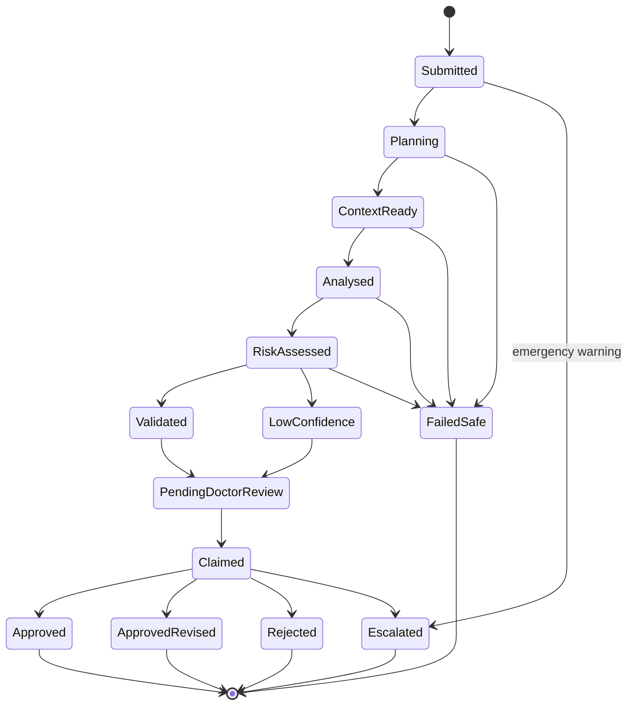
```mermaid
stateDiagram-v2
    [*] --> Submitted
    Submitted --> Planning
    Submitted --> Escalated: emergency warning
    Planning --> ContextReady
    Planning --> FailedSafe
    ContextReady --> Analysed
    ContextReady --> FailedSafe
    Analysed --> RiskAssessed
    Analysed --> FailedSafe
    RiskAssessed --> Validated
    RiskAssessed --> LowConfidence
    RiskAssessed --> FailedSafe
    Validated --> PendingDoctorReview
    LowConfidence --> PendingDoctorReview
    PendingDoctorReview --> Claimed
    Claimed --> Approved
    Claimed --> ApprovedRevised
    Claimed --> Rejected
    Claimed --> Escalated
    Approved --> [*]
    ApprovedRevised --> [*]
    Rejected --> [*]
    Escalated --> [*]
    FailedSafe --> [*]
```

Figure 3.4 separates the lifecycle into three phases. The first, from Submitted to RiskAssessed, is automatic and each step is recorded as an agent trace. The second, from Validated or LowConfidence to Claimed, is the hand-over to a human. The third, from Claimed to a terminal decision, is the doctor's. Four terminal outcomes are shown in the diagram: Approved and ApprovedRevised release guidance to the patient, whereas Rejected, Escalated and FailedSafe never do. A request for information leaves the case pending rather than terminal, which is why it does not appear as a separate state. Only the two approving statuses can ever return guidance to the patient, which keeps the visible-output rule (rule 2) enforceable by checking one condition.

## 3.7 Doctor Approval Gate

The doctor approval gate is the point at which an AI-prepared case file becomes, or does not become, something a patient may see. It is architectural: there is no endpoint, configuration option or code path that returns an AI draft to a patient (rule 3). Access to the gate requires two things at once: a doctor whose verification status is Verified, and an active CaseAccessGrant for the specific case. The doctor selects one of six actions, defined by the ApprovalAction enumeration: Approve, ReviseAndApprove, RequestInformation, Reject, Escalate and CloseReferral.

Final guidance is not free text. When a doctor approves or revises, the guidance must come from a fixed, non-diagnostic allow-list maintained in the backend, so "revise and approve" cannot be used to introduce arbitrary clinical advice (rules 1 and 6). The patient-facing endpoint returns the doctor's final guidance, a timestamp and a disclaimer, and never the raw AI draft. Before an approving decision exists, the same endpoint returns 404, which means a patient cannot discover that a draft exists. Decisions are audited, concurrent conflicting decisions on one case result in a 409 response for the later one, and every terminal decision revokes the active grants so that access does not outlive the decision.

*Figure 3.5 – Doctor Approval Gate*

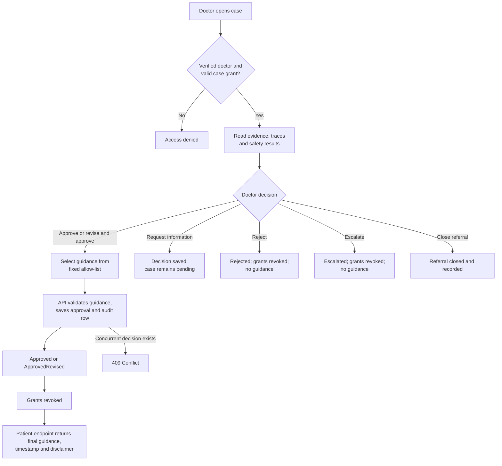
```mermaid
flowchart TD
    A["Doctor opens case"] --> B{"Verified doctor and<br/>valid case grant?"}
    B -->|"No"| C["Access denied"]
    B -->|"Yes"| D["Read evidence, traces<br/>and safety results"]
    D --> E{"Doctor decision"}
    E -->|"Approve or revise and approve"| F["Select guidance from<br/>fixed allow-list"]
    F --> G["API validates guidance,<br/>saves approval and audit row"]
    G --> H["Approved or ApprovedRevised"]
    H --> I["Grants revoked"]
    I --> J["Patient endpoint returns final guidance,<br/>timestamp and disclaimer"]
    E -->|"Request information"| K["Decision saved;<br/>case remains pending"]
    E -->|"Reject"| L["Rejected; grants revoked;<br/>no guidance"]
    E -->|"Escalate"| M["Escalated; grants revoked;<br/>no guidance"]
    E -->|"Close referral"| N["Referral closed and recorded"]
    G -->|"Concurrent decision exists"| O["409 Conflict"]
```

The explanation of Figure 3.5 is in the order of its branches. The first decision point is identity and grant, so a doctor who is unverified, or whose grant has expired or been revoked, never sees the evidence. After the evidence is read, the two approving actions pass through allow-list validation, are persisted together with an audit row, and only then make guidance available. The three non-approving branches (request information, reject and escalate) save the decision but release nothing to the patient, and the final branch shows that a second, conflicting decision is refused with 409 so that two doctors cannot silently overwrite one another.

## 3.8 Health Records and Extraction

The Health Records component stores structured health records, vitals, laboratory reports and hereditary flags for each family member. Records carry a type (condition, allergy, medication, surgery or note) and a flag indicating whether they are shared with the Family Head, which implements the adult-privacy default described in Section 3.4. Vitals are stored with a measurement timestamp so that trends can be charted and compared with reference ranges by the deterministic range classifier.

Laboratory report handling is a separate workflow from triage. A user uploads a PNG or JPEG image of up to 10 MB; the API checks that the caller may act for the member, stores the report and requests extraction. Tesseract, an open-source optical character recognition engine whose architecture is described by Smith (2007), reads the text. A deterministic parser then extracts values, units and printed reference intervals, and stores them as unconfirmed items. The user compares the extracted items with the original image and confirms or corrects them; only then are the values saved as confirmed and displayed against the report's own reference interval. Uploading a report does not create a triage case.

Original images are stored through a backend-only seam in Google Drive, with the drive.file scope, and PostgreSQL keeps the metadata, the extracted values and a storage key (ADR-014). If Drive is unavailable at upload time the image falls back to storage in PostgreSQL so an upload is never lost; if Drive cannot be read at retrieval time the API returns a 422 response stating that the file is temporarily unavailable. Lab reports support soft deletion, a trash view and restore, with a separate permanent-delete action. Two points of terminology matter for safety. First, a patient's confirmation means that the extracted values match the report; it is not a doctor's approval and does not release any AI output. Second, because OCR text is untrusted input (Section 3.5.1), no value is used by later triage analysis until it has been confirmed by a person.

*Figure 3.6 – Lab Report Upload and Extraction Flow*

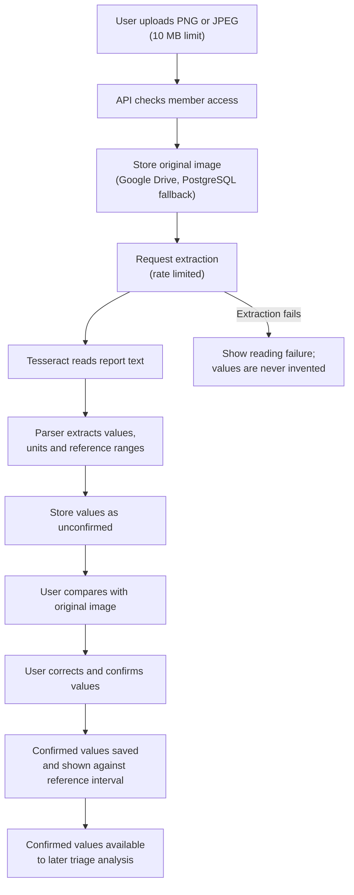
```mermaid
flowchart TD
    A["User uploads PNG or JPEG<br/>(10 MB limit)"] --> B["API checks member access"]
    B --> C["Store original image<br/>(Google Drive, PostgreSQL fallback)"]
    C --> D["Request extraction<br/>(rate limited)"]
    D --> E["Tesseract reads report text"]
    E --> F["Parser extracts values,<br/>units and reference ranges"]
    F --> G["Store values as unconfirmed"]
    G --> H["User compares with original image"]
    H --> I["User corrects and confirms values"]
    I --> J["Confirmed values saved<br/>and shown against reference interval"]
    J --> K["Confirmed values available<br/>to later triage analysis"]
    D -->|"Extraction fails"| L["Show reading failure;<br/>values are never invented"]
```

Figure 3.6 shows that the workflow has a human-in-the-loop checkpoint between extraction and use. Everything above the confirmation step is automatic and untrusted; everything below it is data a person has vouched for. The failure branch is explicit: if extraction fails, the system reports the failure and allows manual entry instead of fabricating values (rule 9).

## 3.9 Family, Identity and Consent

The Family component models a household as a family with members and relationships. A Family Head creates the family and receives a family code. An adult joins by entering the code, which creates a join request that the head can accept or decline, or by accepting a time-limited invitation addressed to an email address that is stored only as a masked display value and a lookup hash. Minors are managed by a guardian and have no login of their own. The head role can be transferred through a request-and-acceptance process recorded in a head-transfer entity, and every membership change is written to a membership event log. When an adult is removed from a family or leaves it, the adult is moved to a household of their own rather than being deleted, and administrator accounts are deactivated rather than deleted, so history remains intact.

Consent governs which hereditary and health information a member shares with relatives and with the triage agents. Each member has one consent record per category (hereditary flags, vitals summary and conditions), and each record is in one of four states: NotSet, Granted, Revoked or PendingReaffirmation. The `ConsentStateMachine` allows exactly six transitions, and any other transition is rejected by the domain layer. A consent granted by a guardian on behalf of a minor moves to PendingReaffirmation when the minor reaches eighteen, and the Familial Risk Agent reads only flags covered by a currently granted consent (rule 8).

*Figure 3.7 – Consent State Machine*

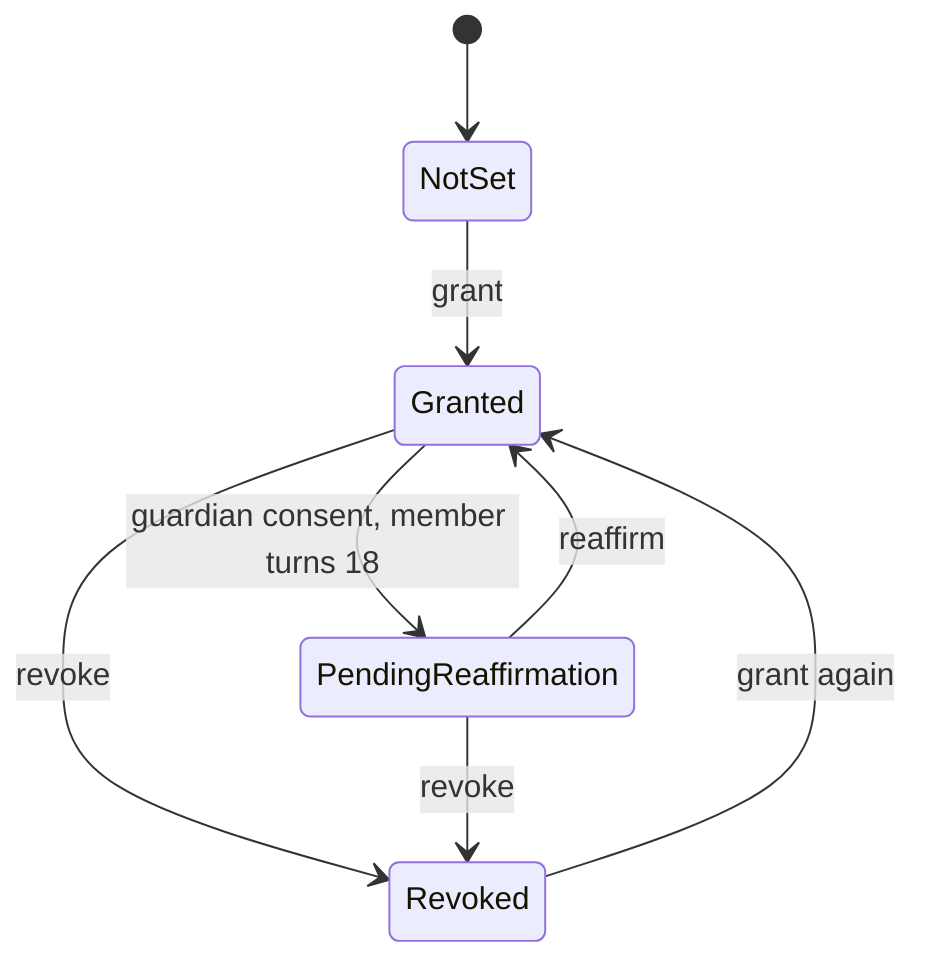
```mermaid
stateDiagram-v2
    [*] --> NotSet
    NotSet --> Granted: grant
    Granted --> Revoked: revoke
    Granted --> PendingReaffirmation: guardian consent, member turns 18
    Revoked --> Granted: grant again
    PendingReaffirmation --> Granted: reaffirm
    PendingReaffirmation --> Revoked: revoke
```

Figure 3.7 is deliberately small. A category begins as NotSet and can only be moved to Granted; it cannot be revoked before it has been granted. A grant can be revoked or, for guardian-given consent, can be put into PendingReaffirmation at the member's eighteenth birthday, from which the member must either reaffirm or revoke. Revoked consent can be granted again. Because the legal transitions are encoded in a pure domain class with no database dependency, they are covered by direct unit tests and cannot be bypassed by a controller or a client.

## 3.10 Database Design

### 3.10.1 Why PostgreSQL

PostgreSQL 16 was chosen because the domain is relational and integrity-critical. Foreign keys tie records to members, members to families and cases to doctors; transactions allow a decision, its audit row and the revocation of grants to succeed or fail together. PostgreSQL also supports partial unique indexes, which let the database itself enforce rules that would otherwise rely on application code being correct under concurrency. Two such indexes are used. The index `ux_family_doctor_requests_pending` ensures that a family has at most one pending request for a given doctor, and the index `ux_family_doctor_assignments_active_primary` ensures that a family has at most one active primary doctor. Under concurrent doctor acceptance, these constraints cause one request to succeed and the other to receive a conflict response, which is the behaviour the integrated tests exercise. Finally, EF Core migrations give a reproducible, reviewable history of schema change, described in Section 3.10.3.

### 3.10.2 Core Entities

The model contains 34 domain entities, plus a table used by ASP.NET Core Data Protection. Table 3.6 groups them by purpose and by owning component.

*Table 3.6 – Core Database Entities*

| Entity | Purpose | Owning component |
|---|---|---|
| UserAccount | Login identity, user type, hashed refresh token and device token | Family, Identity and Consent |
| UserProfile | Display and contact details for an account | Family, Identity and Consent |
| Family | Household, creator and shareable family code | Family, Identity and Consent |
| Member | Person in a family with date of birth, role and clinical sex reference | Family, Identity and Consent |
| Relationship | Biological or other relationship between two members | Family, Identity and Consent |
| Consent | Per-member, per-category consent status and history | Family, Identity and Consent |
| FamilyInvitation | Time-limited invitation with masked email and expiry | Family, Identity and Consent |
| FamilyJoinRequest | Request to join a family by code, awaiting head decision | Family, Identity and Consent |
| FamilyMembershipEvent | Append-only log of joins, leaves and removals | Family, Identity and Consent |
| FamilyHeadTransfer | Request and acceptance record for transferring the head role | Family, Identity and Consent |
| HealthRecord | Condition, allergy, surgery or note entry with sharing flag | Health Records and Extraction |
| LabReport | Uploaded report with OCR status, soft-delete fields and sharing flag | Health Records and Extraction |
| LabReportFile | Stored original image bytes or storage key for a report | Health Records and Extraction |
| LabValue | Extracted value, unit, reference interval and confirmation flag | Health Records and Extraction |
| Vital | Timestamped vital measurement | Health Records and Extraction |
| HereditaryFlag | Structured hereditary flag with confidence and manual-confirmation flag | Health Records and Extraction |
| Episode | Symptom report with duration and severity | Triage and Agent Orchestration |
| TriageCase | Case with status, priority, persisted agent outputs and failure code | Triage and Agent Orchestration |
| AgentTrace | One row per agent step: status, schema validity, confidence, latency and model | Triage and Agent Orchestration |
| NotificationSubscription | Device registration for push delivery | Triage and Agent Orchestration |
| PortalNotification | In-application notification shown in a portal inbox | Triage and Agent Orchestration |
| Doctor | Verified clinician profile, specialty, slot length and availability | Familial Risk and Clinical Approval |
| DoctorLicenseDocument | Uploaded licence document used in verification | Familial Risk and Clinical Approval |
| DoctorVerificationLog | Administrator verification decisions with reasons | Familial Risk and Clinical Approval |
| FamilyDoctorRequest | Family's request to be taken on by a doctor | Familial Risk and Clinical Approval |
| FamilyDoctorAssignment | Active or ended doctor-to-family assignment, primary flag | Familial Risk and Clinical Approval |
| CaseAccessGrant | Time-bound doctor access to one case | Familial Risk and Clinical Approval |
| VisitAccessGrant | Time-bound doctor access tied to a booked appointment | Familial Risk and Clinical Approval |
| Approval | Doctor decision, action, notes and final guidance for a case | Familial Risk and Clinical Approval |
| AuditLog | Append-only record of actor, subject and resource for cross-profile access | Familial Risk and Clinical Approval |
| Appointment | Booked consultation with status | Familial Risk and Clinical Approval |
| DoctorAvailability | Recurring weekly availability | Familial Risk and Clinical Approval |
| DoctorUnavailablePeriod | Blocked time for a doctor | Familial Risk and Clinical Approval |
| ClinicalNote | Doctor note attached to a member, amendable with history | Familial Risk and Clinical Approval |

*Figure 3.8 – Entity-Relationship Diagram*

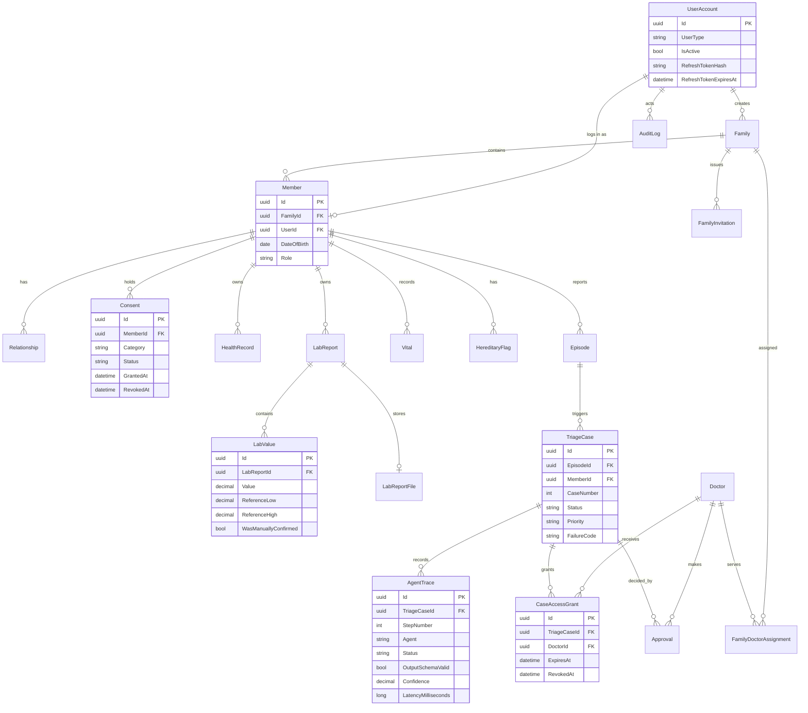
```mermaid
erDiagram
    UserAccount ||--o{ Family : creates
    Family ||--o{ Member : contains
    UserAccount ||--o| Member : "logs in as"
    Member ||--o{ Relationship : has
    Member ||--o{ Consent : holds
    Family ||--o{ FamilyInvitation : issues
    Member ||--o{ HealthRecord : owns
    Member ||--o{ LabReport : owns
    LabReport ||--o{ LabValue : contains
    LabReport ||--o| LabReportFile : stores
    Member ||--o{ Vital : records
    Member ||--o{ HereditaryFlag : has
    Member ||--o{ Episode : reports
    Episode ||--o{ TriageCase : triggers
    TriageCase ||--o{ AgentTrace : records
    Doctor ||--o{ FamilyDoctorAssignment : serves
    Family ||--o{ FamilyDoctorAssignment : assigned
    TriageCase ||--o{ CaseAccessGrant : grants
    Doctor ||--o{ CaseAccessGrant : receives
    TriageCase ||--o{ Approval : decided_by
    Doctor ||--o{ Approval : makes
    UserAccount ||--o{ AuditLog : acts

    UserAccount {
        uuid Id PK
        string UserType
        bool IsActive
        string RefreshTokenHash
        datetime RefreshTokenExpiresAt
    }
    Member {
        uuid Id PK
        uuid FamilyId FK
        uuid UserId FK
        date DateOfBirth
        string Role
    }
    Consent {
        uuid Id PK
        uuid MemberId FK
        string Category
        string Status
        datetime GrantedAt
        datetime RevokedAt
    }
    LabValue {
        uuid Id PK
        uuid LabReportId FK
        decimal Value
        decimal ReferenceLow
        decimal ReferenceHigh
        bool WasManuallyConfirmed
    }
    TriageCase {
        uuid Id PK
        uuid EpisodeId FK
        uuid MemberId FK
        int CaseNumber
        string Status
        string Priority
        string FailureCode
    }
    AgentTrace {
        uuid Id PK
        uuid TriageCaseId FK
        int StepNumber
        string Agent
        string Status
        bool OutputSchemaValid
        decimal Confidence
        long LatencyMilliseconds
    }
    CaseAccessGrant {
        uuid Id PK
        uuid TriageCaseId FK
        uuid DoctorId FK
        datetime ExpiresAt
        datetime RevokedAt
    }
```

Figure 3.8 shows the twenty main entities and the relationships among them; the remaining entities in Table 3.6 are supporting tables for the appointment, notification and family-lifecycle features, and are omitted from the diagram for legibility. The diagram reads in three clusters. On the left, the identity cluster ties user accounts to families, members, relationships and consents. In the middle, the record cluster hangs health records, laboratory reports (with their values and stored file), vitals and hereditary flags from the member. On the right, the clinical cluster links an episode to its triage cases, each case to its agent traces, and each case to the case-access grants and approvals that connect it to doctors. Attribute blocks are shown for seven entities whose fields most directly support the safety design: tokens and activity for accounts, role and date of birth for members, status and timestamps for consents, the confirmation flag on laboratory values, the status and failure code of a case, the schema-validity, confidence and latency fields of a trace, and the expiry and revocation fields of a grant.

### 3.10.3 Migration Protocol

Because two simultaneous EF Core migrations can break a shared repository, schema changes follow a migration-lock protocol. A member announces in the group chat that they are taking the migration lock, pulls the latest `develop` branch, generates the migration, applies and verifies it locally, commits and pushes it immediately, and then announces that the lock is released. At most one migration is ever in flight, and a migration that has already been pushed is never edited; a correction is made by adding a new migration. The repository contains ten migrations, from `InitialCreate` on 23 September 2026 to `S2_AddLabReportSoftDelete` on 5 October 2026.

Production schema changes are not applied by the application on start-up. Migrate-on-startup is disabled because of a provider issue recorded in the project's memory notes, and the deployment decision of 29 September 2026 requires migrations to be applied through an idempotent SQL script. The GitHub Actions workflow `migrate-db.yml` generates that script with `dotnet ef migrations script`, and applies it to the Neon database whenever a migration reaches the `develop` branch; migrations already recorded in the history table are skipped and each runs in its own transaction. Before the migration that introduced the doctor-assignment constraints, a Neon recovery branch was created so that the previous state could be restored if the change failed; the integrated tests also verify that the script can be run twice and that an unsafe rollback is refused.

## 3.11 API Design

All endpoints are versioned under the prefix `/api/v1`. Errors use the RFC 7807 ProblemDetails format, produced centrally by the exception middleware, with generic messages for unexpected failures so that stack traces and internal identifiers are never exposed. List endpoints return a `PagedResult` envelope controlled by `page` and `pageSize` query parameters, and selected lists accept search, sort and filter parameters, for example the `search` parameter on the family members and health records lists. Requests are validated by FluentValidation before reaching the service layer. The API is documented with Swagger, which is served on the hosted deployment so that evaluators can inspect every route and schema.

The API exposes 146 endpoint actions across 15 controllers, comprising 56 GET, 75 POST, eight PUT, two PATCH and five DELETE actions. Table 3.7 lists a representative subset chosen to cover each component and each access policy; the complete list is available from the Swagger interface.

*Table 3.7 – API Endpoints (Representative Subset)*

| Method | Path | Purpose | Access |
|---|---|---|---|
| POST | /api/v1/auth/register/family-head | Register a Family Head and create the account | Anonymous, rate limited |
| POST | /api/v1/auth/login | Authenticate and receive the token pair | Anonymous, rate limited |
| POST | /api/v1/auth/refresh | Exchange a single-use refresh token for a new pair | Refresh token |
| GET | /api/v1/families/me | Read the caller's family | FamilyUser |
| POST | /api/v1/families/{familyId}/invitations | Create a family invitation | FamilyUser (Family Head) |
| PUT | /api/v1/members/{memberId}/consents/{category} | Grant or revoke consent for a category | FamilyUser |
| GET | /api/v1/members/{memberId}/records | List health records (paged, searchable) | FamilyUser, consent and sharing rules |
| POST | /api/v1/members/{memberId}/vitals | Record a vital measurement | FamilyUser |
| POST | /api/v1/members/{memberId}/lab-reports | Upload a laboratory report image | FamilyUser |
| POST | /api/v1/lab-reports/{reportId}/extract | Run OCR extraction on a report | FamilyUser, OCR rate limit |
| PUT | /api/v1/lab-reports/{reportId}/review | Confirm or correct extracted values | FamilyUser |
| POST | /api/v1/members/{memberId}/episodes | Report a symptom episode | FamilyUser |
| POST | /api/v1/episodes/{episodeId}/triage | Submit an episode for agentic triage | FamilyUser |
| GET | /api/v1/triage-cases/{caseId}/status | Read the status of a triage case | FamilyUser |
| GET | /api/v1/triage-cases/{caseId}/traces | Read agent traces for a case | Doctor |
| POST | /api/v1/triage-cases/{caseId}/claim | Claim a case for review | Doctor |
| POST | /api/v1/triage-cases/{caseId}/decision | Record an approval-gate decision | Doctor, case grant |
| GET | /api/v1/triage-cases/{caseId}/approved-guidance | Read doctor-approved guidance (404 until approved) | FamilyUser |
| GET | /api/v1/doctors/me/cases | List the doctor's assigned cases | Doctor |
| POST | /api/v1/admin/doctors/{doctorId}/verify | Verify a doctor's credentials | Admin |
| GET | /api/v1/audit | Read audit rows | Admin or FamilyUser |

## 3.12 Third-Party Integration

The system integrates five external services, all of them called from the backend alone (invariant 4). Table 3.8 summarises each integration, with its failure handling and the data it receives. The common design principle is that an external failure must degrade a feature without ever producing unsafe output or losing user data.

*Table 3.8 – Third-Party Integrations and Failure Handling*

| Service | Purpose | Called from | Timeout / failure handling | Data minimisation |
|---|---|---|---|---|
| Gemini API | Primary LLM for Context, Analysis and Familial Risk agents | Backend GeminiClient inside the agent pipeline | 45 s timeout; on any failure, HTTP 429 or 5xx the call falls through to Groq | Receives only structured, synthetic case inputs assembled through allow-listed tools; no credentials or raw identifiers beyond what a step needs |
| Groq API | Fallback LLM | Backend chat-completions client | 30 s timeout; if it also fails, or no provider key is configured, the case ends in a safe failure | As for Gemini |
| Firebase Cloud Messaging | Push notification when case status changes | Backend NotificationService and FCM client | Configuration-gated: without Firebase configuration the subscription endpoint exists but no push is delivered; push is never the only channel because an in-application inbox also exists | Message carries a status prompt, not clinical content |
| Google Drive (v3 REST, drive.file scope) | Storage of original lab-report images (ADR-014) | Backend report store | Write failure falls back to PostgreSQL storage; read failure returns 422 stating the file is temporarily unavailable | Only the image is stored externally; metadata and extracted values stay in PostgreSQL |
| Neon, Render and Vercel | Database, API and web hosting | Deployment pipeline | Free-tier limits accepted; migrations applied by workflow, and a recovery branch taken before risky changes | Secrets held in platform environment variables |

## 3.13 User Interface Design

The two clients are designed for different purposes while sharing one API. The React web application is the clinical and administrative surface: it is dense, desktop-first and responsive down to tablet width, and it hosts the doctor approval desk, the clinic administration views and the Family Head's administrative tasks. The Flutter application is the patient and family operational surface: one task per screen, thumb-reachable and phone-first, used to capture symptoms and reports, track case status and read approved guidance. Four portals result: Clinic Admin, Doctor, Family Head and Adult Member. Minors are managed by a guardian and have no portal of their own.

The project's UI-parity rule requires that every requested interface change is applied to three surfaces together: web at desktop widths, web at phone and tablet widths, and the Flutter application. A task is not complete if only one surface has been updated, or the report states why a surface does not apply. The responsive checks use widths of 375, 390 and 768 pixels and desktop. Functional parity is also required: every control must work against the real API, and doctor approval and data access remain enforced by the backend rather than by the interface.

The design language is documented in `design.md` at the repository root. It describes an Apple-style "liquid glass" material system in which translucent glass carries the application shell, while content on which a clinical decision rests is opaque. Semantic colour tokens (including primary, surface, danger, warning, success, emergency and agent) carry meaning rather than decoration, and a dedicated agent colour marks every piece of unapproved AI content so that it can never be mistaken for doctor-approved guidance. The emergency colour is reserved for the referral screen. Status is never encoded by colour alone, and an accessibility contrast floor applies to lab values and status pills. On the Flutter side the design specifies a budget of at most three live blur layers per screen so that the glass effect remains smooth on mid-range Android devices. Technical traces and raw agent output are shown only inside an expandable, doctor-only section and never on a patient screen, in keeping with rule 2 and the readable-output requirement of the parity rule.

## 3.14 CI/CD and Deployment

Every change reaches the integration branch through a pull request. Direct pushes to `main` and `develop` are not allowed, `main` is protected, and `develop` is the integration branch from which hosting is deployed. GitHub Actions runs a detect step followed by backend, web and mobile jobs and a final quality gate; a separate CodeQL workflow performs static analysis, and Dependabot proposes dependency updates. After merge, Vercel builds the web application, Render builds the API from its Docker definition, and the migration workflow applies any new migration to Neon (Section 3.10.3).

*Figure 3.9 – CI/CD and Deployment Pipeline*

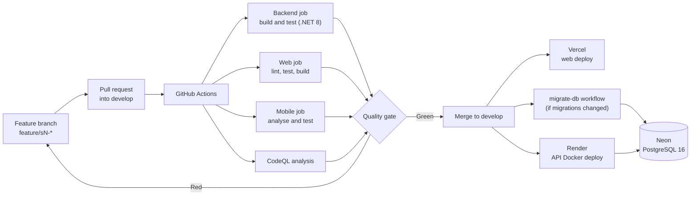
```mermaid
flowchart LR
    A["Feature branch<br/>feature/sN-*"] --> B["Pull request<br/>into develop"]
    B --> C["GitHub Actions"]
    C --> C1["Backend job<br/>build and test (.NET 8)"]
    C --> C2["Web job<br/>lint, test, build"]
    C --> C3["Mobile job<br/>analyse and test"]
    C --> C5["CodeQL analysis"]
    C1 --> C4{"Quality gate"}
    C2 --> C4
    C3 --> C4
    C5 --> C4
    C4 -->|"Green"| D["Merge to develop"]
    C4 -->|"Red"| A
    D --> V["Vercel<br/>web deploy"]
    D --> R["Render<br/>API Docker deploy"]
    D --> M["migrate-db workflow<br/>(if migrations changed)"]
    M --> N[("Neon<br/>PostgreSQL 16")]
    R --> N
```

Figure 3.9 shows that a change cannot reach any hosting platform until the quality gate is green, and that the three deployments are triggered independently from the same merge. The migration job is conditional: it runs only when files under the migrations directory change, and it needs a repository secret holding the production connection string; without that secret the job skips with a warning rather than failing. The workflow is serialised, so two migration runs never overlap. The Android application is not deployed by the pipeline; a debug-signed APK was published as a GitHub release for evaluation.

## 3.15 Architecture Decision Records

Significant decisions are recorded as architecture decision records (ADRs) in `docs/adr/`, together with a shorter log of project decisions in `agent/DECISIONS.md`. Table 3.9 lists the records present in the repository and the other recorded decisions that shaped the design.

> [TO BE ADDED: ADR-001 … ADR-012 files are referenced but not present in docs/adr/ — add them or remove the references before submission.]

*Table 3.9 – Architecture Decision Records*

| ADR | Decision | Status | Rationale |
|---|---|---|---|
| ADR-006 | Use a local LLM through Ollama | Superseded by ADR-013 (2026-09-22) | Keeps health data on team hardware, but cannot run on a 512 MB free-tier host and cannot be evaluated without the team's own machines. |
| ADR-013 | Use hosted Gemini for agent inference with Groq as fallback | Accepted (2026-09-22), owner S3 | Satisfies the cloud-hosted evaluation requirement within free-tier quotas; safety rules remain deterministic and the model never exercises clinical judgement. |
| ADR-014 | Store original lab-report images in Google Drive through a backend-only seam, keeping metadata in PostgreSQL | Accepted (2026-10-01), owner S2; extends ADR-010 | Frees limited free-tier database storage while preserving invariants 4 and 5, with a PostgreSQL fallback so no upload is lost. |
| Decision log, 2026-09-23 | Changes enter `develop` only through pull requests | Recorded | Gives CI a gate and every change a review record. |
| Decision log, 2026-09-28 | Three-portal blueprint with core and future features separated | Recorded | Limits scope to what can be delivered and tested in the available time. |
| Decision log, 2026-09-28b | Whole-project delivery with component tags marking attribution | Recorded | The integrated system required changes across ownership boundaries (Section 3.3). |
| Decision log, 2026-09-29 | Family heads are auto-approved; only doctors require administrator verification; production migrations by idempotent script, never on start-up | Recorded | Removes unnecessary friction for households while keeping clinicians verified; avoids schema lag and a provider defect at start-up. |
| Decision log | Administrator accounts are deactivated, never deleted; an adult who is removed or leaves a family moves to their own household | Recorded | Preserves audit history and avoids orphaned or lost health data. |

---
# CHAPTER 4 — RESULTS AND EVALUATION

## 4.1 Final System Overview

The delivered system is a single, integrated platform in which one ASP.NET Core 8 API serves every client, in accordance with architecture invariants 1 and 2 (one backend, one database, one identity and permission model). The delivered artefacts are as follows.

- **Hosted web application.** The React 18 (Vite, TypeScript) client is deployed to Vercel at https://family-veda-web.vercel.app. It exposes four portals: Clinic Admin, Doctor, Family Head and Adult Member. Minors are guardian-managed and do not hold a login.
- **Hosted API and Swagger.** The ASP.NET Core Web API (C# 12, .NET 8, 146 endpoint actions across 15 controllers, all under `/api/v1`) runs as a Docker service on Render. Its health endpoint is https://family-veda-api.onrender.com/health and its Swagger UI is https://family-veda-api.onrender.com/swagger/index.html. Both returned HTTP 200 on 2026-09-28.
- **Production database.** PostgreSQL 16 is hosted on Neon (project "Family Veda SEF Production"). The schema comprises 34 domain entity sets managed by 10 EF Core migrations. Production migrations are applied through an idempotent SQL script, never through migrate-on-startup.
- **Android application.** A Flutter 3.x client is distributed as a debug-signed, 159 MB APK published as a GitHub pre-release (https://github.com/sahansbandara/Family-Veda-SEF-Project/releases/tag/apk-2026-09-28). It was built against the hosted API.
- **Agent pipeline.** Coordinator, Context, Analysis and Familial Risk agents, together with a deterministic Safety/Validation stage, are executed by a background `TriageWorker`. Agents reach data only through the allow-listed `ToolDispatcher`. The Extraction agent runs in the lab-report upload workflow, using Tesseract OCR. The hosted LLM is Gemini with Groq as fallback.
- **Approval gate.** A verified doctor holding an active case grant must approve before any guidance is visible to a family member. Before approval, the guidance endpoint returns HTTP 404.
- **Delivery pipeline.** GitHub Actions (CI, CodeQL, production-migration workflow) and Dependabot support the repository. Demo accounts are synthetic and are listed in the project README ("Live demo access").


## 4.2 Implemented Features

Table 4.1 summarises the implemented features by component and records, accurately, the items that were not delivered in this phase. Status values reflect the state of the repository on 2026-10-05; "Implemented" means that the capability exists in source and is exercised by the test evidence described in Section 4.4, not that it has been clinically validated.

*Table 4.1 – Implemented Features*

| Component | Status | Notes |
|---|---|---|
| Family, Identity and Consent (S1) | Implemented | Registration and login, family creation with family code, join requests, family-head transfer, leave and remove flows, guardian-managed minors, per-category consent (hereditary flags, vitals summary, conditions) governed by a consent state machine with six permitted transitions. |
| Health Records and Extraction (S2) | Implemented | Health records, vitals, lab reports and lab values; PNG/JPEG upload up to 10 MB, Tesseract OCR, parsed values stored unconfirmed and shown for user comparison and confirmation against the printed reference interval; lab-report soft delete, trash and restore; per-item family sharing for adult records (private by default). |
| Triage and Agent Orchestration (S3) | Implemented | Symptom submission, queued processing by `TriageWorker`, Coordinator, Context and Analysis agents, schema validation of agent output, confidence threshold, deterministic emergency red-flag path, trace persistence as `AgentTrace` rows, Gemini-to-Groq fallback. |
| Familial Risk and Clinical Approval (S4) | Implemented | Familial Risk agent over consented hereditary flags only; deterministic Safety/Validation stage; doctor verification workflow; case grants; approval gate with Approve, Revise and Approve, Request Information, Reject, Escalate and Close Referral; audit of every decision. |
| Authentication and authorisation (cross-cutting) | Implemented | JWT bearer access tokens (60 minutes) with single-use refresh tokens (7 days), PBKDF2 password hashing, role policies, access by grant rather than by role alone, rate limiting, CORS allow-list, RFC 7807 error responses. |
| Notifications (cross-cutting) | Implemented (push config-gated) | In-app portal notifications are delivered through the API. Firebase Cloud Messaging push is issued by the backend only and is delivered only where Firebase configuration is present. |
| Audit (cross-cutting) | Implemented | Audit rows are written for cross-profile reads and for approval decisions. |
| Dashboards (cross-cutting) | Implemented | Family Head, Adult Member and Doctor dashboards on web and mobile, populated from live API data. |
| Appointments (cross-cutting) | Implemented | Request, confirmation, booking in 45-minute durations, overlap protection (HTTP 409), doctor availability and unavailable periods, appointment statuses including Requested, Confirmed, Completed, Cancelled and No-show. |
| Doctor workspace (cross-cutting) | Implemented | Doctor dashboard, approvals desk, cases, member workspace with clinical notes, family-doctor request and acceptance, with verification, grant and consent checks on load. |
| Clinic Admin portal | Implemented | Doctor verification (Pending, Verified, More Information Required, Rejected, Suspended); admin accounts are deactivated, never deleted. |
| Pre-Visit Brief for doctors | Not in this phase (FUTURE) | Doctor-only, grant-scoped, schema-validated summary labelled as AI-generated context; planned in the three-portal blueprint. No implementation was found in source. |
| AI plain-language lab explanation | Not in this phase (FUTURE) | Would use deterministic range status only and pass through the doctor-approval gate. |
| Personal health search ("Ask My Health Records") | Not in this phase (FUTURE) | Would return source records rendered by code, not AI prose. |
| Medical image observations; handwritten document reader | Not in this phase (FUTURE) | Doctor-only drafts by design; never shown to patients or family users. No implementation was found in source. |
| AI doctor discovery; report comparison | Not in this phase (FUTURE) | Listed in the phase plan as work to be carried out only if time remained. |

## 4.3 Screens and Outputs

Figures 4.1 to 4.7 are retained synthetic-data screenshots from the 2026-09-28 release evidence. No real patient data appears in any of them.

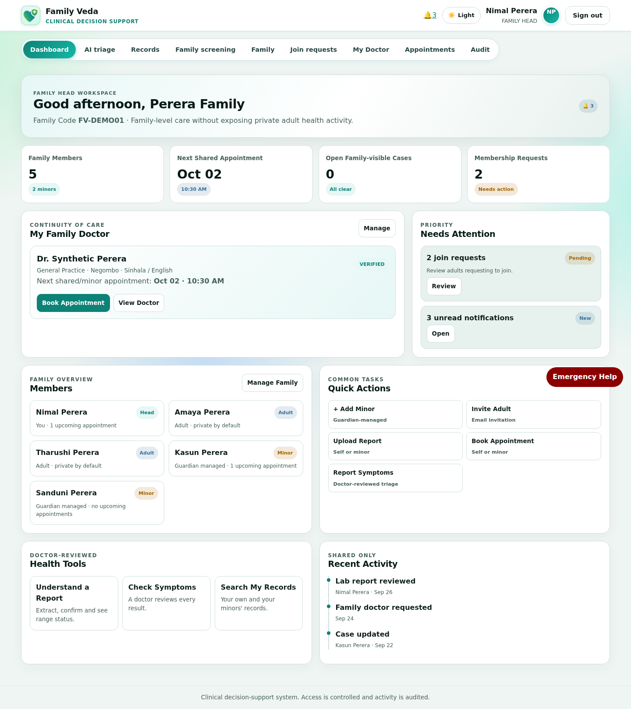

*Figure 4.1 – Family Head Dashboard (Web)*

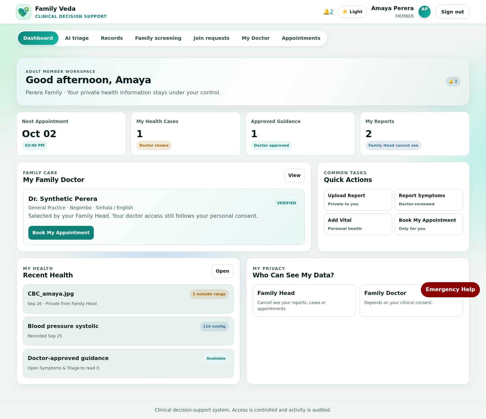

*Figure 4.2 – Adult Member Dashboard (Web)*

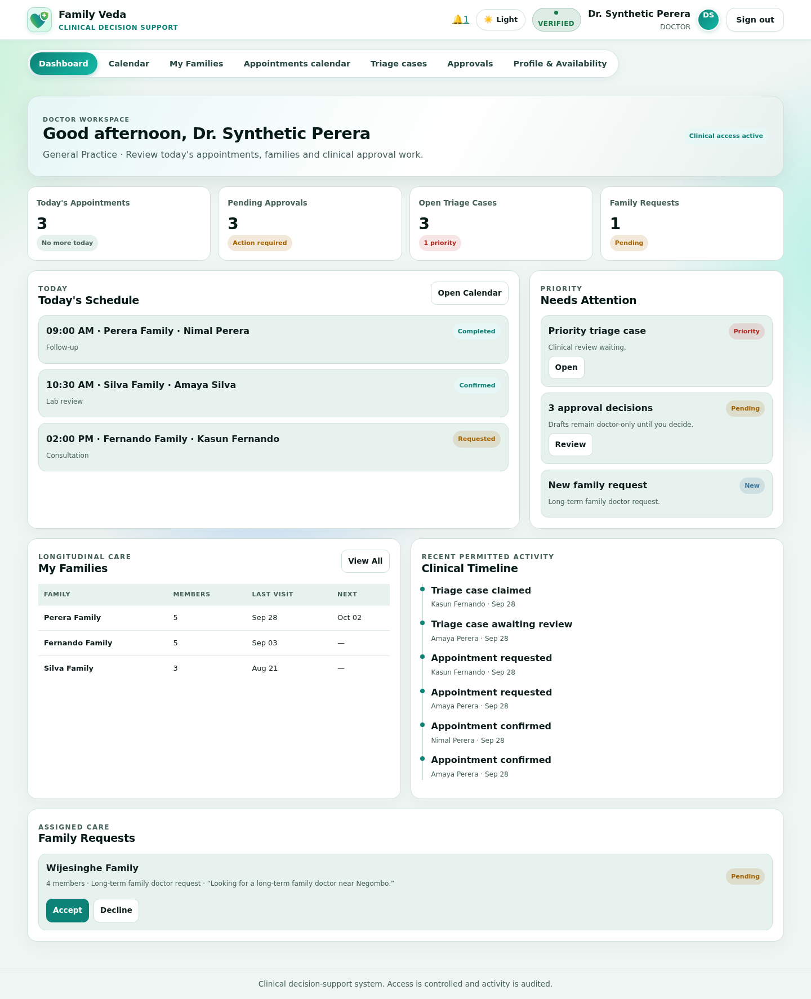

*Figure 4.3 – Doctor Dashboard (Web)*

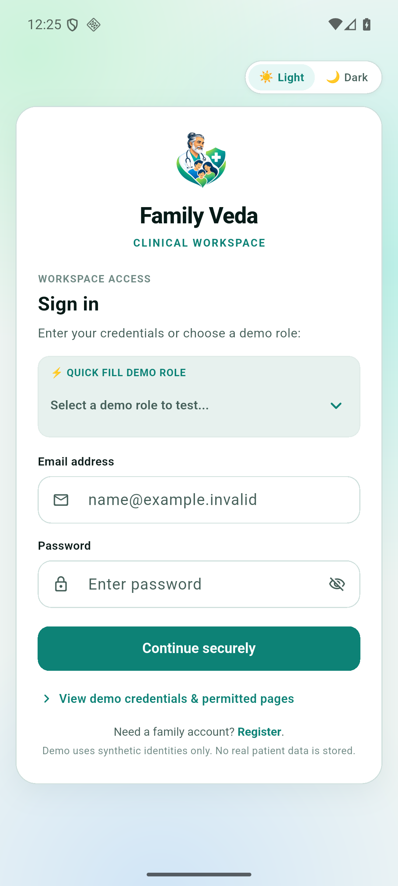

*Figure 4.4 – Android App Launch*

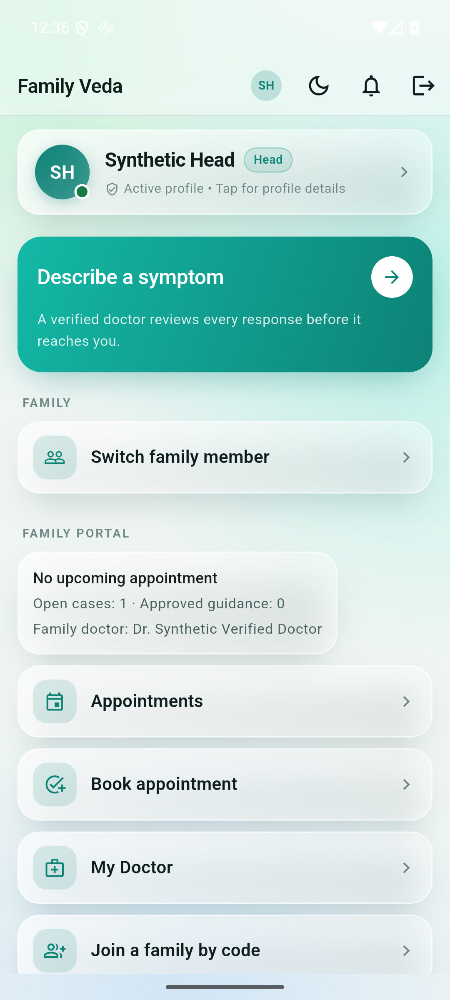

*Figure 4.5 – Android Family Head Dashboard*

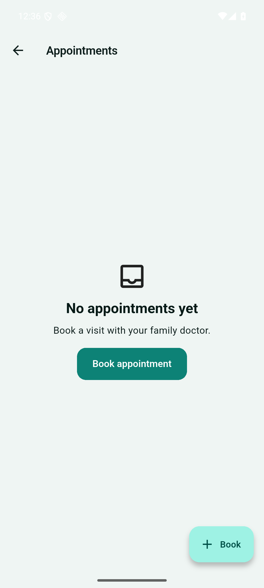

*Figure 4.6 – Android Appointments*

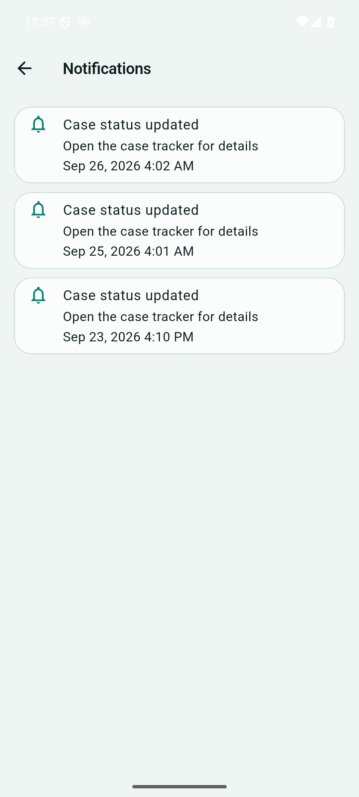

*Figure 4.7 – Android Notifications*

Figures 4.1 to 4.3 show the three web dashboards, each populated from the shared API. Figure 4.3 corresponds to the screen affected by defects D-006 and D-007 (Section 4.7); the screenshot was captured before the D-007 fix reached production. Figures 4.4 to 4.7 were captured on an Android API 36 emulator running the debug-signed APK against the hosted API, signed in as the synthetic Family Head. They show that the mobile client consumes the same API as the web client.

Screens that are still required for a complete evidence set are listed below. Each is a placeholder and must be captured from the live synthetic environment before submission.

- `[INSERT SCREENSHOT: Doctor approval desk showing a pending triage case and the decision actions]`
- `[INSERT SCREENSHOT: Lab report upload and the "check values" comparison screen before confirmation]`
- `[INSERT SCREENSHOT: Triage (symptom) submission screen on web and mobile]`
- `[INSERT SCREENSHOT: Approved guidance as displayed on mobile to the family member]`
- `[INSERT SCREENSHOT: Clinic Admin doctor verification screen]`
- `[INSERT SCREENSHOT: Emergency referral screen (referral shown instead of AI output)]`
- `[INSERT SCREENSHOT: Swagger UI at /swagger/index.html]`

## 4.4 Testing

### 4.4.1 Test Plan

**Objectives.** The test plan has four objectives: (1) to show that each business component behaves correctly for normal, invalid, boundary and failure inputs; (2) to show that the ten clinical safety rules and six architecture invariants hold under test, in particular that no unapproved AI output can reach a patient; (3) to show that the two clients, the API, the database and the agentic subsystem work together in one integrated workflow; and (4) to measure the required non-functional properties, performance and security, with tools rather than by observation.

**Scope.** The system under test is the same integrated application submitted for the main assignment: the ASP.NET Core Web API, the PostgreSQL database, the React web application, the Flutter mobile application and the agentic subsystem. Only synthetic data is used. Real patient data, national identity numbers and medical-council registration numbers are excluded.

**Test environment.**

- *Local development machine:* macOS; .NET SDK 10.0.302 building the `net8.0` target; Node.js 26.9.0; Flutter 3.47.5 with Dart 3.13.4; Docker for Testcontainers (PostgreSQL 16); Android API 36 emulator.
- *Continuous integration:* GitHub Actions on `ubuntu-latest` runners, running the backend, web and mobile jobs and a quality gate on every pull request and on pushes to the integration branch, with CodeQL analysis alongside.
- *Hosted environment:* API on Render, PostgreSQL 16 on Neon and the web application on Vercel, used for smoke checks of the deployed revision.

**Schedule.** Testing followed the dates recorded in the repository: a compliance audit on 2026-09-23 identified the evidence gaps; the baseline execution, defect logging and retests took place on 2026-09-28; regression ran through CI on each pull request between 2026-09-28 and 2026-10-05; and the complete suites were rerun with coverage on 2026-10-05.

Table 4.2 sets out what is tested in each area, the type of testing, the tool and the responsible member.

*Table 4.2 – Test Plan*

| Testing area | What is tested | Testing type | Tool / framework | Expected result | Responsible member (planned) |
|---|---|---|---|---|---|
| Backend / API — Family, Identity and Consent | Registration validators, consent state machine, family lifecycle, join requests, head transfer, authentication and refresh tokens | Unit, validation, authorisation, API integration | xUnit, Moq, Testcontainers | Rules enforced; invalid input rejected; no cross-profile read without consent | S1 |
| Backend / API — Health Records and Extraction | Lab extraction parser, extraction safety, range classifier, report storage and trash, lab review | Unit, service, failure | xUnit, Moq | Only recognised values extracted; confirmed data never overwritten | S2 |
| Backend / API — Triage and Orchestration | Orchestrator schema validation, emergency gate, worker recovery, LLM client fallback, SLA processor | Unit, failure-recovery | xUnit, Moq | Invalid output fails safe; emergency halts before any LLM step | S3 |
| Backend / API — Familial Risk and Clinical Approval | Safety validation, clinical rule tables, case-grant policy, familial-risk policy, approval decisions | Unit, business-rule, authorisation | xUnit, Moq | Deterministic rules decide; expired or revoked grants denied | S4 |
| Database | Migrations on empty and populated databases, partial unique indexes, concurrency constraints, rollback refusal | Integration, constraint, migration, transaction | xUnit, Testcontainers (PostgreSQL 16), EF Core | Schema applies cleanly; one active assignment and one pending request at most | S1 (migrations), S4 (doctor constraints) |
| React web application | Pages, forms, route guards, API-state and error-state rendering for each portal | Component, form-validation, protected-route | Vitest, React Testing Library, ESLint, Vite build | Components render correct state; guards redirect; build succeeds | Component owner for each page (S1–S4) |
| Flutter mobile application | Screens, providers, models, router guards, secure storage | Unit, widget, navigation | flutter_test, `flutter analyze` | No analysis issues; widgets and providers behave as specified | Component owner for each screen (S1–S4) |
| Integration / end-to-end | Golden case from complaint to approved guidance; safe-failure case; three-role API journey | API integration, complete business workflow | xUnit integration tests, `scripts/e2e/synthetic_portal_journey.py` | Guidance unavailable before approval and available after; privacy denial returns 404 | S3, S4 |
| Agentic AI evaluation | Tool allow-list and denial, structured-output validation, prompt-injection resistance through untrusted OCR text, approval enforcement, safe failure and recovery | Agent evaluation, deterministic test cases | xUnit | Denied tools recorded and stopped; no advisory on failure | S1 (tool dispatch), S2 (Extraction), S3 (Coordinator, Context, Analysis), S4 (Familial Risk, Safety) |
| Performance (required) | Authenticated read endpoint under concurrent load | Load baseline | ApacheBench via `scripts/e2e/local_performance_check.py` | Zero failed or non-2xx responses; latency recorded | S1 |
| Security (required) | Access control, unauthenticated access, CORS, token reuse, dependency vulnerabilities, static analysis | Authorisation, dependency audit, static analysis | xUnit, `npm audit`, `dotnet list package --vulnerable`, CodeQL | Unauthorised requests denied; no known vulnerable dependencies | S1, S4 |

> `[CONFIRM: the responsible-member column follows component ownership. Each member must confirm the areas they actually tested and can demonstrate in the viva.]`

### 4.4.2 Testing Strategy

The test strategy follows a test pyramid, with the greatest number of fast, deterministic tests at the base and a smaller number of slower, broader checks above it (Pressman & Maxim, 2020).

1. **Unit tests (xUnit and Moq).** These exercise the domain rules and application services in isolation: the consent state machine, case-grant policy, familial-risk policy, clinical rule tables, safety validation, tool registry and dispatcher, agent orchestration and worker recovery.
2. **Integration tests (xUnit with Testcontainers PostgreSQL 16).** These run the API and EF Core against a real PostgreSQL container, so that constraints, migrations and time-zone handling are exercised against the production database engine rather than an in-memory substitute.
3. **Web component and page tests (Vitest and React Testing Library)**, together with ESLint and a production Vite build as a quality gate.
4. **Mobile tests (flutter_test)**, together with `flutter analyze`.
5. **Scripted API journey.** A repeatable script, `scripts/e2e/synthetic_portal_journey.py`, drives three synthetic roles through the local API. It refuses remote hosts and mutates only synthetic local data.
6. **Performance baseline.** A local ApacheBench run via `scripts/e2e/local_performance_check.py`.
7. **Dependency audits.** `npm audit --omit=dev` for the web client and `dotnet list package --vulnerable --include-transitive` for the API.
8. **CI gate.** GitHub Actions runs CI and CodeQL on `develop`; both completed successfully on commit `49face54` on 2026-09-28.

Testing is risk-based. The highest priority was given to the properties whose failure would breach a clinical safety rule or the integration architecture: the approval gate (no unapproved guidance), consent and case-grant enforcement on every cross-profile read, denial of tools outside an agent's allow-list, deterministic emergency handling, and safe failure when an agent produces invalid output or a provider is unavailable. Lower-risk presentation concerns were covered by component tests and manual emulator checks. This prioritisation reflects the Assignment 2 risk register, in which authorisation leakage, unsafe agent output, migration incompatibility, client/API contract mismatch and success-reported failures were the principal risks.

### 4.4.3 Non-Functional Test Selection

Performance and security testing are mandatory for this assessment. Table 4.3 records which non-functional types were selected, and why the others were not.

*Table 4.3 – Non-Functional Test Selection*

| Non-functional type | Selected | Justification |
|---|---|---|
| Performance (load baseline) | Yes — required | Confirms that an authenticated read path completes without errors under concurrency. Limited to one endpoint and a local environment (Section 4.6). |
| Security | Yes — required | The system handles health-related records and cross-profile access, so access control, token handling and dependency vulnerabilities carry the highest risk (Section 4.5). |
| Reliability and recovery | Yes | A triage case must never be lost or silently replayed. Worker-restart recovery, provider-failure fallback and safe-failure paths are covered by automated tests. |
| Compatibility | Partly | The mobile application was built and run on an Android API 36 emulator only. No physical device and no iOS build were tested. |
| Stress testing | No | Free-tier hosting imposes its own limits, so a stress result would describe the hosting plan rather than the application. |
| Usability and accessibility | No | No tool-based usability or accessibility run (for example Lighthouse or axe) was executed. Responsive layout was checked manually during development, which does not count as tool-based evidence. |

### 4.4.4 Automated Suite Results

Table 4.4 reports the retained 2026-09-28 execution alongside the final local rerun on 2026-10-05 at commit `613bf7e` on `develop`. The rerun output is retained under `docs/evidence/2026-10-05/`. Results are reported as observed, including failures.

*Table 4.4 – Automated Test Suite Results*

| Suite | Tool | Retained run 2026-09-28 | Rerun 2026-10-05 @ `613bf7e` | Line coverage (2026-10-05) | Evidence file |
|---|---|---|---|---|---|
| Backend unit | xUnit + Moq | 91 / 91 passed | 337 / 337 passed | 20.2% overall; Domain 72.4%, Application 76.0% | `backend-unit.txt` |
| PostgreSQL integration | xUnit + Testcontainers (PostgreSQL 16) | 11 / 11 passed | 25 / 25 passed | 69.1% overall; Infrastructure 71.1%, Api 59.0% | `backend-integration.txt` |
| Web tests | Vitest + React Testing Library | 41 / 41 passed | First run 306 / 308 (2 failed); **retest after fix 307 / 307 passed** (52 files) | Not captured — see note | `web-tests.txt`, `web-tests-retest.txt` |
| Web lint and build | ESLint; `tsc -b` + Vite build | Passed | First run failed (lint exit 1, build exit 2); **retest after fix: both exit 0** | — | `web-lint-build.txt`, `web-lint-build-retest.txt` |
| Flutter | `flutter analyze`; flutter_test | No issues; 69 / 69 passed | No issues; 214 / 214 passed | 76.4% | `flutter-tests.txt` |
| Dependency audits | `npm audit --omit=dev`; `dotnet list package --vulnerable` | 0 vulnerabilities; none reported | 0 vulnerabilities; none reported | — | `dependency-audits.txt` |

Three points qualify these figures. First, the first run at `613bf7e` exposed two defects, both from same-day changes to the records pages: two obsolete tests in `web/src/pages/records/VitalsPanel.test.tsx` (D-008) and an unused `Link` import in `web/src/pages/records/RecordsPage.tsx` that failed lint and the production build (D-009). Both were fixed and retested the same day; the retest ran 307 tests because one obsolete test was removed and one was reduced (Table 4.9). Web coverage was not captured: the coverage-instrumented runs timed out on a heavily loaded development machine, so no trustworthy figure is reported. Second, backend coverage is reported per run and has not been merged: the unit run covers the Domain and Application layers well but barely touches controllers and persistence, which the integration run covers instead. The backend line totals also include generated EF Core migration code, which lowers the overall percentage. Third, the growth from the retained run to the rerun (for example 91 to 337 unit tests) reflects tests added with the features delivered between the two dates.

### 4.4.5 Test Case Document

Table 4.5 is the test case document. Each case names the feature, its type (normal, invalid, boundary or failure), the preconditions and steps, the expected and actual result, and the status. Cases TC-01 to TC-24 are individual automated tests, identified by their test method so that they can be rerun; cases A2-* are the wider integrated, non-functional and device cases executed on 2026-09-28. Automated cases were last executed on 2026-10-05 as part of the suites in Table 4.4.

*Table 4.5 – Test Case Document*

| ID | Feature | Type | Preconditions and steps / input | Expected result | Actual result | Status |
|---|---|---|---|---|---|---|
| TC-01 | Registration (S1) | Normal | Submit a complete Family Head registration to the validator — `ValidFamilyHead_Passes` | Validation passes | Passed | Pass |
| TC-02 | Registration (S1) | Invalid | Submit a Family Head registration with no family name — `FamilyHead_RequiresFamilyName` | Validation error on family name | Error returned | Pass |
| TC-03 | Registration (S1) | Invalid | Submit mismatched password and confirmation — `ConfirmPassword_MustMatch` | Validation error | Error returned | Pass |
| TC-04 | Registration (S1) | Boundary | Submit a date of birth below the adult threshold, and a future date — `DateOfBirth_RequiresAdult`, `DateOfBirth_RejectsFuture` | Both rejected | Both rejected | Pass |
| TC-05 | Consent (S1) | Boundary | Guardian-granted consent for a member who turns eighteen — `RequiresReaffirmation_WhenGuardianGrantedAndMemberTurnsEighteen_ReturnsTrue` | Reaffirmation required | Reaffirmation required | Pass |
| TC-06 | Authentication (S1) | Failure | Submit the same refresh token concurrently — `RefreshToken_IsSingleUse_WhenSubmittedConcurrently` | Only one request succeeds | One succeeded | Pass |
| TC-07 | Tool dispatch (S1) | Failure | An agent requests a tool outside its allow-list — `DeniedTool_IsPersisted_AndThrowsHardError` | Denial persisted; processing stops | Denial persisted; error raised | Pass |
| TC-08 | Tool dispatch (S1) | Normal | Familial Risk Agent reads relatives' flags — `FamilialRisk_ReadsOnlyBiologicalRelativesWithCurrentConsent` | Only consented biological relatives returned | As expected | Pass |
| TC-09 | Lab extraction (S2) | Normal | Parse a recognised report table — `ParseValues_ExtractsStructuredRows_AndIgnoresFreeText` | Structured rows extracted; free text ignored | As expected | Pass |
| TC-10 | Lab extraction (S2) | Invalid | Parse text containing appointment times — `ParseValues_DoesNotTreatAppointmentTimesAsLabResults` | No lab value created | None created | Pass |
| TC-11 | Lab extraction (S2) | Invalid | Parse table rows with malformed fields or no recognised header — `ParseValues_TableRows_UseCurrentValueAndRejectMalformedFields`, `ParseValues_DoesNotParseTableRowsWithoutRecognizedHeader` | Malformed rows rejected | Rejected | Pass |
| TC-12 | Lab extraction (S2) | Failure | Extraction recognises zero rows — `ExtractAsync_WhenRecognizedRowsAreZero_FailsWithoutWritingValuesOrFlags` | Fails without writing values or flags | Nothing written | Pass |
| TC-13 | Lab extraction (S2) | Failure | Re-extract a report that already holds manually confirmed data — `ExtractAsync_WhenReportContainsManuallyConfirmedData_RejectsAndPreservesConfirmedRows` | Rejected; confirmed rows preserved | Preserved | Pass |
| TC-14 | Agent orchestration (S3) | Failure | An agent returns output that violates its schema — `InvalidAgentSchema_FailsSafe_AndStopsRemainingAgents` | Case fails safe; later agents do not run | Failed safe | Pass |
| TC-15 | Emergency gate (S3) | Failure | Emergency wording appears in free-text notes — `EmergencyGate_AlsoChecksFreeTextNotes_BeforeEveryLlmAgent` | Halt before every LLM agent | Halted | Pass |
| TC-16 | LLM client (S3) | Failure | Provider returns rate-limit responses twice — `RateLimitedTwice_FailsClosed` | Client fails closed | Failed closed | Pass |
| TC-17 | LLM client (S3) | Invalid | Provider returns a schema violation once — `SchemaViolation_RetriesOnce_ThenReturnsValidOutput` | One retry, then valid output | As expected | Pass |
| TC-18 | Worker recovery (S3) | Boundary | More queued cases than channel capacity at start-up — `Recovery_ReturnsMoreThanChannelCapacity_WithoutBlockingStartup` | Start-up not blocked | Not blocked | Pass |
| TC-19 | Case grant (S4) | Boundary | Grant expired or exactly at its expiry time — `HasAccess_WhenGrantIsExpiredOrAtExpiryBoundary_ReturnsFalse` | Access denied | Denied | Pass |
| TC-20 | Case grant (S4) | Invalid | Grant was revoked — `HasAccess_WhenGrantWasRevoked_ReturnsFalse` | Access denied | Denied | Pass |
| TC-21 | Safety validation (S4) | Failure | Emergency red flag present — `Validate_WhenEmergencyRedFlagExists_HaltsBeforeLlmAndReturnsReferralOnly` | Referral only; no AI output | Referral only | Pass |
| TC-22 | Safety validation (S4) | Invalid | Evidence contains prohibited content — `Validate_WhenLabEvidenceContainsMedicationContent_StillBlocksContent` | Content blocked | Blocked | Pass |
| TC-23 | Approval gate (S4) | Normal | Complete synthetic golden case — `SyntheticGoldenCase_RequiresApprovalBeforeFamilyCanReadGuidance` | Guidance unreadable before approval, readable after | As expected | Pass |
| TC-24 | Doctor verification (S4) | Invalid | Unverified doctor calls clinical routes — `PendingDoctor_IsForbiddenFromEveryClinicalQueueAndDecisionSurface` | Forbidden on every route | Forbidden | Pass |
| A2-API-01 | Three-role API journey | Normal | Synthetic Head, Adult Member and Doctor against local API and PostgreSQL 16; run `scripts/e2e/synthetic_portal_journey.py` | Journey completes; Head denied an adult's records | Join by code, doctor acceptance, 45-minute booking, dashboards and notifications passed; Head received 404 | Pass |
| A2-API-02 | Doctor acceptance | Failure (regression) | Fixture with an already assigned doctor and a legacy pending request; accept the request | No duplicate assignment | HTTP 200, one assignment, request Accepted | Pass |
| A2-DB-02 | Doctor concurrency constraints | Boundary | Competing writes for pending requests and active primary assignments; concurrent accept and decline | At most one of each; one decision with matching audit | One write won each pair; API returned one 200 and one 409 with one audit row | Pass |
| A2-DB-03 | Idempotent migration | Normal | Fresh PostgreSQL 16; apply the first two migrations, then the doctor-constraint script twice | Both runs succeed; one history row per migration | Both runs exited 0; three distinct migration IDs | Pass |
| A2-DB-04 | Populated migration and rollback | Failure | Legacy database with history; conflicting legacy database; repeated assignment after upgrade | Rows preserved; conflicting upgrade rejected atomically; unsafe rollback refused | Confirmed by integration tests | Pass |
| A2-MOB-02 | Android appointment booking | Normal | Synthetic Head on Android API 36 emulator with local API; select 45 minutes and 10:00 AM; submit | Same local time shown in the appointment list | Stored `duration_minutes=45`; list showed 10:00 AM after the time-zone fix | Pass |
| A2-MOB-03 | Hosted-API Android APK | Normal | Build with the production API URL; install on Android API 36 emulator; sign in as synthetic Head | APK builds, installs and reaches the dashboard | Built, installed, signed in; dashboard, appointments and notifications loaded. Doctor-approved guidance journey on the hosted environment not run | Partial |
| A2-E2E-01 | Complete integrated workflow | Normal and failure | Flutter → API, database and agents → React approval → Flutter result | Golden case and safe-failure case demonstrated across both clients | Passed at API level (TC-14, TC-23). Cross-platform visual trace not executed | Partial |
| A2-PERF-01 | Performance | Normal | ApacheBench, 200 authenticated doctor-directory requests at concurrency 10, local API and PostgreSQL 16 | Zero failed or non-2xx responses | 200 completed, 0 failed; 1.827 ms mean; 4 ms p99 | Pass (local baseline) |
| A2-SEC-01 | Access control | Invalid | Unauthenticated GET on three protected live routes; preflight from an untrusted origin | 401 on each route; no allow-origin header | 401 returned three times; no allow-origin header | Pass (scoped) |
| A2-SEC-02 | Web dependency audit | Normal | `npm audit --omit=dev --audit-level=high` | No known vulnerabilities | `found 0 vulnerabilities` (2026-10-05) | Pass |
| A2-SEC-03 | API dependency audit | Normal | `dotnet list package --vulnerable --include-transitive` | No vulnerable packages | None reported (2026-10-05) | Pass |
| A2-WEB-01 | Vitals panel (web) | Normal | Run `VitalsPanel.test.tsx` on 2026-10-05 | All tests pass | First run: two of four failed (D-008). Retest after the tests were aligned with the redesigned panel: three of three passed | Pass (after retest) |
| A2-WEB-02 | Web quality gate | Normal | `npm run lint` and `npm run build` on 2026-10-05 | Both exit 0 | First run: lint exit 1, build exit 2 (D-009). Retest after fix: both exit 0 | Pass (after retest) |

Of the 38 cases, 36 are Pass (two with stated scope qualifications and two after a same-day fix and retest) and 2 are Partial. No case remains failed.

### 4.4.6 Agent Evaluation

The agentic subsystem was evaluated at component level and at API level. The following named test classes exist in the backend test projects and cover the safety-critical behaviour.

- `SafetyValidationServiceTests`: deterministic validation of agent output against rule tables, including prohibited-content rejection.
- `ToolRegistryTests` and `ToolDispatcherTests`: the per-agent tool allow-list and the dispatch-layer enforcement that denies a tool outside it, with the denial recorded as a `ToolDenied` step.
- `TriageOrchestratorSchemaTests`: invalid agent output results in a `FailedSafe` case with an `INVALID_AGENT_SCHEMA` trace, and no advisory is produced.
- `TriageOrchestratorEmergencyTests` and `ClinicalEmergencyReferralTests`: an emergency red-flag phrase produces a deterministic escalation and referral before any LLM step is invoked.
- `TriageWorkerRecoveryTests`: after a worker restart, untouched queued cases are recovered and interrupted cases are marked safely failed rather than silently replayed.
- `CaseGrantPolicyTests`, `ConsentStateMachineTests` and `FamilialRiskPolicyTests`: the grant, consent and hereditary-screening rules that gate what an agent or doctor may read.
- `GoldenCaseFlowTests`: the PostgreSQL golden case and safe-failure case described below.

**Golden case.** The deterministic PostgreSQL test (A2-E2E-01) passed 2/2 at API level. It submits a synthetic episode, runs the agents, confirms that the assigned verified primary doctor receives an active case grant, has that doctor approve through an allow-listed advisory, and then reads the guidance as the family member. Before approval the same family read returns HTTP 404. Calling the shared-pool claim route on the already granted case returns the expected HTTP 409 (this resolved defect D-005, a test design error, not a production defect).

**Safe-failure trace.** The independent invalid-schema test verifies that processing stopped after the Context agent, that a persisted `SafeFailure` trace with code `INVALID_AGENT_SCHEMA` exists, and that approved guidance remained HTTP 404.

**Limits of this evaluation.** The golden-case evidence is backend API evidence. The full cross-platform visual trace (Flutter submission, React doctor approval, Flutter result) has **not** yet been executed and retained; it is pending and is reported as such in Table 4.5 and Table 4.7. No agent-latency or LLM-quality measurement has been taken, and the hosted LLM output is non-deterministic, so the deterministic tests above deliberately do not depend on it.

### 4.4.7 Test Execution Summary

Table 4.6 summarises the final execution on 2026-10-05, after the same-day fixes for D-008 and D-009.

*Table 4.6 – Test Execution Summary*

| Area | Executed | Passed | Failed | Note |
|---|---|---|---|---|
| Backend unit tests | 337 | 337 | 0 | |
| PostgreSQL integration tests | 25 | 25 | 0 | Includes golden case, safe failure, migrations and concurrency |
| Web tests | 307 | 307 | 0 | First run 306 / 308; two obsolete tests corrected (D-008) |
| Flutter tests | 214 | 214 | 0 | `flutter analyze` reported no issues |
| **Automated tests in total** | **883** | **883** | **0** | |
| Web lint and build | 2 checks | 2 | 0 | First run failed on one unused import (D-009) |
| Dependency audits | 2 | 2 | 0 | No known vulnerabilities |
| Integrated, device and non-functional cases (A2-*) | 12 | 10 | 0 | 2 Partial: hosted APK journey and cross-platform trace |
| Defects recorded | 9 | — | — | 9 fixed and retested; D-007 still awaits a production retest |

**Conclusion.** The backend, database and mobile suites pass in full, and the properties that protect patients — the approval gate, consent and grant enforcement, tool denial, the emergency path and safe failure — are each covered by passing automated tests. The final rerun also did its job: it exposed two web defects introduced on the last day, which were fixed and retested before submission. Three gaps remain in the evidence: the integrated workflow is proven at API level but not as a cross-platform visual trace; performance testing is a single local baseline; and security testing is scoped to access control, dependency audits and static analysis rather than a dynamic scan.

## 4.5 Security Evaluation

Table 4.7 lists the security checks for which execution evidence exists. Each is scoped and automated; none is a substitute for a penetration test.

*Table 4.7 – Security Checks*

| ID | Check | Expected | Actual | Status |
|---|---|---|---|---|
| SEC-1 | Guidance requested before doctor approval (integration test) | Family read of unapproved guidance denied | HTTP 404 before approval; guidance returned only after allow-listed approval | Pass |
| SEC-2 | Action by a doctor whose verification is pending (integration test) | Denied | Pending-doctor denial confirmed | Pass |
| SEC-3 | Refresh-token reuse (integration test) | Refresh token usable once only | Single-use behaviour confirmed | Pass |
| SEC-4 | Tool dispatch, case grants and consent (11 unit tests) | Unauthorised tool use, stale grants and revoked consent are denied | 11 unit tests passed | Pass |
| SEC-5 | Unauthenticated GET to `/api/v1/notifications`, `/api/v1/dashboard/family`, `/api/v1/dashboard/doctor` on the live API | HTTP 401 | All three returned HTTP 401 | Pass |
| SEC-6 | CORS preflight from `https://untrusted.example.invalid` | No allow-origin header | HTTP 204 without `Access-Control-Allow-Origin` | Pass |
| SEC-7 | `npm audit --omit=dev --audit-level=high` (web production dependencies) | No known vulnerabilities | `found 0 vulnerabilities` (2026-09-28) | Pass |
| SEC-8 | `dotnet list package --vulnerable --include-transitive` (API) | No known vulnerable packages | None reported (2026-09-28) | Pass |

Checks SEC-1 to SEC-3 are the three integration tests, and SEC-4 the eleven unit tests, that together form the focused xUnit run of A2-SEC-01 (3 + 11 tests). A further privacy check, that a Family Head receives HTTP 404 on an adult member's records, was part of the synthetic API journey A2-API-01 in Table 4.3.

### 4.5.1 Mapping to OWASP

The executed checks map to the OWASP Top Ten 2021 categories (OWASP Foundation, 2021) as follows.

- **A01 Broken Access Control.** SEC-1, SEC-2, SEC-4, SEC-5 and the Head-404 privacy check address object-level and function-level authorisation, grant expiry and consent revocation.
- **A02 Cryptographic Failures and A07 Identification and Authentication Failures.** SEC-3 covers refresh-token single use. Password hashing and token lifetimes are design controls described in Chapter 3; they are not separately tested here beyond the checks listed.
- **A05 Security Misconfiguration.** SEC-6 covers CORS handling for an untrusted origin.
- **A06 Vulnerable and Outdated Components.** SEC-7 and SEC-8 are dependency audits; CodeQL and Dependabot provide continuing coverage.

For the agentic subsystem, the controls are relevant to categories in the OWASP Top 10 for large language model applications (OWASP Foundation, 2025), in particular prompt injection and excessive agency. Indirect prompt injection through untrusted content is a recognised risk for LLM-integrated applications (Greshake et al., 2023). The relevant mitigations are structural: agents hold no database credentials, tool access is limited to a per-agent allow-list enforced at dispatch (`ToolRegistryTests`, `ToolDispatcherTests`, SEC-4), safety validation is deterministic rather than an LLM judgement, and no output reaches a patient without doctor approval (SEC-1). OCR text is treated as untrusted input. This mapping describes which controls address which categories; it does not claim that every category was tested.

The evaluation reported here is **scoped automated testing, not a penetration test**. Authenticated fuzzing, session-management attacks, injection testing of every endpoint and independent review were not performed (see Table 4.10).

## 4.6 Performance Evaluation

Table 4.8 reports the single performance measurement taken.

*Table 4.8 – Performance Baseline*

| Item | Value |
|---|---|
| Tool | ApacheBench |
| Target | Local Kestrel API with PostgreSQL 16, synthetic authenticated doctor-directory request |
| Load | 200 requests at concurrency 10 |
| Completed / failed | 200 completed, 0 failed |
| Mean request time | 1.827 ms |
| 99th percentile | 4 ms |
| Throughput | 5473.00 requests per second (retained local rerun) |

The result should be interpreted conservatively. The run was local, short, and exercised one read endpoint over a small synthetic data set with no network latency between client and server. It shows that the doctor-directory read path completes without errors under modest concurrency in that environment. It does **not** establish production capacity, behaviour under mixed read and write load, or the latency of the agent pipeline, which depends on hosted LLM response times (provider timeouts are configured at 45 seconds for Gemini and 30 seconds for Groq). The hosted deployment uses free-tier tiers of Render, Neon and Vercel, and cold starts on the free Render tier are a known characteristic of that service that users may notice after periods of inactivity; no measurement of this was taken, so no figure is given. Broader load and latency testing is listed in Table 4.10 and Table 4.8.

## 4.7 Defects and Retests

Table 4.9 is the defect report: each defect recorded during execution of the test plan, with its reproduction steps, cause, fix, retest outcome and current status.

*Table 4.9 – Defect and Retest Log*

| ID | Description | Severity / priority | Steps to reproduce | Root cause | Fix and retest result | Status | Evidence |
|---|---|---|---|---|---|---|---|
| D-001 | Doctor acceptance returned HTTP 500 | High / P1 | Run the synthetic API journey to the doctor-acceptance step with a doctor already assigned | Duplicate assignment inserted for an already assigned doctor | Fixed; integration test returns HTTP 200 with one assignment and request Accepted | Closed | `AuthAndPatientFlowTests` (TC A2-API-02) |
| D-002 | Flutter verification blocked | Blocker / P1 | Run `flutter pub get` on Flutter 3.41.2 / Dart 3.11 | `camera ^0.12.1` requires Dart 3.12 | SDK upgraded to Flutter 3.47.5 / Dart 3.13.4; analyze clean and tests pass | Closed | `docs/evidence/2026-09-28/flutter-tests.txt` |
| D-003 | Doctor dashboard returned HTTP 500 | High / P1 | Confirm an appointment, then `GET /api/v1/dashboard/doctor` | Non-UTC `DateTimeOffset` day boundary passed to Npgsql | Query boundary changed to UTC; integration check and repeat journey passed | Closed | `docs/evidence/2026-09-28/backend-integration.txt` |
| D-004 | Android appointment time shown in UTC | Medium / P2 | On a Sri Lanka-time emulator, book 10:00 AM and open the appointment list; 4:30 AM is shown | Model displayed the API instant without converting to device-local time | Timestamp parsed to local time; unit test and emulator retest show 10:00 AM | Closed | `docs/evidence/android_appointment_local_time.png` |
| D-005 | Golden-case test returned HTTP 409 | Test design error / P3 | Run the golden-case test, which called `/claim` on a case the primary doctor already held | Test used the shared-pool route for an already granted case | Test corrected to expect 409 and approve through the existing grant; 2/2 passed | Closed | `GoldenCaseFlowTests` |
| D-006 | Hosted doctor dashboard rendered blank | High / P1 | Sign in as the synthetic verified doctor on the hosted web app and open `/dashboard` | API returns an integer count; the client expected an array | Client contract corrected (PR #49) and redeployed; panel renders with no console errors; regression test added | Closed | `docs/evidence/2026-09-28/web-tests.txt` |
| D-007 | Sample metrics shown above live doctor metrics | Medium / P2 | After the D-006 fix, open the doctor `/dashboard`; hard-coded counts disagree with live counts | Static sample content rendered alongside the live panel | Route changed to render the live panel only; web tests, lint and build passed locally | Fixed — production retest `[CONFIRM]` | `docs/university/RELEASE_EVIDENCE_2026-09-28.md` |
| D-008 | Two vitals-panel web tests fail | Medium / P2 | In `web/`, run `npx vitest run src/pages/records/VitalsPanel.test.tsx` at `613bf7e` | The redesign of the vitals panel removed the history table and its type filter, but two tests still asserted them; the product behaved as designed and the tests were obsolete | The history-table assertion was removed from one test and the filter test was deleted; recorded readings remain covered by the per-vital dialog test. Retest: web suite 307 / 307 passed | Closed | `docs/evidence/2026-10-05/web-tests.txt`, `web-tests-retest.txt` |
| D-009 | Web lint and production build fail | High / P1 | In `web/`, run `npm run lint` then `npm run build` at `613bf7e` | Unused `Link` import left in `RecordsPage.tsx` (ESLint `no-unused-vars`, TypeScript TS6133) | Import removed. Retest: lint exit 0, build exit 0 | Closed | `docs/evidence/2026-10-05/web-lint-build.txt`, `web-lint-build-retest.txt` |

Priority follows severity: P1 blocks a user journey or the build, P2 misleads without blocking, and P3 affects only the test suite. D-009 is rated high because a failing build blocks the CI quality gate and the web deployment.

Two of these defects, D-003 and D-006, are instructive. D-003 was found only because the integration tests ran against real PostgreSQL, where Npgsql rejects a non-UTC offset that an in-memory provider would have accepted. D-006 was a contract mismatch between client and API that component tests with mocked data did not detect, and it was found by a live synthetic sign-in; a regression test now guards it. Related deployment findings (a hosted Swagger 500 from a duplicate schema identifier, and a notifications page that previously failed to load until a follow-up Neon migration) were also corrected and are recorded in the release evidence.

## 4.8 Limitations

Table 4.10 states the principal limitations of the delivered system and its evidence.

*Table 4.10 – Limitations*

| # | Limitation | Impact | Why accepted |
|---|---|---|---|
| 1 | The LLM is hosted (Gemini with Groq fallback), so the agent pipeline is not available offline and depends on third-party availability and latency. | Triage drafts cannot be produced without connectivity; provider outages cause safe failure rather than an advisory. | A local model (ADR-006) was superseded by ADR-013 because of resource constraints; failure is safe by design. |
| 2 | Hosting uses free tiers (Render, Neon, Vercel). | Cold starts, resource limits and no uptime guarantee. | Appropriate for a university demonstration; no production traffic is expected. |
| 3 | The Android APK is debug-signed and 159 MB; no release-signed APK has been produced. | Not suitable for store distribution; sideloading required. | Sufficient to demonstrate the mobile client against the hosted API. |
| 4 | No physical-device evidence; mobile runs were on an Android API 36 emulator. | Device-specific behaviour (camera, performance) is unverified. | Emulator evidence was achievable within the time available. |
| 5 | The full Flutter, React and Flutter visual golden trace is pending; the golden case is evidenced at API level (2/2). Hosted doctor-approved guidance on mobile is also pending (A2-MOB-03). | End-to-end behaviour across all three surfaces is not demonstrated visually. | The deterministic API test exercises the same approval path; the visual trace remains scheduled work. |
| 6 | Firebase push delivery is configuration-gated. | Without Firebase configuration the subscription endpoint exists but no push is delivered; in-app notifications still work. | Credentials must not be committed; backend-only delivery is retained. |
| 7 | OCR is limited to typed PNG or JPEG images up to 10 MB; handwritten documents and PDFs are not supported. | Some real-world reports cannot be extracted automatically; manual entry remains available. | Tesseract reliability on handwriting is poor, and unsafe extraction is worse than none. |
| 8 | Performance and security testing are narrow: one local read-endpoint baseline, scoped access-control checks and dependency audits. | Production capacity, agent latency and resistance to a determined attacker are unknown. | Time limited; no claim beyond the evidence is made. |
| 9 | Only synthetic data was used; no clinical validation, no clinician evaluation and no user study. | The advisory quality and clinical usefulness of agent output are not established. | Rule 7 prohibits real patient data; the system is a prototype and never diagnoses. |

## 4.9 Future Improvements

Table 4.11 lists the improvements identified in the project plan as future work. All are constrained by the ten clinical safety rules: none would show unapproved AI output to a patient, name drugs or doses, or diagnose.

*Table 4.11 – Future Improvements*

| Priority | Improvement | Technical approach | Value |
|---|---|---|---|
| High | Complete cross-platform visual golden trace and physical-device testing | Scripted journey across Flutter, React and Flutter on synthetic accounts; test on at least one physical Android device; retain screenshots and logs. | Closes the remaining evidence gap in A2-E2E-01 and A2-MOB-03. |
| High | Broader performance and security testing | Load tests across mixed read and write endpoints and the triage pipeline; agent-latency measurement; independent penetration test. | Establishes capacity and resilience beyond the single local baseline. |
| High | Release-signed APK and stable distribution | Production signing key held outside the repository; signed release build in CI. | Removes debug-signing and sideloading limits. |
| Medium | Doctor Pre-Visit Brief | Doctor-only, case-grant scoped, schema-validated, audited, labelled "AI-generated context only". | Saves doctor preparation time while keeping the doctor in control. |
| Medium | AI plain-language lab explanation | Built from deterministic range status only and routed through the doctor approval gate. | Helps families understand reports without any diagnostic claim. |
| Medium | Personal health search ("Ask My Health Records") | The model converts the question to a structured query over allow-listed read-only tools; the response is a list of source records rendered by code. | Faster retrieval of a family's own history without free-text AI answers. |
| Medium | AI doctor discovery | Parse preferences, apply hard filters on the backend, show "Suggested based on...", and leave the choice with the Family Head. | Helps families find a suitable family doctor. |
| Low | Medical image observations (doctor-only) | Doctor-only drafts attached to a triage case; no diagnosis from images. | Adds visual context for the reviewing doctor. |
| Low | Handwritten document reader (doctor-only) | Transcription visible to doctors only, with low-confidence words marked and verification required. | Digitises paper records without exposing drug names to patients. |
| Low | Lifecycle gaps and report comparison | Revocation of old-doctor grants on leaving a family, minor turning 18, inactive-head recovery, sharing controls for vitals, cases and appointments; comparison of lab reports over time. | Strengthens privacy and longitudinal use. |

---

# CHAPTER 5 — CONCLUSION

## 5.1 Achievement of Objectives

1. **Analyse the continuity-of-care problem and derive requirements and safety rules.** Achieved. The problem premise, requirements and the ten clinical safety rules are set out in Chapter 2; the relevance of family history and primary-care continuity is supported by Guttmacher et al. (2004) and Starfield et al. (2005).
2. **Design a clean-architecture system with one shared ASP.NET Core API for React and Flutter.** Achieved. The four-project layered design (Chapter 3) follows the dependency rule described by Martin (2017); both clients consume the same API, as shown by Figures 4.1 to 4.7.
3. **Implement four integrated business components.** Achieved. Table 4.1 shows all four components, plus cross-cutting features, implemented.
4. **Implement JWT authentication with consent- and grant-based access control and auditing.** Achieved. JWT bearer authentication (Jones et al., 2015), single-use refresh tokens, consent state machine and case grants are implemented and covered by the checks in Table 4.7 (Section 4.5).
5. **Implement a controlled multi-agent triage workflow with allow-listed tools and deterministic safety validation.** Achieved. Tool allow-listing and deterministic validation are evidenced in Section 4.4.6 and Table 4.4. LLM output quality and latency were not measured.
6. **Enforce a doctor approval gate so no AI output reaches a patient unapproved.** Achieved at API level. Guidance returns HTTP 404 before approval (SEC-1; A2-E2E-01). The visual cross-platform trace is pending.
7. **Verify the system with automated backend, web, mobile, integration, security and performance tests.** Achieved with stated gaps. The backend, database and mobile suites in Table 4.4 pass in full, and the web suite passes after two defects found by the final rerun were fixed and retested (D-008, D-009), but two cases in Table 4.5 are Partial, security testing is scoped (Section 4.5.1), performance evidence is a single local baseline (Section 4.6), and no physical-device or user evidence exists (Table 4.10).
8. **Deploy the API, database and web app to the cloud, ship an Android APK and run CI.** Achieved (Section 4.1). The API, database and web client are hosted; the APK is debug-signed; CI and CodeQL were green on 2026-09-28. The exact Render revision for the retained evidence is not recorded.

## 5.2 Achievement of Project Aim

The aim was to deliver a longitudinal family health context platform with agentic clinical triage that prepares information for a doctor without diagnosing and without exposing unapproved AI output to patients. A working, hosted, multi-client system has been delivered in which the structural safeguards (allow-listed tools, deterministic safety validation and a mandatory approval gate) are enforced in the backend and are covered by automated tests. The aim is therefore met as a prototype on synthetic data. It is not demonstrated as clinically valid, and the evidence for full end-to-end visual behaviour, device coverage, performance at scale and user acceptance remains incomplete, as stated in Table 4.7. Consistent with the guidance on ethical governance of AI for health (World Health Organization, 2021), the system keeps clinical judgement with a licensed doctor, and its design reflects the view that AI should support, not replace, clinicians (Topol, 2019).

## 5.3 Summary of Key Contributions

Table 5.1 states the contributions with measured outcomes only.

*Table 5.1 – Summary of Key Contributions*

| Contribution | Measurable outcome |
|---|---|
| One shared API for web and mobile | 146 endpoint actions across 15 controllers under `/api/v1`; React and Flutter clients consume the same API. |
| Persistent data model | 34 domain entity sets and 10 EF Core migrations on PostgreSQL 16. |
| Controlled agent pipeline | Six agent kinds with per-agent tool allow-lists; deterministic safety stage; invalid output yields persisted `SafeFailure` with `INVALID_AGENT_SCHEMA`. |
| Doctor approval gate | Guidance HTTP 404 before approval; golden case 2/2 passed at API level. |
| Automated test suites | Final run 2026-10-05: 883 automated tests executed, 883 passed (unit 337, integration 25, web 307, Flutter 214) after two web defects found by the first run were fixed and retested the same day (D-008, D-009; Table 4.6, Table 4.9). |
| Defects found and corrected | Seven defects recorded (D-001 to D-007), each with root cause and retest status. |
| Cloud deployment and CI | API (Render), database (Neon), web (Vercel) live; CI and CodeQL green on `develop` at `49face54` on 2026-09-28. |
| Mobile delivery | 159 MB debug-signed Android APK, installed and signed in on an API 36 emulator. |
| Codebase size | Backend 180 C# files (19,637 lines), web 178 TS/TSX files (37,868 lines), mobile 159 Dart files (33,004 lines); 484 commits and 142 merged pull requests over 14 days (see Table A.1). |
| Baseline performance | 200 of 200 requests succeeded; 1.827 ms mean and 4 ms p99 (local, single endpoint). |

## 5.4 Lessons Learned

1. **Test against the real database engine.** Defect D-003 (a non-UTC `DateTimeOffset` rejected by Npgsql) and the idempotent-migration cases A2-DB-03 and A2-DB-04 were found or verified only because integration tests used Testcontainers PostgreSQL 16 (Microsoft, n.d.; PostgreSQL Global Development Group, n.d.). Mocks alone would have hidden these.
2. **Client/API contracts need their own tests.** Defect D-006 (the React client expected an array where the API returned an integer) passed component tests that used mock data and reached production, where it was found by a live sign-in. The regression test now fixes the contract, and the lesson is that one shared API does not by itself guarantee two clients agree with it.
3. **Treat migrations as a controlled, recoverable operation.** Only one EF migration may be in flight (the migration lock). The production migration was applied from a reviewed, hashed, idempotent script only after a Neon recovery branch had been created, and its result was verified through migration history and index checks.
4. **Test design errors are defects too.** D-005 was an error in the golden-case test, not in the product. Reading the doctor-portal behaviour (a granted case offers no claim action) corrected the test. Recording it avoided a false production defect and clarified the intended approval path.
5. **Pin toolchains and fix time-zone assumptions early.** D-002 (Flutter and Dart versions incompatible with a dependency) blocked mobile verification until the SDK was upgraded, and D-004 (UTC shown as local time) showed that a correct stored instant can still mislead if the client does not convert it.
6. **Keep safety checks deterministic and outside the LLM.** Because emergency handling, schema validation, tool denial and the approval gate do not depend on model behaviour, they could be tested repeatably (Section 4.4.6) even though the hosted LLM is non-deterministic. This is the central design lesson of the project and follows from clinical safety rule 4.

## 5.5 Individual Reflections

### S1 — IT23544154 — Samaranayaka S.G.V.S

`[STUDENT-AUTHORED — S1 to write in their own words. Must not be AI-generated (Assignment 1 pp. 15–17).]`

### S2 — IT24101875 — Fernando K.R.N

`[STUDENT-AUTHORED — S2 to write in their own words. Must not be AI-generated (Assignment 1 pp. 15–17).]`

### S3 — IT24100551 — Karunathilaka K.D.J.C (Group Leader)

`[STUDENT-AUTHORED — S3 to write in their own words. Must not be AI-generated (Assignment 1 pp. 15–17).]`

### S4 — IT24100559 — Wasala W.M.S.S.B.

`[STUDENT-AUTHORED — S4 to write in their own words. Must not be AI-generated (Assignment 1 pp. 15–17).]`

---

# REFERENCES

- Google. (n.d.). *Flutter documentation*. https://docs.flutter.dev
- Google. (n.d.). *Gemini API documentation*. https://ai.google.dev/gemini-api/docs
- Greshake, K., Abdelnabi, S., Mishra, S., Endres, C., Holz, T., & Fritz, M. (2023). Not what you've signed up for: Compromising real-world LLM-integrated applications with indirect prompt injection. In *Proceedings of the 16th ACM Workshop on Artificial Intelligence and Security (AISec '23)* (pp. 79–90). ACM. https://doi.org/10.1145/3605764.3623985
- Guttmacher, A. E., Collins, F. S., & Carmona, R. H. (2004). The family history — more important than ever. *New England Journal of Medicine, 351*(22), 2333–2336. https://doi.org/10.1056/NEJMsb042979
- Jones, M., Bradley, J., & Sakimura, N. (2015). *JSON Web Token (JWT)* (RFC 7519). IETF. https://doi.org/10.17487/RFC7519
- Martin, R. C. (2017). *Clean architecture: A craftsman's guide to software structure and design*. Prentice Hall.
- Meta Open Source. (n.d.). *React documentation*. https://react.dev
- Microsoft. (n.d.). *ASP.NET Core documentation*. https://learn.microsoft.com/aspnet/core
- Microsoft. (n.d.). *Entity Framework Core documentation*. https://learn.microsoft.com/ef/core
- Nottingham, M., & Wilde, E. (2016). *Problem details for HTTP APIs* (RFC 7807). IETF. https://doi.org/10.17487/RFC7807
- OWASP Foundation. (2021). *OWASP Top Ten 2021*. https://owasp.org/Top10/
- OWASP Foundation. (2025). *OWASP Top 10 for large language model applications*. https://genai.owasp.org/llm-top-10/
- Personal Data Protection Act, No. 9 of 2022 (Sri Lanka). Parliament of the Democratic Socialist Republic of Sri Lanka.
- PostgreSQL Global Development Group. (n.d.). *PostgreSQL 16 documentation*. https://www.postgresql.org/docs/16/
- Pressman, R. S., & Maxim, B. R. (2020). *Software engineering: A practitioner's approach* (9th ed.). McGraw-Hill Education.
- Smith, R. (2007). An overview of the Tesseract OCR engine. In *Ninth International Conference on Document Analysis and Recognition (ICDAR 2007)* (Vol. 2, pp. 629–633). IEEE. https://doi.org/10.1109/ICDAR.2007.4376991
- Starfield, B., Shi, L., & Macinko, J. (2005). Contribution of primary care to health systems and health. *The Milbank Quarterly, 83*(3), 457–502. https://doi.org/10.1111/j.1468-0009.2005.00409.x
- Topol, E. J. (2019). High-performance medicine: The convergence of human and artificial intelligence. *Nature Medicine, 25*(1), 44–56. https://doi.org/10.1038/s41591-018-0300-7
- World Health Organization. (2021). *Ethics and governance of artificial intelligence for health: WHO guidance*. WHO. https://www.who.int/publications/i/item/9789240029200

> [VERIFY each reference and DOI against the source before submission.]

---
# PART C — POST-BODY SECTION

# APPENDIX A — CONTRIBUTION AND GIT EVIDENCE

This appendix presents raw, reproducible data from the Git history of the project repository. It reports what the repository records; it does not assign contribution percentages. All figures were taken on 5 October 2026 from the `develop` branch using read-only Git commands (`git rev-list`, `git shortlog`, `git log`).

## A.1 Repository Overview

*Table A.1 – Repository Overview*

| Metric | Value |
|---|---|
| Repository URL | https://github.com/sahansbandara/Family-Veda-SEF-Project |
| Default integration branch | `develop` (`main` is protected and holds only deployable releases) |
| Total commits | 484 |
| Merge commits | 171 |
| Non-merge commits | 313 |
| Pull requests merged | 142 pull requests merged into `develop` (GitHub, 2026-10-05); highest pull-request number #158 |
| Remote branches | 34 |
| First commit | 2026-09-22 |
| Latest commit (at time of measurement) | 2026-10-05 |
| Source files — backend | 180 C# files (`.cs`) |
| Source files — web | 178 TypeScript files (`.ts`, `.tsx`) |
| Source files — mobile | 159 Dart files (`.dart`) |
| Source lines — backend | 19,637 lines of C# (migrations excluded; tests included) |
| Source lines — web | 37,868 lines of TypeScript, TSX and CSS |
| Source lines — mobile | 33,004 lines of Dart (`lib` and `test`) |
| API endpoints | 146 endpoint actions across 15 controllers, all under `/api/v1` |
| Database entities | 34 domain entity sets (plus the ASP.NET Core Data Protection key set) |
| EF Core migrations | 10 (from `InitialCreate`, 2026-09-23, to `S2_AddLabReportSoftDelete`, 2026-10-05) |

Table A.1 shows a project delivered in fourteen calendar days on a single shared code base. The commit total includes the commits created by merging branches, which is why Table A.2 reports non-merge commits only.

## A.2 Commits by Git Author

*Table A.2 – Commits by Git Author*

| Git author identity | Non-merge commits | Maps to | Notes |
|---|---|---|---|
| ImSahanS | 188 | S4 — Wasala W.M.S.S.B. (GitHub account `@sahansbandara`, repository owner) | Also the account used for the cross-component delivery described in Section A.3 |
| Jani6969 | 42 | S3 — Karunathilaka K.D.J.C (GitHub account `@Jani6969`) | Group Leader's account |
| Karunathilaka K.D.J.C | 13 | S3 — Karunathilaka K.D.J.C | Same student, second git identity |
| Fernando K.R.N | 13 | S2 — Fernando K.R.N | |
| Samaranayaka S.G.V.S | 13 | S1 — Samaranayaka S.G.V.S | |
| Claude | 21 | AI co-author identity (not a student) | Commits created with AI assistance; disclosed in Appendix E |
| dependabot[bot] | 23 | Automated dependency updates | Created by GitHub Dependabot; not a team member |
| **Total** | **313** | | |

*Note.* A Git author identity records whose account or configured name pushed a commit. It does not, on its own, establish who designed, wrote or reviewed the change, and several students used more than one identity on different machines. Table A.2 must therefore be read together with Table A.3 and with the per-member evidence in Table A.4. Each member's own `git log --author` output is to be reproduced in Appendix B.

## A.3 Commits by Component Scope

*Table A.3 – Commits by Component Scope Tag*

| Scope tag | Component | Non-merge commits |
|---|---|---|
| `(s1)` | Family, Identity and Consent | 59 |
| `(s2)` | Health Records and Extraction | 23 |
| `(s3)` | Triage and Agent Orchestration | 16 |
| `(s4)` | Familial Risk and Clinical Approval | 73 |

*Note.* The scope tag in a conventional-commit subject, for example `feat(s3): ...`, names the **component that the commit touched**, not the person who authored it. Under the project decision of 2026-09-28 ("whole-project delivery", recorded in `agent/DECISIONS.md`), work crossed component-ownership boundaries so that all four components, the three portals, the web interface and the Flutter application could be completed before the deadline. Tables A.2 and A.3 must therefore be read together. The scope-tag counts cover only commits whose subject carries a tag; commits without a tag (for example dependency updates and merge-conflict commits) are not counted in Table A.3.

Assignment 1 assesses each student individually on their ability to explain, test, modify and debug their own component. The data above is supporting evidence of scope and activity; it is not a measure of understanding, and it does not replace each student's explanation in Appendix B.

## A.4 Member Contribution Summary

*Table A.4 – Member Contribution Summary*

The owned-file counts below come from the ownership manifest `docs/OWNERSHIP.tsv`, as summarised in `docs/individual-reports/EVIDENCE.md` (generated 2026-09-22). Both were generated early in the project and **must be regenerated before submission**, because later work added files and crossed ownership boundaries.

| Ref | Student ID | Member | Component | Owned files per OWNERSHIP manifest (as generated 2026-09-22) | Key evidence pointers | Agreed contribution % |
|---|---|---|---|---|---|---|
| S1 | IT23544154 | Samaranayaka S.G.V.S | Family, Identity and Consent; tool-permission enforcement layer; CI and testing lead | 85 | `AuthController`, `FamiliesController`, `MembersController`; `AuthService`, `FamilyService`, `ToolDispatcher`; `ConsentStateMachine`; tests `ConsentStateMachineTests`, `FamilyServicePrivacyTests`, `ToolDispatcherTests`, `ToolRegistryTests`, `AuthAndPatientFlowTests`, `MigrationTests` | `[INSERT — agreed by all four members]` |
| S2 | IT24101875 | Fernando K.R.N | Health Records and Extraction; Extraction Agent (OCR) | 22 | `RecordsController`; `RecordService`, `LabExtractionService`, `TesseractOcrService`, `ExtractionAgent`; tests `LabExtractionParserTests`, `LabExtractionSafetyTests`, `LabReportDurableStorageTests`, `RecordServiceLabReviewTests`, `RecordsPage.test.tsx`, `records_screen_test.dart` | `[INSERT — agreed by all four members]` |
| S3 | IT24100551 | Karunathilaka K.D.J.C (Group Leader) | Triage and Agent Orchestration; Coordinator, Context and Analysis agents; notifications | 59 | `TriageController`, `TriageWorker`, `CaseSlaWorker`; `TriageOrchestrator`, `TriageService`, `GeminiClient`, `ChatCompletionsLlmClient`, `NotificationService`, `ContextAgent`, `AnalysisAgent`; tests `TriageOrchestratorEmergencyTests`, `TriageOrchestratorSchemaTests`, `TriageWorkerRecoveryTests`, `CaseSlaProcessorTests`, `NotificationServiceTests`, `ChatCompletionsLlmClientTests` | `[INSERT — agreed by all four members]` |
| S4 | IT24100559 | Wasala W.M.S.S.B. | Familial Risk and Clinical Approval; Familial Risk and Safety/Validation agents; deterministic rule tables | 33 | `ClinicalController`; `ClinicalService`, `FamilialRiskAgent`, `SafetyValidationService`, `ClinicalRuleTables`, `CaseGrantPolicy`, `FamilialRiskPolicy`; tests `SafetyValidationServiceTests`, `ClinicalRuleTableTests`, `CaseGrantPolicyTests`, `ClinicalEmergencyReferralTests`, `ClinicalCasePoolPrivacyTests`, `FamilialRiskPolicyTests`, `ApprovalsPage.test.tsx`, `approved_guidance_screen_test.dart` | `[INSERT — agreed by all four members]` |

The contribution percentages are intentionally blank. They are to be agreed by the four members and entered here; they must not be derived mechanically from Tables A.2 or A.3.

### Signatures

To be signed once all members have reviewed Tables A.1 to A.4 and the agreed percentages.

| Member | Student ID | Signature | Date |
|---|---|---|---|
| S1 — Samaranayaka S.G.V.S | IT23544154 | `[SIGNATURE — S1]` | `[DATE]` |
| S2 — Fernando K.R.N | IT24101875 | `[SIGNATURE — S2]` | `[DATE]` |
| S3 — Karunathilaka K.D.J.C | IT24100551 | `[SIGNATURE — S3]` | `[DATE]` |
| S4 — Wasala W.M.S.S.B. | IT24100559 | `[SIGNATURE — S4]` | `[DATE]` |

---

# APPENDIX B — INDIVIDUAL COMPONENT SECTIONS

Each section below begins with a short factual statement of the component's scope, drawn from the repository. Every sub-heading that follows is to be written by the named student. Nothing under those sub-headings has been written on a student's behalf.

## B.1 S1 — Samaranayaka S.G.V.S (IT23544154) — Family, Identity & Consent

**Component scope.** S1 covers the family, identity and consent component, together with the tool-permission enforcement layer that every agent depends on and the continuous-integration workflow. The API surface is `AuthController`, `FamiliesController` and `MembersController`, with the shared `ExceptionMiddleware` (RFC 7807 problem details) and `HttpCurrentUser`. The domain contains `ConsentStateMachine` (consent categories `HereditaryFlags`, `VitalsSummary` and `Conditions`; statuses `NotSet`, `Granted`, `Revoked` and `PendingReaffirmation`). The infrastructure contains `AuthService` (JWT access and refresh tokens, `PasswordHasher`), `FamilyService`, and `ToolDispatcher`, which enforces the per-agent allow-list defined in `ToolRegistry`. Owned tables are `users`, `families`, `members`, `relationships` and `consents`. S1 owns no agent. Key test classes are `ConsentStateMachineTests`, `FamilyServicePrivacyTests`, `ToolDispatcherTests` and `ToolRegistryTests`, with `AuthAndPatientFlowTests` and `MigrationTests` in the integration suite. The ownership manifest also assigns S1 the web authentication and onboarding pages and the Flutter login, splash and members screens.

### Implementation explanation
`[STUDENT-AUTHORED — S1 to write]`

### My commits and pull requests (git log --author)
`[STUDENT-AUTHORED — S1 to write]`

### Tests I wrote and ran
`[STUDENT-AUTHORED — S1 to write]`

### Defects I debugged
`[STUDENT-AUTHORED — S1 to write]`

### AI usage log
`[STUDENT-AUTHORED — S1 to write]`

### Personal reflection
`[STUDENT-AUTHORED — S1 to write]`

## B.2 S2 — Fernando K.R.N (IT24101875) — Health Records & Extraction

**Component scope.** S2 covers health records, lab-report upload and extraction, and the Extraction Agent. The API surface is `RecordsController`. The infrastructure contains `RecordService`, `TesseractOcrService`, `LabExtractionService` and `ExtractionAgent`; the Extraction Agent is permitted the tools `read_member_profile`, `read_raw_record`, `ocr_extract` and `write_lab_extraction`. Uploaded PNG and JPEG images (up to 10 MB) are read by Tesseract, parsed into values, units and reference ranges, stored as unconfirmed, and then confirmed or corrected by the user. Original images are held through a backend-only Google Drive seam with a PostgreSQL fallback (ADR-014), and lab reports support soft-delete and restore (migration `S2_AddLabReportSoftDelete`). Owned tables are `health_records`, `lab_reports`, `lab_values`, `vitals` and `hereditary_flags`. Key test classes are `LabExtractionParserTests`, `LabExtractionSafetyTests`, `LabReportDurableStorageTests` and `RecordServiceLabReviewTests`, with `RecordsPage.test.tsx` on the web and `records_screen_test.dart` in Flutter.

### Implementation explanation
`[STUDENT-AUTHORED — S2 to write]`

### My commits and pull requests (git log --author)
`[STUDENT-AUTHORED — S2 to write]`

### Tests I wrote and ran
`[STUDENT-AUTHORED — S2 to write]`

### Defects I debugged
`[STUDENT-AUTHORED — S2 to write]`

### AI usage log
`[STUDENT-AUTHORED — S2 to write]`

### Personal reflection
`[STUDENT-AUTHORED — S2 to write]`

## B.3 S3 — Karunathilaka K.D.J.C (IT24100551) — Triage & Agent Orchestration

**Component scope.** S3, the Group Leader, covers triage and agent orchestration. The API surface is `TriageController`, with the background services `TriageWorker` and `CaseSlaWorker`. The infrastructure contains `TriageOrchestrator`, `TriageService`, `TriageWorkQueue`, `CaseSlaProcessor`, `NotificationService` and `FcmPushNotificationClient`, and the language-model clients `GeminiClient` (primary) and `ChatCompletionsLlmClient` (Groq fallback), as recorded in ADR-013. S3 contributes the Coordinator agent (no tools), the Context agent (`read_member_profile`, `read_member_vitals`, `read_member_episodes`, `read_member_conditions`) and the Analysis agent (`read_lab_trends`, `compute_deviation`). Owned tables are `episodes`, `triage_cases`, `agent_traces` and `notification_subscriptions`. Key test classes are `TriageOrchestratorEmergencyTests`, `TriageOrchestratorSchemaTests`, `TriageWorkerRecoveryTests`, `CaseSlaProcessorTests`, `NotificationServiceTests` and `ChatCompletionsLlmClientTests`. The ownership manifest also assigns S3 the web design tokens and layout components and the Flutter home, case-status and notification screens.

### Implementation explanation
`[STUDENT-AUTHORED — S3 to write]`

### My commits and pull requests (git log --author)
`[STUDENT-AUTHORED — S3 to write]`

### Tests I wrote and ran
`[STUDENT-AUTHORED — S3 to write]`

### Defects I debugged
`[STUDENT-AUTHORED — S3 to write]`

### AI usage log
`[STUDENT-AUTHORED — S3 to write]`

### Personal reflection
`[STUDENT-AUTHORED — S3 to write]`

## B.4 S4 — Wasala W.M.S.S.B. (IT24100559) — Familial Risk & Clinical Approval

**Component scope.** S4 covers familial risk and the clinical approval gate. The API surface is `ClinicalController`. The domain contains `FamilialRiskPolicy`, `CaseGrantPolicy`, `ClinicalRuleTables` and `SafetyValidationService`, which are deterministic and contain no language-model call. The infrastructure contains `ClinicalService` and `FamilialRiskAgent`, which is permitted only `read_consented_hereditary_flags`, `read_relationship_graph` and `lookup_inheritance_pattern`, and is hard-denied raw records at the dispatch layer. S4 also contributes the Safety/Validation agent (no tools, no language model). Owned tables are `doctors`, `doctor_verification_log`, `family_doctor_assignments`, `case_access_grants`, `approvals` and `audit_log`. Key test classes are `SafetyValidationServiceTests`, `ClinicalRuleTableTests`, `CaseGrantPolicyTests`, `ClinicalEmergencyReferralTests`, `ClinicalCasePoolPrivacyTests` and `FamilialRiskPolicyTests`, with `ApprovalsPage.test.tsx` on the web and `approved_guidance_screen_test.dart` and `emergency_screen_test.dart` in Flutter.

### Implementation explanation
`[STUDENT-AUTHORED — S4 to write]`

### My commits and pull requests (git log --author)
`[STUDENT-AUTHORED — S4 to write]`

### Tests I wrote and ran
`[STUDENT-AUTHORED — S4 to write]`

### Defects I debugged
`[STUDENT-AUTHORED — S4 to write]`

### AI usage log
`[STUDENT-AUTHORED — S4 to write]`

### Personal reflection
`[STUDENT-AUTHORED — S4 to write]`

---

# APPENDIX C — PROJECT MANAGEMENT

## C.1 Project Timeline

The timeline below is reconstructed only from dated evidence in the repository: commit dates, the ten migration dates, dated headings in `agent/DECISIONS.md`, and the phase plan in `agent/TODO.md`. The project ran for fourteen calendar days of commit activity (22 September to 5 October 2026); Table C.1 does not describe any earlier planning period because the repository holds no dated evidence of one.

*Table C.1 – Project Timeline*

| Phase | Dates | Key deliverables |
|---|---|---|
| Repository set-up and component scaffolding | 22 Sep | Repository initialised with CI, ownership manifest and push plans (first commit); per-component layers committed for S4 and S2 (domain entities, contracts, table configuration, services, agents, endpoints, web and mobile screens, tests); ownership manifest and `EVIDENCE.md` generated |
| Component scaffolding and first database | 23 Sep | S3 component layers committed; `InitialCreate` migration (23 Sep); ADR-013 records the hosted Gemini decision; decision to enforce a pull-request-to-`develop` workflow after a direct merge to `main` was reverted; hosting plan for Neon, Render and Vercel |
| Integration and provider change | 25 – 27 Sep | Ollama fallback removed in favour of Gemini then Groq (25 Sep); family-head, member and password-reset work; feature-branch merges for S3 (26 and 27 Sep) |
| Three-portal build and hosted deployment | 28 Sep | Three-portal blueprint and whole-project delivery decisions; doctor-assignment constraints and three-portal migrations; Phase 1 baseline (revision check, Swagger fix); CI and CodeQL green; Vercel, Render and Neon deployment evidence; Android debug APK released (`apk-2026-09-28`); first retained test run and A2 evidence (`docs/evidence/2026-09-28/`) |
| Synthetic data, registration and family lifecycle | 29 Sep | Phase 1b synthetic seed (`Phase1bSeeder`); migrations for member clinical sex and sharing, registration profiles, family lifecycle and doctor workspace; decisions on family-head auto-approval, admin deactivation and household handling |
| Interface refinement | 30 Sep | Premium sidebar and login layout, notification timeline, topbar and profile-menu refinements; invitation e-mail lookup migration |
| Report storage and viva material | 1 – 2 Oct | ADR-014 (Google Drive for original report images); viva synthetic accounts and medical-report test pack; seed and preview fixes |
| Doctor approval refinement | 3 – 4 Oct | Case-specific approval reasons and supporting evidence; verified synthetic review recorded; doctor original-report viewing; `AddTriageCaseNumber` migration (4 Oct) |
| Hardening and evidence | 5 Oct | `AddLabReportSoftDelete` migration; chart and vital-entry fixes; test rerun on `develop` (results in Table 4.4); this report |
| Submission | 6 Oct | Report and artefacts submitted via CourseWeb (due 11:00 AM) |

The ten migration dates are 23 Sep (`InitialCreate`), 27 Sep, 28 Sep (two), 29 Sep (two, including the registration-profiles and family-lifecycle migrations), 30 Sep, 4 Oct and 5 Oct, as read from the migration file timestamps; the migration names carry the intended dates (28 Sep to 5 Oct) in their descriptive part.

## C.2 Branching and Review Workflow

The repository follows a three-tier branch model: `main` (protected, always deployable) receives changes only from `develop` (the integration branch), and `develop` receives changes only through pull requests from short-lived branches named `feature/sN-*`, where `N` identifies the component (for example `feature/s3-agent-orchestration`). The rules in force are as follows.

- **No direct pushes** to `main` or `develop`. This was formalised on 23 September 2026 after a direct merge to `main` was reverted (`agent/DECISIONS.md`).
- **Pull request into `develop` with green continuous integration.** The CI workflow (`ci.yml`) builds and tests the backend, web and mobile projects; a separate CodeQL workflow and Dependabot configuration scan for vulnerabilities.
- **Conventional commits with a component scope**, for example `feat(s2): ...`, `fix(s4): ...`, `test(s1): ...`, so that the history can be filtered by component (Table A.3).
- **Migration lock.** Because two concurrent Entity Framework migrations would corrupt the migration history, a member announces the lock to the group, pulls `develop`, adds exactly one migration, verifies it, pushes immediately and releases the lock. An existing pushed migration is never edited; a new one is added instead.
- **CODEOWNERS.** `.github/CODEOWNERS` is generated from the ownership manifest so that GitHub requests the owning member as reviewer on every pull request touching their files. Shared files are listed last so that their coordinator takes precedence.
- **Ownership headers.** Every source file carries an `// Owner: Sx` header. Under the whole-project delivery decision of 28 September 2026, any component could be edited, with scope tags marking attribution.
- **Production migrations** are applied by an idempotent SQL script through the `migrate-db.yml` workflow, never by migrating on application start-up.

## C.3 Tools and Infrastructure

*Table C.2 – Tools and Infrastructure*

| Area | Tool or service | Purpose |
|---|---|---|
| Source control | Git, GitHub | Version control, pull requests, CODEOWNERS routing |
| Continuous integration | GitHub Actions (`ci.yml`, `codeql.yml`, `migrate-db.yml`) | Build and test, static security analysis, production migration |
| Dependency management | Dependabot | Automated dependency update pull requests |
| Backend | ASP.NET Core 8 (C# 12), EF Core 8 with Npgsql, FluentValidation | REST API, persistence, request validation |
| Database | PostgreSQL 16 (Neon in production) | Relational storage |
| Web | React 18, Vite, TypeScript, React Router, Redux Toolkit | Browser client |
| Mobile | Flutter 3.x, go_router, Riverpod, flutter_secure_storage | Android and iOS client |
| Testing | xUnit and Moq, Testcontainers (PostgreSQL 16), Vitest and React Testing Library, `flutter_test` | Unit, integration and interface tests |
| OCR | Tesseract (server-side) | Lab-report text extraction |
| Language models | Gemini (primary), Groq (fallback), both hosted and called only from the backend | Context, analysis and familial-risk agents |
| Notifications | Firebase Cloud Messaging via the backend (Twilio SMS named as an optional fallback) | Push notification delivery |
| Report storage | Google Drive v3 REST via the backend, with PostgreSQL fallback | Original lab-report images |
| Hosting | Render (API, Docker), Neon (database), Vercel (web); free tiers | Deployment |
| API documentation | Swagger (OpenAPI) | Interactive endpoint reference |
| Project memory | `agent/` files (`BRIEF`, `TODO`, `MEMORY`, `DECISIONS`) | Recorded decisions and task plan |
| AI assistance | Claude Code and similar tools (see Appendix E) | Development assistance, disclosed |

---

# APPENDIX D — RISK ANALYSIS

## D.1 Risk Register

The risks below are specific to Family Veda. Probability and impact are rated Low, Medium or High on the project team's judgement; they are not statistical estimates. Status is one of "Mitigated", "Occurred — resolved" or "Open".

*Table D.1 – Risk Register*

| ID | Risk | Category | Probability | Impact | Mitigation | Status |
|---|---|---|---|---|---|---|
| R1 | Unsafe or diagnostic AI output reaches a patient | Clinical safety | Medium | High | Mandatory doctor approval gate; endpoint returns 404 before approval and never returns the raw AI draft; deterministic Safety/Validation step with prohibited-content check; low-confidence and invalid-schema outputs withheld; fixed non-diagnostic guidance allow-list | Mitigated |
| R2 | Prompt injection through text extracted by OCR from a lab report | Security | Medium | High | OCR output treated as untrusted data; the Extraction Agent has no access to triage tools; output schema validation; tool calls enforced by the dispatch allow-list | Mitigated |
| R3 | Cross-profile privacy leak between family members | Privacy | Medium | High | Consent state machine; case and visit access grants; role policies; audit row on cross-profile reads; test that a Head receives 404 on an adult's private records (A2-API-01) | Mitigated |
| R4 | Concurrent Entity Framework migrations corrupt the schema history | Process | Medium | High | Migration lock protocol; CODEOWNERS review on the migrations folder; idempotent production script; recovery branch created before production migration; idempotent re-run test (A2-DB-03) | Mitigated |
| R5 | Language-model provider outage or rate limit | External dependency | High | Medium | Gemini first (45 s timeout) then Groq (30 s timeout) on failure, HTTP 429 or 5xx; if all providers fail the case ends in a safe failure with no advisory | Mitigated |
| R6 | Free-tier hosting cold starts and usage limits delay the demonstration | Operational | High | Medium | `/health` endpoint for warm-up before the demonstration; local run instructions in Appendix F; no claim of production-grade availability (Section 4.7) | Open |
| R7 | Uneven contribution or weak authorship evidence for individual assessment | Process | Medium | High | Ownership manifest and file headers; conventional-commit scopes; Tables A.2 and A.3 read together; each student's own commit log and explanation in Appendix B; whole-project delivery decision documented | Open |
| R8 | Flutter toolchain drift breaks the mobile build (defect D-002) | Technical | Medium | High | Occurred: camera package `^0.12.1` was incompatible with the installed toolchain; resolved by upgrading the SDK; analyse and test results retained (Table 4.4) | Occurred — resolved |
| R9 | Client and API contract drift (defect D-006) | Technical | Medium | Medium | Occurred: the live doctor dashboard rendered blank because a response field was not an array; fixed in PR #49 and redeployed; shared contracts and interface tests reduce recurrence | Occurred — resolved |
| R10 | Deadline compression reduces testing and documentation time | Schedule | High | High | Phase plan with a hardening phase (Phase 6) and a submission phase (Phase 7); CI gate on every pull request; limitations stated honestly in Section 4.7 rather than claimed as complete | Open |

## D.2 Risk Response Summary

*Table D.2 – Risk Response Summary*

| Status | Count | Risk IDs | Response |
|---|---|---|---|
| Mitigated | 5 | R1, R2, R3, R4, R5 | Controls are built into the architecture or workflow; residual risk is monitored through the automated suites and the golden-case test |
| Occurred — resolved | 2 | R8, R9 | Each occurred during development, was logged in Table 4.9 and was fixed and retested |
| Open | 3 | R6, R7, R10 | Managed through procedure (warm-up, evidence tables, scheduling) rather than eliminated; to be reviewed before submission |

Risks R1 to R3 relate to the clinical-safety rules and the six architecture invariants described in Chapter 3; they are the risks that would fail the assignment's safety requirements, and they are therefore the ones with the strongest architectural control.

---

# APPENDIX E — AI USE DISCLOSURE

This statement is made at group level and is limited to what the repository and the project rules record. It does not replace the individual disclosures that each student must write.

- **Development assistance.** AI-assisted development was used in this project. Such use is permitted by the assignment at the disclosed level, and it is disclosed here. Output from AI tools was reviewed, built and tested before being merged, in the same pull-request workflow as other code (Appendix C.2).
- **Visible in history.** Commits co-authored by an AI assistant appear in the Git history under the author identity "Claude" (21 non-merge commits; Table A.2).
- **Product use of AI.** The product's own agentic subsystem uses hosted language models (Gemini as primary, Groq as fallback), called only by the backend. The product is designed so that no AI output reaches a patient without doctor approval.
- **Demonstration and viva.** The final demonstration and the viva use no external AI assistant.
- **Reflections.** The personal reflections in Appendix B are written by the students themselves and are not AI-generated.

Per-member AI usage logs are to be written by each student:

- `[STUDENT-AUTHORED AI USAGE LOG — S1]`
- `[STUDENT-AUTHORED AI USAGE LOG — S2]`
- `[STUDENT-AUTHORED AI USAGE LOG — S3]`
- `[STUDENT-AUTHORED AI USAGE LOG — S4]`

*Note.* The repository documents (`docs/individual-reports/EVIDENCE.md`) refer to per-member files `docs/ai-disclosure/S1.md` to `S4.md`. At the time of measurement the folder `docs/ai-disclosure/` does not exist, so these four files must be written by their students and added to the repository.

---

# APPENDIX F — SETUP AND SUBMISSION MATERIAL

## F.1 Environment Variables

Names and purposes only; no values are given. Variables marked secret must never appear in git, screenshots or this report. The list is taken from `docs/ENV_VARS.md` and `.env.example`.

*Table F.1 – Environment Variables*

| Name | Purpose | Secret |
|---|---|---|
| `ConnectionStrings__DefaultConnection` | PostgreSQL connection string | Yes |
| `ASPNETCORE_ENVIRONMENT` | `Development` or `Production` | No |
| `ASPNETCORE_URLS` | Bind address and port (hosted) | No |
| `Jwt__Issuer`, `Jwt__Audience` | JWT issuer and audience claims | No |
| `Jwt__Key` | JWT signing key | Yes |
| `Jwt__AccessTokenMinutes`, `Jwt__RefreshTokenDays` | Access and refresh token lifetimes | No |
| `Cors__AllowedOrigins` | Allowed web origins | No |
| `Gemini__ApiKey` | Primary hosted language-model key | Yes |
| `Gemini__Model`, `Gemini__TimeoutSeconds` | Gemini model name and per-call timeout | No |
| `Llm__Provider`, `Llm__BaseUrl`, `Llm__Model`, `Llm__TimeoutSeconds` | Groq fallback client configuration | No |
| `Llm__ApiKey` | Groq fallback key | Yes |
| `Agents__ConfidenceThreshold` | Below this value a case becomes low-confidence and the draft is hidden | No |
| `Ocr__Engine`, `Ocr__TesseractDataPath` | OCR engine and Tesseract data path | No |
| `Ocr__DeskewCommand`, `Ocr__PdfRenderCommand`, `Ocr__PdfMaxPages` | Optional image straightening and PDF rasterisation | No |
| `Ocr__TimeoutSeconds`, `Ocr__MaxConcurrentProcesses`, `Ocr__MaxOutputCharacters` | OCR limits | No |
| `Storage__Provider`, `Storage__LabReportPath`, `Storage__MaxUploadBytes` | Report storage provider, path and upload limit | No |
| `GoogleDrive__ClientId` | Google Drive client identifier | No |
| `GoogleDrive__ClientSecret`, `GoogleDrive__RefreshToken` | Google Drive credentials | Yes |
| `Fcm__ProjectId` | Firebase project identifier | No |
| `Fcm__ServiceAccountJson` | Firebase service account | Yes |
| `DataProtection__KeysPath` | Key-ring directory for encrypted device tokens | No |
| `Database__MigrateOnStartup` | Apply migrations at start-up (not used in production) | No |
| `Seed__Enabled` | Enable the synthetic demonstration seed | No |
| `Seed__DefaultPassword` | Shared initial password for synthetic demo accounts | Yes |
| `Twilio__AccountSid`, `Twilio__AuthToken`, `Twilio__FromNumber` | Optional SMS fallback | Auth token and SID: yes |
| `Sla__DoctorResponseHours` | Hours before a case is released to the shared pool | No |
| `Grants__ExpiryHours` | Case grant lifetime | No |
| `VITE_API_BASE_URL`, `VITE_APP_ENV` | Web API base and environment (compiled into the client; never a secret) | No |
| `API_BASE_URL`, `APP_ENV` | Mobile API base and environment, passed with `--dart-define` | No |
| `ANDROID_KEYSTORE_PATH`, `ANDROID_KEY_ALIAS` | Release signing keystore location and alias | No |
| `ANDROID_KEYSTORE_PASSWORD`, `ANDROID_KEY_PASSWORD` | Release signing passwords | Yes |

## F.2 Build and Run Commands

The commands below assume a clone of the repository, .NET 8, Node.js, the Flutter SDK and a local PostgreSQL 16 instance with the environment variables from Table F.1 set. Run each command from the folder indicated.

Backend, restore dependencies (from `backend/`):

```bash
dotnet restore
```

Backend, build:

```bash
dotnet build
```

Backend, run all tests (integration tests need Docker for Testcontainers):

```bash
dotnet test
```

Backend, run the API:

```bash
dotnet run --project src/Api
```

Web, install exact dependencies (from `web/`):

```bash
npm ci
```

Web, development server:

```bash
npm run dev
```

Web, tests:

```bash
npm test
```

Web, production build:

```bash
npm run build
```

Mobile, fetch packages (from `mobile/`):

```bash
flutter pub get
```

Mobile, tests:

```bash
flutter test
```

Mobile, build an Android APK against a chosen API (replace the placeholder with the API address):

```bash
flutter build apk --dart-define=API_BASE_URL=<API_BASE_URL> --dart-define=APP_ENV=production
```

## F.3 Android APK Installation

A debug-signed APK (about 159 MB) is attached to the release `apk-2026-09-28`:

https://github.com/sahansbandara/Family-Veda-SEF-Project/releases/tag/apk-2026-09-28

To install it on a device or emulator with USB debugging enabled:

```bash
adb install -r <downloaded-apk-file>
```

The device needs network access, because the application calls the hosted API. The package is debug-signed, not release-signed; installing it may require allowing installation from unknown sources. Use the synthetic demonstration accounts listed in the README section "Live demo access"; the shared password is deliberately not repeated in this report.

## F.4 Submission Links

*Table F.2 – Submission Links*

| Item | Link |
|---|---|
| Source repository | https://github.com/sahansbandara/Family-Veda-SEF-Project |
| Web application | https://family-veda-web.vercel.app |
| API health check | https://family-veda-api.onrender.com/health |
| Swagger (API reference) | https://family-veda-api.onrender.com/swagger/index.html |
| Android APK | https://github.com/sahansbandara/Family-Veda-SEF-Project/releases/tag/apk-2026-09-28 |
| Assignment 2 testing report | `[INSERT A2 TESTING REPORT LINK OR FILE REFERENCE]` |

The hosted API runs on a free tier and may need up to a minute to respond to its first request after idle time; open the health link before any demonstration.

---

# END OF REPORT

---

## WHAT STILL NEEDS TO BE DONE — CHECKLIST

**Pre-body**

- [ ] 1. Each member to confirm the responsible-member column in Table 4.2.
- [ ] 2. Add the CLEAR-framework AI declaration required by Assignment 2 (each student, Appendix E).
- [ ] 3. Confirm group number SE_016, submission name `SE3090_SE016` and all four student names and IDs on the cover and declaration pages.
- [ ] 4. Complete the declaration, acknowledgements and abstract pages and the lists of tables and figures with final page numbers.
- [x] 5. Fill the test-rerun tokens (unit, integration, web, Flutter) with the real results of the 5 October 2026 rerun, and make Table 4.4 agree with them.

**Chapters 1 to 5**

- [ ] 6. Verify that every table (2.1 to 5.1) and figure (2.1 to 3.9, 4.1 to 4.7) is referred to by number in the body text.
- [ ] 7. Check that every Mermaid diagram renders and is exported at readable size.
- [ ] 8. Add the existing screenshots (Android launch, hosted Head dashboard, appointments, notifications, three dashboards) as Figures 4.1 to 4.7 with captions.
- [ ] 9. Re-read Chapter 4 so that only measured results are stated, and that the limitations in Table 4.10 are not overstated or softened.

**References**

- [ ] 10. Check that every in-text citation has a reference-list entry and vice versa (APA 7).
- [ ] 11. Confirm that every cited source can be opened and that access dates are recorded.

**Appendices**

- [ ] 12. Regenerate `docs/OWNERSHIP.tsv` and `docs/individual-reports/EVIDENCE.md` (generated 22 September) and update the owned-file counts in Table A.4.
- [ ] 13. Regenerate the Git figures in Tables A.1–A.3 at the final submission commit (the branch was still moving when they were measured).
- [ ] 14. Agree and enter the contribution percentages in Table A.4 (all four members).
- [ ] 15. Obtain the four signatures and dates after all members have reviewed Appendix A.
- [ ] 16. S1 to write all six sub-sections of Appendix B.1.
- [ ] 17. S2 to write all six sub-sections of Appendix B.2.
- [ ] 18. S3 to write all six sub-sections of Appendix B.3.
- [ ] 19. S4 to write all six sub-sections of Appendix B.4.
- [ ] 20. Each student to paste their own `git log --author` output and pull-request list into their section.
- [ ] 21. Each student to write their own AI usage log (Appendix E).
- [ ] 22. Review the risk register (Table D.1) and update the statuses of R6, R7 and R10 at submission time.

**Evidence gaps to close**

- [ ] 23. Capture a visual golden-case trace across Flutter, React and Flutter (A2-E2E-01 is partial).
- [ ] 24. Run the application on a physical Android device (only an emulator was used) or state the limitation.
- [ ] 25. Retest defect D-007 (static sample counts mixed with live doctor metrics) in production and record the result.
- [ ] 26. Add the ADR files that are referred to but missing from `docs/adr/` (ADR-001 to ADR-012), or state them as not written; only ADR-006, ADR-013 and ADR-014 exist.
- [ ] 27. Add `docs/ai-disclosure/S1.md` to `S4.md` (the folder does not exist).
- [ ] 28. Add the individual report files `docs/individual-reports/S1.md` to `S4.md` (only `EVIDENCE.md` exists).
- [ ] 29. Fix the README links to documents that do not exist: `docs/ARCHITECTURE.md`, `docs/DATABASE.md`, `docs/API_CONTRACT.md`, `docs/AGENTS_DESIGN.md`, `docs/CLINICAL_SAFETY.md`, `docs/PERMISSIONS.md`, `docs/AUDIT_LOGGING.md`, `docs/TIMELINE.md`, `docs/RISK_REGISTER.md`, `docs/FUTURE_WORK.md` and `docs/Family_Veda_Project_Blueprint.md`; either create them or remove the links. (The references to `docs/TESTING.md`, `docs/DEPLOYMENT.md` and `docs/VIVA_PREP.md` resolve.)
- [ ] 30. Replace the reference to `OllamaClientTests` in the ownership manifest if the file has been deleted (the file is listed in `EVIDENCE.md` but is not in the repository).
- [ ] 31. Obtain the exact Render revision used for the demonstration, and a release-signed APK if one is to be claimed.

**Formatting pass**

- [ ] 32. Apply the faculty template: fonts, margins, line spacing, heading numbering and page numbers.
- [ ] 33. Check that table captions sit above tables and figure captions above figures, with consistent numbering.
- [ ] 34. Check British English spelling and a consistent formal tone throughout.
- [ ] 35. Export to the required file format and check that no table or code block is cut across pages.

**Final sanity check**

- [ ] 36. Search the final file for `[INSERT`, `[STUDENT-AUTHORED`, `[SIGNATURE`, `[CONFIRM` and `{{`; none may remain.
- [ ] 37. Open every link in a private browser window to confirm that it opens without an access request, and that the links stay live until 21 October 2026.
- [ ] 38. Confirm that no screenshot, table or text contains a secret, a password, a token or real patient data (synthetic data only).
- [ ] 39. Name the submission file `SE3090_SE016` and submit through CourseWeb before 6 October 2026, 11:00 AM.
